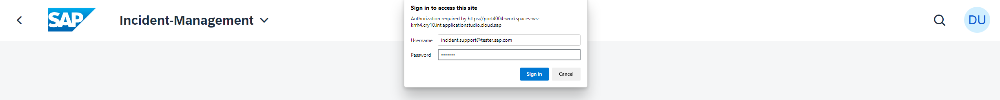
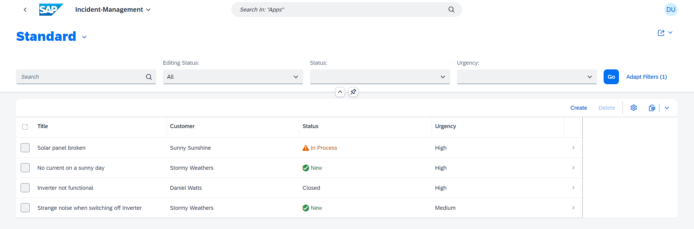
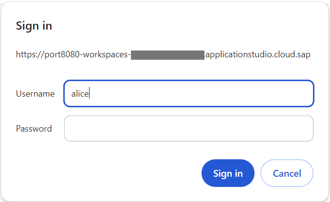

## You will learn

- How to add CAP role restrictions to entities
- How to add users for local testing
- How to access the Incident Management application with password


## Prerequisites

You have added a launch page for local testing to your application. Follow the steps in the [Use a Local Launch Page](use-local-launch-page) tutorial that is part of the [Develop a Full-Stack CAP Application Following SAP BTP Developer’s Guide](https://developers.sap.com/group.cap-application-full-stack.html) tutorial group.

> This tutorial follows the guidance provided in the [SAP BTP Developer's Guide](https://help.sap.com/docs/btp/btp-developers-guide/what-is-btp-developers-guide).

### Add CAP role restrictions to entities


1. Open the **srv/services.cds** file.

2. To specify restrictions, add the `annotate ProcessorService with @(requires: 'support');` and the `annotate AdminService with @(requires: 'admin');` lines to the **srv/services.cds** file:

    ```CDS[10, 15]
    using { sap.capire.incidents as my } from '../db/schema';

    /**
    * Used by support team members to process incidents
    */
    service ProcessorService  {
      ...
    }
    annotate ProcessorService.Incidents with @odata.draft.enabled; 
    annotate ProcessorService with @(requires: 'support');

    service AdminService {
      ...
    }
    annotate AdminService with @(requires: 'admin');
    ```

With these changes, users with the **support** role can view and change the incidents and customers, while users with the **admin** role can perfom admin activities such as auditing logs.

### Add users for local testing

> You can create a CAP project in either Node.js or Java. You have to choose one way or the other and follow through. The tabs **Node.js** and **Java** provide detailed steps for each alternative way.

[OPTION BEGIN [Node.js]]

The authorization checks that you added to the CAP model apply not only when deployed in the cloud but also when testing locally. Therefore, you need a way to log in to the application locally.

CAP offers a possibility to add local users for testing as part of the `cds` configuration. In this tutorial, you use the **development** profile in **package.json** file to add the users.

1. Open the **package.json** file in your project directory.
   
2. In the **package.json** file, add the following code:
    ```json[14-23]    
    {
      "name": "incident-management",
      "version": "1.0.0",
      "description": "A simple CAP project.",
      "repository": "<Add your repository here>",
      "license": "UNLICENSED",
      "private": true,
      "dependencies": {
        ...
      },
      "scripts": {
        ...
      },  
      "cds": {
        "requires": {
          "[development]": {
            "auth": {
              "kind": "mocked",
              "users": {}
            }
          }
        }
      },
      ...
    }
    ```

    The code creates the **cds.requires** section that didn't exist so far in the **package.json** file. Also, the code defines which configuration to use when running with the **development** profile. You define some general parameters for the authentication behavior. Notice that the users object is empty, in the next step, you will define some test users.

3. In the **package.json** file, replace the empty **users** object with the following code:

    ```json[6-17]
    "cds": {
        "requires": {
          "[development]": {
            "auth": {
              "kind": "mocked",
              "users": {
                "incident.support@tester.sap.com": {
                  "password": "initial",
                  "roles": ["support"]
                },
                "alice": {
                  "roles": ["support"]
                },
                "bob": {
                  "roles": ["support"]
                }
              }
            }
          }
        }
      
    ```

    Each user entry is part of the **users** object. The key is the **id** of the user and they can have different properties. For this scenario you define a **password** and an array of roles.
  
    You have added three users:

    - `incident.support@tester.sap.com` with the `support` role and the `initial` password
    - `alice` with the `support` role and no password
    - `bob` with the `support` role and no password

    > Keep in mind that the CAP roles and the Cloud Foundry roles and scopes are not the same thing. See [Authentication](https://cap.cloud.sap/docs/node.js/authentication) in the CAP documentation.

[OPTION END]

[OPTION BEGIN [Java]]

The authorization checks that you added to the CAP model apply not only when deployed in the cloud but also when testing locally. Therefore, you need a way to log in to the application locally.


1. Add the `cds-starter-cloudfoundry` dependency to your `srv` module. This is needed to enable authorization and authentication at runtime. Without that dependency any call to a service annotated with `@requires` will result in an authentication failure. Open your **srv/pom.xml** file and add the following snippet as a child node to the `<dependencies>` node:

    ```xml
    <dependency>
      <groupId>com.sap.cds</groupId>
      <artifactId>cds-starter-cloudfoundry</artifactId>
    </dependency>
    ```
   
2. Now, we can add the mock users to the application's configuration. As with any other Spring Boot application, the configuration can be done in the application's **application.yaml** file. In our case, it is the file **srv/src/main/resources/application.yaml**. Add the following content to this file:
    ```yaml    
    cds:
      security:
        mock.users:
          alice:
            roles: [ admin, support ]
          bob:
            roles: [ support ]
    ```
  
    You have added two users:

    - `alice` with the `support` amd `admin` roles and no password
    - `bob` with the `support` role and no password

    > Keep in mind that the CAP roles and the Cloud Foundry roles and scopes are not the same thing. See [Authentication](https://cap.cloud.sap/docs/node.js/authentication) in the CAP documentation.

[OPTION END]

### Access the Incident Management application with a password

[OPTION BEGIN [Node.js]]

When accessing the **Incidents** service of the **Incident Management** application in your browser, you get a basic auth popup now, asking for your user and password. You can use the users to log in and see how it works.

1. Make sure the SAP Fiori application is running. If you closed it, choose the **Preview Application** option in the **Application Info - incidents** tab and select the **watch-incidents** npm script.

    > To open the **Application Info - incidents** tab: 
    >
    >1. Invoke the Command Palette - **View** &rarr; **Command Palette** or <kbd>Command</kbd> + <kbd>Shift</kbd> + <kbd>P</kbd> for macOS / <kbd>Ctrl</kbd> + <kbd>Shift</kbd> + <kbd>P</kbd> for Windows. 
    >2. Choose **Fiori: Open Application Info**.


3. In the **Username** field of the auth popup, enter `incident.support@tester.sap.com`.

4. In the **Password** field, enter `initial`.

    <!-- border; size:540px --> 

    You can now access the **Incident Management** application.

    <!-- border; size:540px --> 

[OPTION END]

[OPTION BEGIN [Java]]

When accessing the **Incidents** service of the **Incident Management** application in your browser, you get a basic auth popup now, asking for your user and password. You can use the users to log in and see how it works.

1. Make sure the SAP Fiori application is running. If you closed it, navigate to the **srv** folder in the terminal and run `mvn cds:watch`.


3. In the **Username** field of the auth popup, enter `alice`.

4. Leave the **Password** field empty.

    <!-- border; size:540px --> 

    You can now access the **Incident Management** application.

    <!-- border; size:540px --> 

[OPTION END]

> Currently, there’s no logout functionality. You can clear your browser's cache or simply close all browser windows to get rid of the login data in your browser. For Google Chrome, restart your browser (complete shutdown and restart) by entering `chrome://restart` in the address line.
