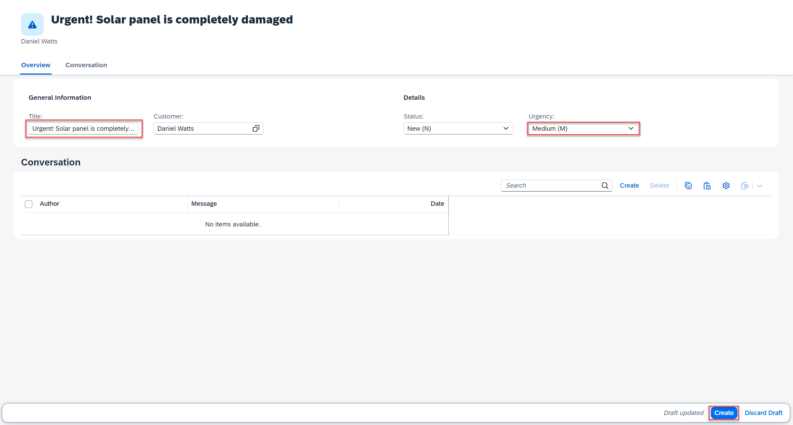
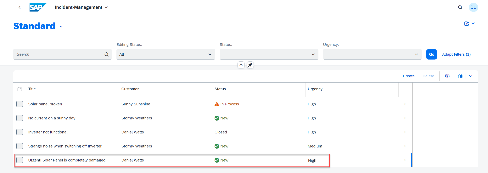

## You will learn

- How to add custom code that changes the value of the **urgency** property
- How CAP automatically treats the JavaScript file that you add as a handler

## Prerequisites

You have implemented the user interface of your application. See [Add SAP Fiori Elements UIs](../../add-fiori-elements-uis.html).

### Add custom code

In this tutorial, you add some custom code to the CAP application. Depending on the contents of the **title** property, the custom code changes the value of the **urgency** property.

1. In SAP Business Application Studio, go to your **IncidentManagement** dev space.

    > Make sure the **IncidentManagement** dev space is in status **RUNNING**.

2. Create a new **processor-service.js** file in the **srv** folder of the **INCIDENT-MANAGEMENT** application.

3. Add the following code (the actual business logic) to the **processor-service.js** file:

    ```js
    const cds = require('@sap/cds')

    class ProcessorService extends cds.ApplicationService {
      /** Registering custom event handlers */
      init() {
        this.before("UPDATE", "Incidents", (req) => this.onUpdate(req));
        this.before("CREATE", "Incidents", (req) => this.changeUrgencyDueToSubject(req.data));

        return super.init();
      }

      changeUrgencyDueToSubject(data) {
        if (data) {
          const incidents = Array.isArray(data) ? data : [data];
          incidents.forEach((incident) => {
            if (incident.title?.toLowerCase().includes("urgent")) {
              incident.urgency = { code: "H", descr: "High" };
            }
          });
        }
      }

      /** Custom Validation */
      async onUpdate (req) {
        const { status_code } = await SELECT.one(req.subject, i => i.status_code).where({ID: req.data.ID})
        if (status_code === 'C')
          return req.reject(`Can't modify a closed incident`)
      }
    }
    module.exports = ProcessorService
    ```

3. Make sure the SAP Fiori application is running. If you closed it, choose the **Preview Application** option in the **Application Info - incidents** tab and select the **watch-incidents** npm script.

    > To open the **Application Info - incidents** tab: 
    >
    >1. Invoke the Command Palette - **View** &rarr; **Command Palette** or <kbd>Command</kbd> + <kbd>Shift</kbd> + <kbd>P</kbd> for macOS / <kbd>Ctrl</kbd> + <kbd>Shift</kbd> + <kbd>P</kbd> for Windows. 
    >2. Choose **Fiori: Open Application Info**.

4. Create a new incident with the word **urgent** in its title and with the urgency set to **Medium**. 

    <!-- border; size:540px --> 
    
    You'll see that the value in the **Urgency** field is automatically set to **high**.

    <!-- border; size:540px --> 


### Understand the custom code

Because your file is called **processor-service.js** and has the same name as your application definition file **processor-service.cds**, CAP automatically treats it as a handler file for the application defined in there. CAP exposes several [events](https://cap.cloud.sap/docs/node.js/events) and you can easily write handlers like the one mentioned above.

In this case, the event is triggered after a **READ** was carried out for the **Incidents** entity. In your custom handler, you get all the data (in this case, all the incidents) that was read according to the query. You can loop over each of them and, if needed, adjust the data of the response. In this case, you change the value of the **urgency** property when the **title** contains the word **urgent**. The new values for **Urgency** are then part of the response to the READ request.
