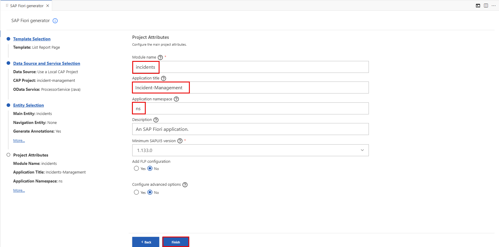

## You will learn

- How to generate the UI with an SAP Fiori elements template
- How to modify the UI with the SAP Fiori page editor

## Prerequisites

You have built your CAP application. See [Build a CAP application](build-cap-app).

### Overview

SAP Fiori elements provides designs for UI patterns and predefined floorplans for common application use cases. Application developers can use SAP Fiori elements to create SAP Fiori applications based on OData services and annotations that don't need JavaScript UI coding. The resulting application uses predefined views and controllers that are provided centrally. This means no application-specific view instances are required. SAPUI5 interprets the metadata and the annotations of the underlying OData service and uses the corresponding views for the SAP Fiori application at startup.

By following one of the [SAP Fiori elements floorplans](https://sapui5.hana.ondemand.com/#/topic/797c3239b2a9491fa137e4998fd76aa7.html), you:

- Boost your development productivity
- Get future-proof UX consistency
- Get enterprise readiness

To learn more about each of these points, see [Why Use SAP Fiori Elements?](https://sapui5.hana.ondemand.com/#/topic/0a5377076f4e4ccba055a9072befadbd).

### Generate the UI with an SAP Fiori Elements template

1. In SAP Business Application Studio, go to your **IncidentManagement** dev space.

    > Make sure the **IncidentManagement** dev space is in status **RUNNING**.

2. Choose the burger menu and then choose **View** &rarr; **Command Palette**.

    > You can also invoke the Command Palette quickly using the following key combination:
    >
    > - For macOS: <kbd>Command</kbd> + <kbd>Shift</kbd> + <kbd>P</kbd>
    > - For Windows: <kbd>Ctrl</kbd> + <kbd>Shift</kbd> + <kbd>P</kbd>

3. Type **Fiori: Open Application Generator** in the field and select this entry from the list.

4. In the **Template Selection** step:

    - In the **Template Type** dropdown menu, select **SAP Fiori**. Then, choose the **List Report Page** template tile.

    - Choose **Next**.

        <!-- border; size:540px --> 

5. In the **Data Source and Service Selection** step:

    - In the **Data source** dropdown menu, select **Use a Local CAP Project**.

    - In the **Choose your CAP project** dropdown menu, select the **incident-management** project.

    - In the **OData service** dropdown menu, select the **ProcessorService (Node.js)**.
    
    - Choose **Next**.

        <!-- border; size:540px --> 

6. In the **Entity Selection** step:

    - In the **Main entity** dropdown menu, select **Incidents**.

    - Leave the **Navigation entity** value as **none**, and then select **Yes** to add table columns automatically.
    
    - Choose **Next**.

        <!-- border; size:540px --> 

7. In the **Project Attributes** step:

    - In the **Module name** field, enter **incidents**.

    - In the **Application title** field, enter **Incident-Management**.

    - In the **Application namespace** field, enter **ns**.

    - Leave the default values for all the other settings and choose **Finish**.

        <!-- border; size:540px --> 

    The application is now generated and in a few seconds you can see the application's **incidents** folder in the **app** folder of your **incident-management** project. It contains a **webapp** folder with a **Component.js** file that is typical for an SAPUI5 application. However, the source code of this application is minimal. It inherits its logic from the **sap/fe/core/AppComponent** class. This class is managed centrally by SAP Fiori elements and provides all the services that are required (routing, edit flow) so that the building blocks and the templates work properly.

### Start the Incident-Management application

Instead of using `cds watch` command in the terminal to start the service, you will use the `watch-incidents` script that has been added to the **package.json** file by the application generator. The script contains an additional `sap-ui-xx-viewCache=false` parameter added to the application's start URL. This parameter ensures that if custom extensions are implemented, changes to the extension artifacts get properly updated when refreshing the UI.

> If the `cds watch` command is already running in a terminal, end it with the <kbd>Ctrl</kbd> + <kbd>C</kbd> key combination. Otherwise the default port 4004 will already be in use by the running CAP server's process.


1. In the **Application Info - incidents** tab, choose the **Preview Application** option.

    <!-- border; size:540px --> 

    > If you get an error **SyntaxError: Unexpected token / in JSON at position 4**, open the file **.vscode/launch.json**, delete any comments that you have there, and try again. 

    This opens a dropdown menu at the top offering all scripts maintained in the scripts section of the `package.json` file that are based on the `cds run` and `cds watch` commands.

    > In case the **Application Info - incidents** tab is closed: 
    >
    >1. Invoke the Command Palette - **View** &rarr; **Command Palette** or <kbd>Command</kbd> + <kbd>Shift</kbd> + <kbd>P</kbd> for macOS / <kbd>Ctrl</kbd> + <kbd>Shift</kbd> + <kbd>P</kbd> for Windows. 
    >2. Choose **Fiori: Open Application Info**.

2. Select the **watch-incidents** npm script.

    <!-- border; size:540px --> 

    This script runs the service in an application modeler terminal session and automatically starts the SAP Fiori application in a new browser session.

3. You can now see the application with the generated columns. Choose **Go**.

    <!-- border; size:540px --> 

### Configure the List View Page

In this section, you'll modify the List View Page of the UI with the SAP Fiori page editor.

#### Add filter fields

1. In the **Application Info - incidents** tab, choose the **Open Page Map** option. 

    <!-- border; size:540px --> 

    The page map of the **incidents** application opens in a new tab within SAP Business Application Studio. You will see the properties on the right side of the page map. You can edit these properties to update the UI of the application.

    <!-- border; size:540px --> 

    > In case the **Application Info - incidents** tab is closed: 
    >
    >1. Invoke the Command Palette - **View** &rarr; **Command Palette** or <kbd>Command</kbd> + <kbd>Shift</kbd> + <kbd>P</kbd> for macOS / <kbd>Ctrl</kbd> + <kbd>Shift</kbd> + <kbd>P</kbd> for Windows. 
    >2. Choose **Fiori: Open Application Info**.

2. In the **List Report** tile, choose the **Pencil** icon next to the title. The page editor is opened.

    <!-- border; size:540px --> 

3. In the **Filter Bar** section of the page editor, choose **Filter Fields** and then choose the **Plus** icon to add filter fields. Then, select **Add Filter Fields** in the dropdown menu.

    <!-- border; size:540px --> 

4. In the **Add Filter Fields** popup:

    - Select the **status_code** and **urgency_code** checkboxes in the **Filter Field** dropdown menu.
    - Choose **Add**. Your application will be updated to show the new filters.

    <!-- border; size:540px --> 

    > This this is how you define which properties are exposed as search fields in the header bar above the list.

#### Edit filter fields

The filter labels are text strings. It's a good idea to update them so they are compliant with internationalization standards (i18n).

5. Change the **urgency_code** filter label. In the **Label** field, change the value to **Urgency**. Press <kbd>Enter</kbd> to confirm the change.

    <!-- border; size:540px --> 

6. Choose the **Globe** icon to generate a translatable text key and choose **Apply**.

    <!-- border; size:540px --> 

7. Choose the **status_code** filter. In the **Label** field, change the value to **Status**. Press <kbd>Enter</kbd> to confirm the change.

8. Choose the **Globe** icon to generate a translatable text key and choose **Apply**.

9. For both the **Urgency** and **Status** filters, in the **Display Type** dropdown menu, select **Value Help**. A popup shows up. 

    <!-- border; size:540px --> 

10. In the **Define Value Help Properties for Urgency/Status** popup: 

    - Choose the dropdown menu in the **Value Description Property** field.
    - Select **descr**.
    - Choose **Apply**.

    <!-- border; size:540px --> 

#### Edit columns

10. Expand the **Columns** section under **Table** and delete the columns **urgency_code** and **status_code**. 

    <!-- border; size:540px --> 

11. In **Table** &rarr; **Columns**, choose the **Plus** icon to add columns. Choose **Add Basic Columns**.

    <!-- border; size:540px --> 

12. In the **Add Basic Columns** popup, choose the dropdown menu in the **Columns** field and:

    - Select the **status** &rarr; **descr** checkbox.
    - Select the **urgency** &rarr; **descr** checkbox.
    - Select the **customer** &rarr; **name** checkbox and add the columns.

    <!-- border; size:540px --> 

14. Select the **name** column and choose **^** to move the column up just under the **Title** column.

    <!-- border; size:540px --> 

15. Choose the **Title** column, choose the **Globe** icon in the **Label** field to generate a translatable text key, and apply the changes.

    > The filter labels are text strings. It's a good idea to update them so they are compliant with internationalization standards (i18n).

    > Learn more about how internationalization works for the backend part in [Where to Place Text Bundles?](https://cap.cloud.sap/docs/guides/i18n#where-to-place-text-bundles) in the CAP documentation.

5. For each of the **name**, **Description (status/descr)**, and **Description (urgency/descr)** columns:

    - In the **Label** field, change the value to **Customer**, **Status**, and **Urgency**, respectively.
    - Press <kbd>Enter</kbd> to confirm the change.
    - Choose the **Globe** icon in the **Label** field to generate a translatable text key.

    <!-- border; size:540px --> 

#### Configure tables

17. Choose **Table** and in the **Initial Load** dropdown menu, select **Enabled** to load the data automatically.

    <!-- border; size:540px --> 

18. In the **Type** dropdown menu, select **ResponsiveTable** to make the table responsive.

    <!-- border; size:540px --> 
  
19. Navigate to **Table** &rarr; **Columns** &rarr; **Status** and in the **Criticality** dropdown menu, select **status/criticality**.

    <!-- border; size:540px --> 

#### Check the result

20. The list page of the Incident Management application should look like this:

    <!-- border; size:540px --> 

21. Navigate back to the page editor and choose **Page Map** in the top left. This takes you back to the overview of the **incidents** application.

### Configure the Incident Object Page

In this section, you'll modify the Incident Object Page of the UI with the SAP Fiori page editor.

#### Edit header

1. Make sure the SAP Fiori page editor is open. If you closed it, choose the **Open Page Map** option in the **Application Info - incidents** tab.

    > To open the **Application Info - incidents** tab: 
    >
    >1. Invoke the Command Palette - **View** &rarr; **Command Palette** or <kbd>Command</kbd> + <kbd>Shift</kbd> + <kbd>P</kbd> for macOS / <kbd>Ctrl</kbd> + <kbd>Shift</kbd> + <kbd>P</kbd> for Windows. 
    >2. Choose **Fiori: Open Application Info**.

2. In the **Incident Object Page** tile, choose the **Pencil** icon next to the title.

    <!-- border; size:540px --> 

3. Choose **Header** and in the **Title** dropdown menu, select **title**.

    <!-- border; size:540px --> 

4. In the **Description Type** dropdown menu, select **Property**. A popup opens.

    <!-- border; size:540px --> 

5. In the **Define Property** popup, choose the dropdown menu in the **Description** field and:

    - Select **customer** &rarr; **name**.
    - Choose **Apply**.


    <!-- border; size:540px --> 


6. In the **Icon URL** field, enter `sap-icon://alert`.

    <!-- border; size:540px --> 

#### Add Overview section

8. Choose **Sections** and then choose the **Plus** icon to add more sections. Choose **Add Group Section**.

    <!-- border; size:540px --> 

9. In the **Add Group Section** popup:

    - Enter **Overview** in the **Label** field.
    - Choose the **Globe** icon to generate a translatable text key. 
    - Choose **Add**.

    <!-- border; size:540px --> 

#### Add Details subsection

9. Navigate to **Sections** &rarr; **Overview** &rarr; **Subsections**.


10. Choose the **Plus** icon to add more sections and choose **Add Form Section**.

    <!-- border; size:540px --> 

10. In the **Add Form Section** popup:

    - Enter **Details** in the **Label** field.
    - Choose the **Globe** icon to generate a translatable text key. 
    - Choose **Add**.

    <!-- border; size:540px --> 

#### Configure fields

1. Navigate to **Sections** &rarr; **General Information** &rarr; **Form** &rarr; **Fields** and delete the **urgency_code** and **status_code** fields.

    <!-- border; size:540px --> 

2. Choose **Sections** &rarr; **General Information** and choose the **Globe** icon in the **Label** field for **General Information** to generate a translatable text key.  

    <!-- border; size:540px --> 

3. Choose **Sections** &rarr; **General Information** &rarr; **Form** &rarr; **Fields**, choose the **Plus** icon to add more fields, and then choose **Add Basic Fields**.

    <!-- border; size:540px --> 

4. In the **Add Basic Fields** popup

    - From the dropdown menu in the **Fields** field, select **customer_ID**.
    - Choose **Add**.

    <!-- border; size:540px --> 

5. For the **customer_ID** field:

    - In the **Label** field, change the value to **Customer**.
    - Press <kbd>Enter</kbd> to confirm the change.
    - Choose the **Globe** icon in the **Label** field to generate a translatable text key.

    <!-- border; size:540px --> 

6. For the **Customer** field, select **customer/name** in the **Text** dropdown menu, select **Text Only** in the **Text Arrangement** dropdown menu, and then select the hyperlink **Edit properties for Value Help** under **Display Type**. A popup opens, switch off **Display as Dropdown** and choose **Apply**.

    <!-- border; size:540px --> 

7. Navigate to **Sections**, drag the **General Information** and drop it in the **Overview** &rarr; **Subsections** node.

    <!-- border; size:540px --> 

11. Navigate to **Sections** &rarr; **Overview** &rarr; **Subsections** &rarr; **Details** &rarr; **Form** &rarr; **Fields**, choose the **Plus** icon to add more fields, and then choose **Add Basic Fields**.

    <!-- border; size:540px --> 

12. In the **Add Basic Fields** popup

    - From the dropdown menu in the **Fields** field, select **status_code**, and **urgency_code**. 
    - Choose **Add**.

    <!-- border; size:540px --> 

8. For the **Status** field, select **status/descr** in the **Text** dropdown menu and then select **Value Help** in the **Display Type** dropdown menu. A popup opens.

    <!-- border; size:540px --> 

9. In the **Define Value Help Properties for Status** popup:

    - Select **Status** in the **Value Source Entity** dropdown menu.
    - Select **code** in the **Value Source Property** dropdown menu.
    - Select **descr** in the **Value Description Property** dropdown menu.
    - Leave the default values for the rest of the properties and choose **Apply**.

    <!-- border; size:540px --> 

10. For the **Urgency** field, select **urgency/descr** in the **Text** dropdown menu and then select **Value Help** in the **Display Type** dropdown menu. A popup opens.

    <!-- border; size:540px --> 

11. In the **Define Value Help Properties for Urgency** popup:

    - Select **Urgency** in the **Value Source Entity** dropdown menu.
    - Select **code** in the **Value Source Property** dropdown menu.
    - Select **descr** in the **Value Description Property** dropdown menu.
    - Leave the rest of the properties with the default values and choose **Apply**.

    <!-- border; size:540px --> 

#### Add Conversation section

19. Navigate to **Sections** and then choose the **Plus** icon to add more sections. Select **Add Table Section** in the dropdown menu.

20. Choose **Add Table Section**. A popup appears.

    <!-- border; size:540px --> 

20. In the **Add Table Section** popup:

    - Enter **Conversation** in the **Label** field.
    - Choose the **Globe** icon to generate a translatable text key. 
    - Select **conversation** in the **Source Value** dropdown menu and choose **Add**.

    <!-- border; size:540px --> 

#### Configure columns

21. Navigate to **Conversation** &rarr; **Table** &rarr; **Columns** and choose the **Plus** icon to add columns. 

22. Choose **Add Basic Columns**. A popup appears.

    <!-- border; size:540px --> 

23. In the **Add Basic Columns** popup:

    - In the **Columns** dropdown menu, select **author**, **message**, and **timestamp**. 
    - Choose **Add**.

    <!-- border; size:540px --> 

5. For each of the **CreatedBy**, **message**, and **CreatedOn** columns:

    - In the **Label** field, change the value to **Author**, **Message**, and **Date**, respectively.
    - Press <kbd>Enter</kbd> to confirm the change.
    - Choose the **Globe** icon in the **Label** field to generate a translatable text key.

    <!-- border; size:540px --> 

#### Configure table and check the result

1. For **Table**, in the **Type** dropdown menu, select **ResponsiveTable** to make the table responsive.

    <!-- border; size:540px --> 

2. In the **Creation Mode: Name** dropdown menu, select **Inline**.

    <!-- border; size:540px --> 

3. The complete list object page looks like this:

    <!-- border; size:540px --> 

### Enable draft with `@odata.draft.enabled`

SAP Fiori supports editing business entities with draft states stored on the server, so users can interrupt editing and continue later on, possibly from different places and devices. CAP, as well as SAP Fiori elements, provide out-of-the-box support for drafts. We recommend that you always use draft when your SAP Fiori application needs data input by end users.

>- For more details, see the SAP Fiori Design Guidelines for [Draft Handling](https://experience.sap.com/fiori-design-web/draft-handling/).
>- Read more about [Draft Support](https://cap.cloud.sap/docs/advanced/fiori#draft-support) in the CAP documentation.

Enabling a draft for an entity allows the users to edit the entities. To enable a draft for an entity exposed by a service, follow these steps:

1. Open the **srv/processor-service.cds** file.

2. Annotate the file with `@odata.draft.enabled` like this:

    ```js[5]
    service ProcessorService { 
    ...
    }
    ...
    annotate ProcessorService.Incidents with @odata.draft.enabled; 
    ```

3. Start creating a new incident but leave the **Customer**, **Status**, and **Urgency** fields empty.

    <!-- border; size:540px --> )

4. Go back to the list view page without creating the incident. You should be able to see the incident draft there with the empty fields.

    <!-- border; size:540px --> )

5. Try to access it again to continue the creation from where you stopped.

    <!-- border; size:540px --> )

