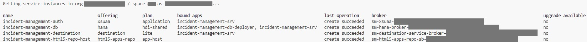

## You will learn

- How to deploy your CAP application as multi-target application (MTA)

## Prerequisites

- You have configured the respective entitlements, enabled the Cloud Foundry runtime in your subaccount, and created an SAP HANA Cloud service instance in the SAP BTP cockpit. Follow the steps in the [Prepare for Deployment in the SAP BTP, Cloud Foundry Runtime](prepare-btp-cf) tutorial that is part of the [Deploy a Full-Stack CAP Application in SAP BTP, Cloud Foundry Runtime Following SAP BTP Developer’s Guide](https://developers.sap.com/group.deploy-full-stack-cap-application.html) tutorial group.
- You have an [enterprise global account](https://help.sap.com/docs/btp/sap-business-technology-platform/getting-global-account#loiod61c2819034b48e68145c45c36acba6e) in SAP BTP. To use services for free, you can sign up for an SAP BTPEA (SAP BTP Enterprise Agreement) or a Pay-As-You-Go for SAP BTP global account and make use of the free tier services only. See [Using Free Service Plans](https://help.sap.com/docs/btp/sap-business-technology-platform/using-free-service-plans?version=Cloud).
- You have a platform user. See [User and Member Management](https://help.sap.com/docs/btp/sap-business-technology-platform/user-and-member-management).
- You are an administrator of the global account in SAP BTP.
- You have a subaccount in SAP BTP to deploy the services and applications.
- You have one of the following browsers that are supported for working in SAP Business Application Studio:
    - Mozilla Firefox
    - Google Chrome
    - Microsoft Edge

> This tutorial follows the guidance provided in the [SAP BTP Developer's Guide](https://help.sap.com/docs/btp/btp-developers-guide/what-is-btp-developers-guide).

### Introduction

The SAP BTP, Cloud Foundry environment allows you to create polyglot cloud applications in Cloud Foundry. It contains the SAP BTP, Cloud Foundry runtime, which is based on the open-source application platform managed by the Cloud Foundry Foundation.

The SAP BTP, Cloud Foundry environment enables you to develop new business applications and business services, supporting multiple runtimes, programming languages, libraries, and services.

For more information about the Cloud Foundry environment, see [Cloud Foundry Environment](https://help.sap.com/docs/btp/sap-business-technology-platform/cloud-foundry-environment).

### Set up the MTA for deployment

A multitarget application (MTA) is logically a single application comprised of multiple parts created with different technologies, which share the same lifecycle.

The developers of the MTA describe the desired result using the MTA model which contains MTA modules, MTA resources and interdependencies between them. Afterwards, the MTA deployment service validates, orchestrates, and automates the deployment of the MTA, which results in Cloud Foundry (CF) applications, services and SAP-specific contents.

You will use the [Cloud MTA Build Tool](https://sap.github.io/cloud-mta-build-tool/) to deploy the Incident Management application. The modules and services are configured in the **mta.yaml** deployment descriptor file.

1. In SAP Business Application Studio, go to your **IncidentManagement** dev space.

    > Make sure the **IncidentManagement** dev space is in status **RUNNING**.

2. From the root of the **INCIDENT-MANAGEMENT** project, choose the burger menu, and then choose **Terminal** &rarr; **New Terminal**.

3. Run the following command to generate the **mta.yaml** deployment descriptor:

    ```bash
    cds add mta
    ```

### Add configuration for SAP Build Work Zone, standard edition

> You can create a CAP project in either Node.js or Java. You have to choose one way or the other and follow through. The tabs **Node.js** and **Java** provide detailed steps for each alternative way.

[OPTION BEGIN [Node.js]]

1. Run the following command in the terminal:

    ```bash
    cds add workzone-standard
    ```


2. Verify that the destinations module and resource have been added to the **mta.yaml** file without errors:


    ```yaml[5-35, 39-68]
    _schema-version: '3.1'
    ...
    module:
      ...
    - name: incident-management-destinations
      type: com.sap.application.content
      requires:
        - name: incident-management-auth
          parameters:
            service-key:
              name: incident-management-auth-key
        - name: incident-management-html5-repo-host
          parameters:
            service-key:
              name: incident-management-html5-repo-host-key
        - name: srv-api
        - name: incident-management-destination
          parameters:
            content-target: true
      build-parameters:
        no-source: true
      parameters:
        content:
          instance:
            existing_destinations_policy: update
            destinations:
              - Name: incident-management-html5-repository
                ServiceInstanceName: incident-management-html5-repo-host
                ServiceKeyName: incident-management-html5-repo-host-key
                sap.cloud.service: incidentmanagement.service
              - Name: incident-management-auth
                Authentication: OAuth2UserTokenExchange
                ServiceInstanceName: incident-management-auth
                ServiceKeyName: incident-management-auth-key
                sap.cloud.service: incidentmanagement.service
        ...
    resources:
      ...
    - name: incident-management-destination
      type: org.cloudfoundry.managed-service
      parameters:
        service: destination
        service-plan: lite
        config:
          HTML5Runtime_enabled: true
          init_data:
            instance:
              existing_destinations_policy: update
              destinations:
                - Name: incident-management-srv-api
                  URL: ~{srv-api/srv-url}
                  Authentication: NoAuthentication
                  Type: HTTP
                  ProxyType: Internet
                  HTML5.ForwardAuthToken: true
                  HTML5.DynamicDestination: true
                - Name: ui5
                  URL: https://ui5.sap.com
                  Authentication: NoAuthentication
                  Type: HTTP
                  ProxyType: Internet
      requires:
        - name: srv-api
          group: destinations
          properties:
            name: srv-api # must be used in xs-app.json as well
            url: ~{srv-url}
            forwardAuthToken: true
    ```


2. Verify that the navigation target **incidents-display** and the SAP Cloud service have been correctly added to the application manifest file **app/incidents/webapp/manifest.json**:


    ```json[10-23, 25-28]
    "sap.app": {
      "id": "ns.incidents",
      ...
      "sourceTemplate": {
        ...
      },
      "dataSources": {
        ...
      },
      "crossNavigation": {
        "inbounds": {
          "incidents-display": {
            "semanticObject": "incidents",
            "action": "display",
            "title": "{{flpTitle}}",
            "subTitle": "{{flpSubtitle}}",
            "signature": {
              "parameters": {},
              "additionalParameters": "allowed"
            }
          }
        }
      }
    ...
    "sap.cloud": {
        "public": true,
        "service": "incidents"
      }
    }   
    ```


4. Open **app/incidents/webapp/manifest.json** and remove the leading `/` from the `uri` parameter.

    ```json[10]
    {
        "_version": "1.49.0",
        "sap.app": {
            "id": "ns.incidents",
            "type": "application",
            "i18n": "i18n/i18n.properties",
            ...
            "dataSources": {
                "mainService": {
                    "uri": "odata/v4/processor/",
                    "type": "OData",
                    "settings": {
                        "annotations": [],
                        "localUri": "localService/metadata.xml",
                        "odataVersion": "4.0"
                    }
                }
            },
            ...
        },
        ...
    }
    ```

    This is needed as the dataSource URIs must be relative to the base URL, which means there is no need for a slash as the first character.

    Check [Accessing Business Service UI](https://help.sap.com/docs/btp/sap-business-technology-platform/accessing-business-service-ui?locale=39723061bc4b4b679726b120cbefdf5a.html&q=base%20URL) for more information.

5. Make sure that line 2 in the following snippet is added to the **app/incidents/xs-app.json** file. Add if it is missing. 

    ```json[2]
    {
      "welcomeFile": "/index.html",
      "authenticationMethod": "route",
      "routes": [
        {
          "source": "^/?odata/(.*)$",
          "target": "/odata/$1",
          "destination": "incident-management-srv-api",
          "authenticationType": "xsuaa",
          "csrfProtection": true
        },
        {
          "source": "^(.*)$",
          "target": "$1",
          "service": "html5-apps-repo-rt",
          "authenticationType": "xsuaa"
        }
      ]
    }
    ```

[OPTION END]

[OPTION BEGIN [Java]]

1. Run the following command in the root folder of your project:

    ```bash
    cds add workzone
    ```

    You should see the following output in the terminal:

    ```bash
    Adding feature 'destination'...
    Adding feature 'html5-repo'...
    Adding feature 'workzone'...
    Adding feature 'workzone-standard'...
    ```

2. Verify that all required modules and resources have been added to the **mta.yaml** file without errors:

    ```yaml[5-62, 66-100]
    _schema-version: '3.1'
    ...
    module:
      ...
    - name: incident-management-app-deployer
      type: com.sap.application.content
      path: .
      requires:
        - name: incident-management-html5-repo-host
          parameters:
            content-target: true
      build-parameters:
        build-result: resources
        requires:
          - name: incidentmanagementincidents
            artifacts:
              - incidents.zip
            target-path: resources

    - name: incidentmanagementincidents
      type: html5
      path: app/incidents
      build-parameters:
        build-result: dist
        builder: custom
        commands:
          - npm ci
          - npm run build
        supported-platforms:
          []

    - name: incident-management-destinations
      type: com.sap.application.content
      requires:
        - name: incident-management-auth
          parameters:
            service-key:
              name: incident-management-auth-key
        - name: incident-management-html5-repo-host
          parameters:
            service-key:
              name: incident-management-html5-repo-host-key
        - name: srv-api
        - name: incident-management-destination
          parameters:
            content-target: true
      build-parameters:
        no-source: true
      parameters:
        content:
          instance:
            existing_destinations_policy: update
            destinations:
              - Name: incident-management-html5-repository
                ServiceInstanceName: incident-management-html5-repo-host
                ServiceKeyName: incident-management-html5-repo-host-key
                sap.cloud.service: incidentmanagement.service
              - Name: incident-management-auth
                Authentication: OAuth2UserTokenExchange
                ServiceInstanceName: incident-management-auth
                ServiceKeyName: incident-management-auth-key
                sap.cloud.service: incidentmanagement.service
        ...
    resources:
      ...
    - name: incident-management-destination
      type: org.cloudfoundry.managed-service
      parameters:
        service: destination
        service-plan: lite
        config:
          HTML5Runtime_enabled: true
          init_data:
            instance:
              existing_destinations_policy: update
              destinations:
                - Name: incident-management-srv-api
                  URL: ~{srv-api/srv-url}
                  Authentication: NoAuthentication
                  Type: HTTP
                  ProxyType: Internet
                  HTML5.ForwardAuthToken: true
                  HTML5.DynamicDestination: true
                - Name: ui5
                  URL: https://ui5.sap.com
                  Authentication: NoAuthentication
                  Type: HTTP
                  ProxyType: Internet
      requires:
        - name: srv-api
          group: destinations
          properties:
            name: srv-api # must be used in xs-app.json as well
            url: ~{srv-url}
            forwardAuthToken: true
    - name: incident-management-html5-repo-host
      type: org.cloudfoundry.managed-service
      parameters:
        service: html5-apps-repo
        service-plan: app-host
    ```

4. Open **app/incidents/webapp/manifest.json** and remove the leading `/` from the `uri` parameter.

    ```json[10]
    {
        "_version": "1.49.0",
        "sap.app": {
            "id": "ns.incidents",
            "type": "application",
            "i18n": "i18n/i18n.properties",
            ...
            "dataSources": {
                "mainService": {
                    "uri": "odata/v4/processor/",
                    "type": "OData",
                    "settings": {
                        "annotations": [],
                        "localUri": "localService/metadata.xml",
                        "odataVersion": "4.0"
                    }
                }
            },
            ...
        },
        ...
    }
    ```

    This is needed as the dataSource URIs must be relative to the base URL, which means there is no need for a slash as the first character.

    Check [Accessing Business Service UI](https://help.sap.com/docs/btp/sap-business-technology-platform/accessing-business-service-ui?locale=39723061bc4b4b679726b120cbefdf5a.html&q=base%20URL) for more information.

6. Navigate to the **db** folder in the terminal and run the following command:

    ```bash
    npm install
    ```

7. Navigate to the **app/incidents** folder in the terminal and run the following command:

    ```bash
    npm install
    ```


[OPTION END]

### Make additional changes to the mta.yaml file

[OPTION BEGIN [Node.js]]

1. Update the `incident-management-app-deployer` module (build result directory and the target path) as follows:

    ```yaml[7, 13, 18]
    _schema-version: '3.1'
    ...
    module:
      ...
    - name: incident-management-app-deployer
      type: com.sap.application.content
      path: .
      requires:
      - name: incident-management_html_repo_host
        parameters:
          content-target: true
      build-parameters:
        build-result: resources/
        requires:
          - name: incidentmanagementincidents
            artifacts:
              - incidents.zip
            target-path: resources/
            
    - name: incidentmanagementincidents
    ...
    ```

2. Update the build parameters:

    ```yaml[7]
    build-parameters:
    before-all:
      - builder: custom
      commands:
        - npm ci
        - npx cds build --production 
        - mkdir -p resources  
    ```

3. Verify the **mta.yaml** file before deployment.

    This is how your **mta.yaml** file should look like at this stage:

    ```yaml
    _schema-version: 3.3.0
    ID: incident-management
    version: 1.0.0
    description: "A simple CAP project."
    parameters:
      enable-parallel-deployments: true
      deploy_mode: html5-repo
    build-parameters:
      before-all:
        - builder: custom
          commands:
            - npm ci
            - npx cds build --production
            - mkdir -p resources  
    modules:
      - name: incident-management-srv
        type: nodejs
        path: gen/srv
        parameters:
          buildpack: nodejs_buildpack
          readiness-health-check-type: http
          readiness-health-check-http-endpoint: /health
        build-parameters:
          builder: npm
        provides:
          - name: srv-api # required by consumers of CAP services (e.g. approuter)
            properties:
              srv-url: ${default-url}
        requires:
          - name: incident-management-db
          - name: incident-management-auth
          - name: incident-management-destination

      - name: incident-management-db-deployer
        type: hdb
        path: gen/db
        parameters:
          buildpack: nodejs_buildpack
        requires:
          - name: incident-management-db

      - name: incident-management-app-deployer
        type: com.sap.application.content
        path: .
        requires:
          - name: incident-management-html5-repo-host
            parameters:
              content-target: true
        build-parameters:
          build-result: resources/
          requires:
            - name: incidentmanagementincidents
              artifacts:
                - incidents.zip
              target-path: resources/

      - name: incidentmanagementincidents
        type: html5
        path: app/incidents
        build-parameters:
          build-result: dist
          builder: custom
          commands:
            - npm ci
            - npm run build
          supported-platforms:
            []

      - name: incident-management-destinations
        type: com.sap.application.content
        requires:
          - name: incident-management-auth
            parameters:
              service-key:
                name: incident-management-auth-key
          - name: incident-management-html5-repo-host
            parameters:
              service-key:
                name: incident-management-html5-repo-host-key
          - name: srv-api
          - name: incident-management-destination
            parameters:
              content-target: true
        build-parameters:
          no-source: true
        parameters:
          content:
            instance:
              existing_destinations_policy: update
              destinations:
                - Name: incident-management-html5-repository
                  ServiceInstanceName: incident-management-html5-repo-host
                  ServiceKeyName: incident-management-html5-repo-host-key
                  sap.cloud.service: incidentmanagement.service
                - Name: incident-management-auth
                  Authentication: OAuth2UserTokenExchange
                  ServiceInstanceName: incident-management-auth
                  ServiceKeyName: incident-management-auth-key
                  sap.cloud.service: incidentmanagement.service

    resources:
      - name: incident-management-db
        type: com.sap.xs.hdi-container
        parameters:
          service: hana
          service-plan: hdi-shared
      - name: incident-management-html5-repo-host
        type: org.cloudfoundry.managed-service
        parameters:
          service: html5-apps-repo
          service-plan: app-host
      - name: incident-management-auth
        type: org.cloudfoundry.managed-service
        parameters:
          service: xsuaa
          service-plan: application
          path: ./xs-security.json
          config:
            xsappname: incident-management-${org}-${space}
            tenant-mode: dedicated
      - name: incident-management-destination
        type: org.cloudfoundry.managed-service
        parameters:
          service: destination
          service-plan: lite
          config:
            HTML5Runtime_enabled: true
            init_data:
              instance:
                existing_destinations_policy: update
                destinations:
                  - Name: incident-management-srv-api
                    URL: ~{srv-api/srv-url}
                    Authentication: NoAuthentication
                    Type: HTTP
                    ProxyType: Internet
                    HTML5.ForwardAuthToken: true
                    HTML5.DynamicDestination: true
                  - Name: ui5
                    URL: https://ui5.sap.com
                    Authentication: NoAuthentication
                    Type: HTTP
                    ProxyType: Internet
        requires:
          - name: srv-api
            group: destinations
            properties:
              name: srv-api # must be used in xs-app.json as well
              url: ~{srv-url}
              forwardAuthToken: true
    
    ```

[OPTION END]

[OPTION BEGIN [Java]]

3. Verify the **mta.yaml** file before deployment.


    This is how your **mta.yaml** file should look like at this stage:

    ```yaml
    _schema-version: 3.3.0
    ID: incident-management
    version: 1.0.0-SNAPSHOT
    description: "A simple CAP project."
    parameters:
      enable-parallel-deployments: true
      deploy_mode: html5-repo
    modules:
      - name: incident-management-srv
        type: java
        path: srv
        parameters:
          buildpack: sap_java_buildpack_jakarta
          readiness-health-check-type: http
          readiness-health-check-http-endpoint: /actuator/health/readiness
        properties:
          SPRING_PROFILES_ACTIVE: cloud,sandbox
          JBP_CONFIG_COMPONENTS: "jres: ['com.sap.xs.java.buildpack.jre.SAPMachineJRE']"
          JBP_CONFIG_SAP_MACHINE_JRE: '{ version: 21.+ }'
        build-parameters:
          builder: custom
          commands:
            - mvn clean package -DskipTests=true --batch-mode
          build-result: target/*-exec.jar
        provides:
          - name: srv-api # required by consumers of CAP services (e.g. approuter)
            properties:
              srv-url: ${default-url}
        requires:
          - name: incident-management-db
          - name: incident-management-auth
          - name: incident-management-destination

      - name: incident-management-db-deployer
        type: hdb
        path: db
        parameters:
          buildpack: nodejs_buildpack
        build-parameters:
          builder: custom
          commands:
            - npm run build
        requires:
          - name: incident-management-db

      - name: incident-management-app-deployer
        type: com.sap.application.content
        path: .
        requires:
          - name: incident-management-html5-repo-host
            parameters:
              content-target: true
        build-parameters:
          build-result: resources
          requires:
            - name: incidentmanagementincidents
              artifacts:
                - incidents.zip
              target-path: resources

      - name: incidentmanagementincidents
        type: html5
        path: app/incidents
        build-parameters:
          build-result: dist
          builder: custom
          commands:
            - npm ci
            - npm run build
          supported-platforms:
            []

      - name: incident-management-destinations
        type: com.sap.application.content
        requires:
          - name: incident-management-auth
            parameters:
              service-key:
                name: incident-management-auth-key
          - name: incident-management-html5-repo-host
            parameters:
              service-key:
                name: incident-management-html5-repo-host-key
          - name: srv-api
          - name: incident-management-destination
            parameters:
              content-target: true
        build-parameters:
          no-source: true
        parameters:
          content:
            instance:
              existing_destinations_policy: update
              destinations:
                - Name: incident-management-html5-repository
                  ServiceInstanceName: incident-management-html5-repo-host
                  ServiceKeyName: incident-management-html5-repo-host-key
                  sap.cloud.service: incidentmanagement.service
                - Name: incident-management-auth
                  Authentication: OAuth2UserTokenExchange
                  ServiceInstanceName: incident-management-auth
                  ServiceKeyName: incident-management-auth-key
                  sap.cloud.service: incidentmanagement.service

    resources:
      - name: incident-management-db
        type: com.sap.xs.hdi-container
        parameters:
          service: hana
          service-plan: hdi-shared
      - name: incident-management-auth
        type: org.cloudfoundry.managed-service
        parameters:
          service: xsuaa
          service-plan: application
          path: ./xs-security.json
          config:
            xsappname: incident-management-${org}-${space}
            tenant-mode: dedicated
      - name: incident-management-destination
        type: org.cloudfoundry.managed-service
        parameters:
          service: destination
          service-plan: lite
          config:
            HTML5Runtime_enabled: true
            init_data:
              instance:
                existing_destinations_policy: update
                destinations:
                  - Name: incident-management-srv-api
                    URL: ~{srv-api/srv-url}
                    Authentication: NoAuthentication
                    Type: HTTP
                    ProxyType: Internet
                    HTML5.ForwardAuthToken: true
                    HTML5.DynamicDestination: true
                  - Name: ui5
                    URL: https://ui5.sap.com
                    Authentication: NoAuthentication
                    Type: HTTP
                    ProxyType: Internet
        requires:
          - name: srv-api
            group: destinations
            properties:
              name: srv-api # must be used in xs-app.json as well
              url: ~{srv-url}
              forwardAuthToken: true
      - name: incident-management-html5-repo-host
        type: org.cloudfoundry.managed-service
        parameters:
          service: html5-apps-repo
          service-plan: app-host

    
    ```

[OPTION END]

### Assemble with the Cloud MTA Build Tool

Run the following command to assemble everything into a single **mta.tar** archive:

```bash
mbt build
```

See [Multitarget Applications in the Cloud Foundry Environment](https://help.sap.com/products/BTP/65de2977205c403bbc107264b8eccf4b/d04fc0e2ad894545aebfd7126384307c.html?locale=en-US) to learn more about MTA-based deployment.

### Deploy in the SAP BTP, Cloud Foundry runtime

[OPTION BEGIN [Node.js]]

1. From the root of the **INCIDENT-MANAGEMENT** project, choose the burger menu, and then choose **Terminal** &rarr; **New Terminal**.

2. Log in to your subaccount in SAP BTP:

    ```bash
    cf api <API-ENDPOINT>
    cf login
    cf target -o <ORG> -s <SPACE>
    ```

    > You can find the API endpoint in the **Overview** section of your subaccount in the SAP BTP cockpit.

3. Run the following command to deploy the generated archive to the SAP BTP, Cloud Foundry runtime:

    ```bash
    cf deploy mta_archives/incident-management_1.0.0.mtar 
    ```

4. Check if all services have been created:

    ```bash 
    cf services
    ```

    You should see the following services in your space:

    <!-- border; size:540px --> 

5. Check if the apps are running:

    ```bash
    cf apps
    ```

    <!-- border; size:540px --> 

<!-- 6. Enter the route displayed for **incident-management-srv** in your browser. -->

<!-- border; size:540px  -->

<!-- undeploy command: `cf undeploy incident-management --delete-service-keys --delete-services` -->

<!-- You see the CAP start page: -->

<!-- border; size:540px  -->

<!-- 4. When you choose the **Incidents** service entity, you will see an error message.  -->

<!-- border; size:540px  -->

<!-- The service expects a so called JWT (JSON Web Token) in the HTTP Authorization header that contains the required authentication and authorization information to access the service.  -->

[OPTION END]

[OPTION BEGIN [Java]]

1. From the root of the **INCIDENT-MANAGEMENT** project, choose the burger menu, and then choose **Terminal** &rarr; **New Terminal**.

2. Log in to your subaccount in SAP BTP:

    ```bash
    cf api <API-ENDPOINT>
    cf login
    cf target -o <ORG> -s <SPACE>
    ```

    > You can find the API endpoint in the **Overview** section of your subaccount in the SAP BTP cockpit.

3. Run the following command to deploy the generated archive to the SAP BTP, Cloud Foundry runtime:

    ```bash
    cf deploy mta_archives/incident-management_1.0.0-SNAPSHOT.mtar 
    ```

4. Check if all services have been created:

    ```bash 
    cf services
    ```

    You should see the following services in your space:

    <!-- border; size:540px --> 

5. Check if the apps are running:

    ```bash
    cf apps
    ```

    <!-- border; size:540px --> 


[OPTION END]

In the next tutorials, you will access your UIs from SAP Build Work Zone, standard edition. The SAP Build Work Zone, standard edition will trigger the authentication flow to provide the required token to access the service.
