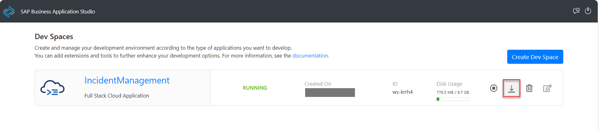
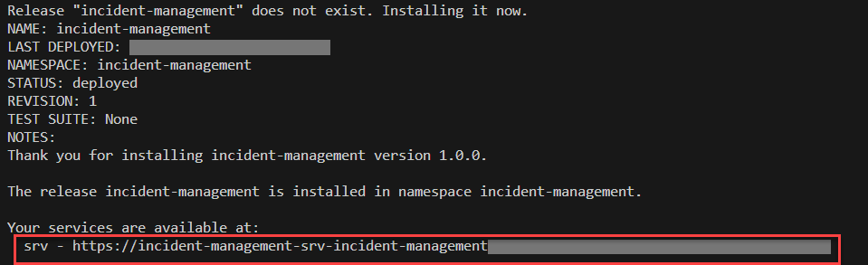

## You will learn

- How to deploy your CAP application in SAP BTP, Kyma runtime

## Prerequisites

- You have an [enterprise global account](https://help.sap.com/docs/btp/sap-business-technology-platform/getting-global-account#loiod61c2819034b48e68145c45c36acba6e) in SAP BTP. To use services for free, you can sign up for a CPEA (Cloud Platform Enterprise Agreement) or a Pay-As-You-Go for SAP BTP global account and make use of the free tier services only. See [Using Free Service Plans](https://help.sap.com/docs/btp/sap-business-technology-platform/using-free-service-plans?version=Cloud).
- You have an S-user or P-user. See [User and Member Management](https://help.sap.com/docs/btp/sap-business-technology-platform/user-and-member-management).
- You are an administrator of the global account in SAP BTP.
- You have a subaccount in SAP BTP to deploy the services and applications.
- You have one of the following browsers that are supported for working in SAP Business Application Studio:
    - Mozilla Firefox
    - Google Chrome
    - Microsoft Edge
- You have configured the respective entitlements, enabled the Kyma runtime in your subaccount, and created an SAP HANA Cloud service instance in the SAP BTP cockpit. See [Prepare for Deployment in the SAP BTP, Kyma Runtime](prepare-btp-kyma).
 - For Windows, you'll need Chocolatey. This is a package manager that will speed up and ease installation of the tools in this tutorial. See how to install Chocolatey in [Setup/Install](https://docs.chocolatey.org/en-us/choco/setup).
 - You have prepared a container registry and you've logged in to the container registry through your CLI. A container registry is a repo where you can push your docker images. SAP BTP doesn't currently provide a container registry. You can use any container registry offering as long as it can be reached from public Internet.

### Introduction

SAP BTP, Kyma runtime is a cloud-native application runtime that combines the power of Kubernetes with a set of best-in-class tools and open-source components that empower you to develop, run, and operate secure and scalable cloud-native applications. Detailed information is available at [Kyma Environment](https://help.sap.com/docs/btp/sap-business-technology-platform/kyma-environment).

The Kyma runtime for SAP BTP's files are provided as a container image. In addition, since the containers run on Kubernetes, their configuration is described by Kubernetes resources.

Hence, you need two kinds of artifacts to run applications on Kubernetes:

- Container images
- Kubernetes resources

You start by building your project as container images and push those images to a container registry of your choice. Then, you add a [CAP Helm chart](https://cap.cloud.sap/docs/guides/deployment/deploy-to-kyma#about-cap-helm) to your project. As a last step, you deploy the Helm chart to your Kyma resources, where service instances of SAP BTP services are created and pods pull the previously created container images from the container registry.

### Install kubectl

[OPTION BEGIN [macOS]]
1. To install kubectl, run the following command:
```Shell/Bash
brew install kubectl
```
2. Check if the installation is successful:
```Shell/Bash
kubectl version --client
```
You should see a version number.
[OPTION END]

[OPTION BEGIN [Windows]]
You can install kubectl using chocolatey.

1. To install kubectl, run the following command:
```Shell/Bash
choco install kubernetes-cli
```
2. Check if the installation is successful:
```Shell/Bash
kubectl version --client
```
You should see something like:
`Client Version: version.Info{Major:"1", Minor:"19", GitVersion:"v1.19.3", GitCommit:"1e11e4a2108024935ecfcb2912226cedeafd99df", GitTreeState:"clean", BuildDate:"2020-10-14T12:50:19Z", GoVersion:"go1.15.2", Compiler:"gc", Platform:"windows/amd64"}`
[OPTION END]

[OPTION BEGIN [Linux]]
Follow the instructions for your preferred way of installing kubectl at [Install and Set Up kubectl on Linux](https://kubernetes.io/docs/tasks/tools/install-kubectl-linux/).
[OPTION END]

### Install kubelogin

[OPTION BEGIN [macOS]]
To install kubelogin, run the following command:
```Shell/Bash
brew install int128/kubelogin/kubelogin
```
See [Setup](https://github.com/int128/kubelogin#setup) in the kubelogin docs for more details.
[OPTION END]

[OPTION BEGIN [Windows]]
You can install kubelogin using chocolatey:

```Shell/Bash
choco install kubelogin
```

See [Setup](https://github.com/int128/kubelogin#setup) in the kubelogin docs for more details.
[OPTION END]

[OPTION BEGIN [Linux]]
To install kubelogin, run the following command:
```Shell/Bash
brew install int128/kubelogin/kubelogin
```

See [Setup](https://github.com/int128/kubelogin#setup) in the kubelogin docs for more details.
[OPTION END]

### Login to your Kyma cluster

1. Choose `KubeconfigURL` under the **Kyma Environment** tab in your subaccount.

    <!-- border; size:540px --> 

    A file `kubeconfig.yaml` is downloaded.

    <!-- border; size:540px --> 

2. Copy the `kubeconfig.yaml` file to the `~/.kube/` directory and rename it to `config`. Replace or rename any existing file with the same name.


There are two additional steps for Windows users only:

3. Go to `C:\ProgramData\chocolatey\bin`.

4. Rename `kubelogin.exe` to `kubectl-oidc_login.exe`.

### Install helm

[OPTION BEGIN [macOS]]
There's a multitude of options to install helm. You can see the full list at [Installing Helm](https://helm.sh/docs/intro/install/). We have also listed some options:

To install helm, run the following command:
```Shell/Bash
brew install helm
```
[OPTION END]

[OPTION BEGIN [Windows]]
There's a multitude of options to install helm. You can see the full list at [Installing Helm](https://helm.sh/docs/intro/install/). We have also listed some options:

You can install helm using chocolatey.

1. To install helm run the following command:
```Shell/Bash
choco install kubernetes-helm
```
2. Check if the installation is successful:
```Shell/Bash
helm version
```
You should see something like `version.BuildInfo{Version:"v3.8.0", GitCommit:"d14138609b01886f544b2025f5000351c9eb092e", GitTreeState:"clean", GoVersion:"go1.17.5"}`.
[OPTION END]


### Install Paketo (pack)

[OPTION BEGIN [macOS]]
Pack lets you build container images, which are collaboratively maintained making it easier to maintain and update.

```Shell/Bash
brew install buildpacks/tap/pack
```
[OPTION END]

[OPTION BEGIN [Windows]]
Pack lets you build container images, which are collaboratively maintained making it easier to maintain and update.

You can install pack using chocolatey with the command:
```Shell/Bash
choco install pack
```
As an alternative, you can install `pack` manually:

1. Download `pack` for your platform from [GitHub](https://github.com/buildpacks/pack/releases).
2. Extract the `pack` binary.
3. Enter **Edit the System Environment Variables** in the Windows search box (Windows icon in the task bar). The **System Properties** dialog is opened.
4. Choose **Environment Variables...**.
5. Choose your `Path` environment variable under *User Variables for `<your_user_name>`* and choose **Edit**.
6. Choose **Browse** and navigate to the folder where you extracted the `pack` binary.
7. Choose **OK** to add `pack` to your `Path` environment variable.
[OPTION END]

[OPTION BEGIN [Linux]]
Pack lets you build container images, which are collaboratively maintained making it easier to maintain and update.

Follow the instructions to install the [pack CLI](https://buildpacks.io/docs/tools/pack/#install).
[OPTION END]

### Install a container management app

[OPTION BEGIN [Docker Desktop]]

Kyma runs on containers. Hence, for this tutorial, you'll need an application that enables you to manage (build, push, pull, and run) container images on your desktop and a docker-compatible command line interface. We provide two examples below - Docker Desktop and Rancher Desktop. You can pick one of them or any other app suitable for the purpose.


* **macOS**: Download the installer from [Install Docker Desktop on Mac](https://docs.docker.com/desktop/mac/install/) and follow the instructions to install and set up Docker Desktop.

* **Windows**: Download the installer from [Install Docker Desktop on Windows](https://docs.docker.com/desktop/windows/install/) and follow the instructions to install and set up Docker Desktop.

[OPTION END]
[OPTION BEGIN [Rancher Desktop]]

Kyma runs on containers. Hence, for this tutorial, you'll need an application that enables you to manage (build, push, pull, and run) container images on your desktop and a docker-compatible command line interface. We provide two examples below - Docker Desktop and Rancher Desktop. You can pick one of them or any other app suitable for the purpose.


* **macOS**:

    1. Go to the [releases](https://github.com/rancher-sandbox/rancher-desktop/releases) page.
    2. Download the Rancher Desktop installer for macOS.

        > The macOS installer is called `Rancher.Desktop-<version.architecture>.dmg`. Here's an example with the current latest version: `Rancher.Desktop-1.2.1.x86_64.dmg`.

    3. Run the installer. When the installation is complete, drag the Rancher Desktop icon to the **Applications** folder.

        > You can find details about installation requirements and install/uninstall steps in [macOS](https://docs.rancherdesktop.io/getting-started/installation#macos).

* **Windows**:

    1. Go to the [releases](https://github.com/rancher-sandbox/rancher-desktop/releases) page.
    2. Download the Rancher Desktop installer for Windows.

        > The Windows installer is called `Rancher.Desktop.Setup.<version>.exe`. Here's an example with the current latest version: `Rancher.Desktop.Setup.1.2.1.exe`.

    3. Run the installer. When the installation is complete, choose **Finish**.

        > You can find details about installation requirements and install/uninstall steps in [Windows](https://docs.rancherdesktop.io/getting-started/installation#windows).

* **Linux**: There are several different ways to install Rancher Desktop on Linux. You can find details about installation requirements and steps to install or uninstall steps in [Linux](https://docs.rancherdesktop.io/getting-started/installation#linux).

[OPTION END]

### Download and set up the project locally

1. In SAP Business Application Studio, choose the icon to download dev space content.

    <!-- border; size:540px --> 

    > Make sure the **IncidentManagement** dev space is in status **RUNNING**.

2. Extract the **incident-management** folder from the downloaded archive.

3. Open a command line window in the **incident-management** folder and run the following command to open the project in VS Code:

    ```bash
    code .
    ```

### Build images

>- Make sure you're logged in to your container registry.
>
>- If you're using any device with a non-x86 processor (e.g. MacBook M1/M2) you need to instruct Docker to use x86 images by setting the **DOCKER_DEFAULT_PLATFORM** environment variable using the command `export DOCKER_DEFAULT_PLATFORM=linux/amd64`. Check [Environment variables](https://docs.docker.com/engine/reference/commandline/cli/#environment-variables) for more info.
 
#### Build the CAP Node.js and the database image

1. In VS Code, choose **Terminal** &rarr; **New Terminal** and run `npm install` to install required dependencies and update the **package-lock.json** file of your project.

1. Create the productive CAP build for your application: 

    ```bash
    cds build --production
    ```

    The CAP build writes to the **gen/srv** folder.

2. Build the CAP Node.js image:

    ```bash
    pack build <your-container-registry>/incident-management-srv:<image-version> \
        --path gen/srv \
        --builder paketobuildpacks/builder-jammy-base \
        --publish
    ```

    > Make sure to replace `<your-container-registry>` with your docker server URL and keep in mind that `<image version>` should be a string. 

    > Looking for your docker server URL?
    
    > The docker server URL is the same as the path used for docker login, so you can quickly check it by running the following command in your terminal:

    > ```json
    > cat ~/.docker/config.json
    > ```

    > In case you're using Docker Hub as your container registry, replace the placeholder `<your-container-registry>` with your Docker Hub user ID.

    > The pack CLI builds the image that contains the build result in the **gen/srv** folder and the required npm packages by using the [Cloud Native Buildpack for Node.JS](https://github.com/paketo-buildpacks/nodejs) provided by Paketo.

3. Build the database image

    Run the following command to build the database image:

    ```bash
    pack build <your-container-registry>/incident-management-hana-deployer:<image-version> \
        --path gen/db \
        --builder paketobuildpacks/builder-jammy-base \
        --publish
    ```
    > Make sure to replace `<your-container-registry>` with the link to your container registry and keep in mind that `<image version>` should be a string. 

    > Looking for your docker server URL?
    
    > The docker server URL is the same as the path used for docker login, so you can quickly check it by running the following command in your terminal:

    > ```json
    > cat ~/.docker/config.json
    > ```

    > In case you're using Docker Hub as your container registry, replace the placeholder `<your-container-registry>` with your Docker Hub user ID.

####  Prepare the UI deployer image configuration and build the image

1. Create a new folder **resources** under **app/incidents**.

    The HTML5 applications deployer looks for the **resources** folder which has the static files of the HTML5 application.

2. Move the **app/incidents/webapp** folder in the **resources** folder.

2. Open **app/incidents/package.json** and replace the contents of the file with the following code:

    ```json
    {
        "name": "incidents",
        "version": "0.0.1",
        "description": "A Fiori application.",
        "keywords": [
            "ui5",
            "openui5",
            "sapui5"
        ],
        "main": "webapp/index.html",
        "scripts": {
            "start": "node node_modules/@sap/html5-app-deployer/index.js",
            "deploy-config": "npx -p @sap/ux-ui5-tooling fiori add deploy-config cf"
        },
        "dependencies": { 
            "@sap/html5-app-deployer": "5.0.0" 
          },
        "devDependencies": { }
    }

    ```

3. In the VS Code terminal, navigate to the **app/incidents** folder and run `npm install`.

3. Create a new file **xs-app.json** in **app/incidents/resources/webapp/** and add the following code to it:

    ```json
    {
    "welcomeFile": "/index.html",
    "authenticationMethod": "route",
    "routes": [
        {
        "source": "^/odata/v4/processor/(.*)$",
        "destination": "srv-api",
        "authenticationType": "xsuaa"
        },
        {
        "source": "^/resources/(.*)$",
        "target": "/resources/$1",
        "authenticationType": "none",
        "destination": "ui5"
        },
        {
        "source": "^/test-resources/(.*)$",
        "target": "/test-resources/$1",
        "authenticationType": "none",
        "destination": "ui5"
        },
        {
        "source": "^(.*)$",
        "target": "$1",
        "service": "html5-apps-repo-rt",
        "authenticationType": "xsuaa"
        }
      ]
    }
    ```

4. Open **app/incidents/resources/webapp/manifest.json** and remove the leading `/` from the `uri` parameter.

    ```json[10]
    {
        "_version": "1.49.0",
        "sap.app": {
            "id": "ns.incidents",
            "type": "application",
            "i18n": "i18n/i18n.properties",
            ...
            "dataSources": {
                "mainService": {
                    "uri": "odata/v4/processor/",
                    "type": "OData",
                    "settings": {
                        "annotations": [],
                        "localUri": "localService/metadata.xml",
                        "odataVersion": "4.0"
                    }
                }
            },
            ...
        },
        ...
    }
    ```

    This is needed as the dataSource URIs must be relative to the base URL, which means there is no need for a slash as the first character.

    Check [Accessing Business Service UI](https://help.sap.com/docs/btp/sap-business-technology-platform/accessing-business-service-ui?locale=39723061bc4b4b679726b120cbefdf5a.html&q=base%20URL) for more information.

5. Add navigation configuration and deploy configuration to the **app/incidents/resources/webapp/manifest.json** file:

    ```json[9-22,25-28]
    {
        "_version": "1.49.0",
        "sap.app": {
            "id": "ns.incidents",
            ...
            "dataSources": {
                ...
            },
            "crossNavigation": {
                "inbounds": {
                    "incidents-display": {
                        "semanticObject": "incidents",
                        "action": "display",
                        "title": "{{flpTitle}}",
                        "subTitle": "{{flpSubtitle}}",
                        "signature": {
                            "parameters": {},
                            "additionalParameters": "allowed"
                        }
                    }
                }
            }
        },
        ...
        "sap.cloud": {
            "public": true,
            "service": "incidents"
        }
    }
    ```

5. Build the UI deployer image:

    ```bash
    pack build <your-container-registry>/incident-management-html5-deployer:<image-version> \
        --path app/incidents \
        --builder paketobuildpacks/builder-jammy-base \
        --publish
    ```

    > Make sure to replace `<your-container-registry>` with the link to your container registry and keep in mind that `<image version>` should be a string. 
    
    > Looking for your docker server URL?
    
    > The docker server URL is the same as the path used for docker login, so you can quickly check it by running the following command in your terminal:

    > ```json
    > cat ~/.docker/config.json
    > ```

    > In case you're using Docker Hub as your container registry, replace the placeholder `<your-container-registry>` with your Docker Hub user ID.

### Add Helm chart

CAP provides a configurable Helm chart for Node.js applications.

1. Run the following command in your project root folder: 

    ```bash
    cds add helm
    ```

    As a result, you'll see a newly-created **chart** folder in your project. The **chart** folder holds the helm configuration, including the **values.yaml** file where you'll add your container image settings later on.

2. Run the following command to automate the setup for HTML5 application deployment:

    ```bash
    cds add html5-repo
    ```

    For more information about Helm and CAP, see [About CAP Helm chart](https://cap.cloud.sap/docs/guides/deployment/deploy-to-kyma?impl-variant=node#about-cap-helm).


1. Add your container image settings to your **chart/values.yaml** file:

    ```yaml[4,5,9,10,14,15]
    ...
    srv:
      image:
        repository: <your-container-registry>/incident-management-srv
        tag: <incident-management-srv-image-version>
    ...
    hana-deployer:
      image:
        repository: <your-container-registry>/incident-management-hana-deployer
        tag: <incident-management-hana-deployer-image-version>
    ...
    html5-apps-deployer:
      image:
        repository: <your-container-registry>/incident-management-html5-deployer
        tag: <incident-management-html5-deployer-image-version>
    ```

2. Change the value of `SAP_CLOUD_SERVICE` to `incidents`:

    ```yaml[3]
    html5-apps-deployer:
      env:
        SAP_CLOUD_SERVICE: incidents
    ```

3. Run the following command to get the domain name of your Kyma cluster:

    ```yaml
    kubectl get gateway -n kyma-system kyma-gateway \
            -o jsonpath='{.spec.servers[0].hosts[0]}'
    ```

    Result should look like this:

    ```bash
    *.<xyz123>.kyma.ondemand.com
    ```

    > `<xyz123>` is a placeholder for a string of characters that's unique for your cluster.

1. Add the result without the leading `*.` in the `domain` property to the **chart/values.yaml** file so that the URL of your CAP service can be generated:

    ```yaml[2]
    global:
        domain: <cluster domain>
    ...
    ```

2. Replace `<your-cluster-domain>` with your cluster domain in the `xsuaa` section of the **chart/values.yaml** file:

    ```yaml[9]
    xsuaa:
      serviceOfferingName: xsuaa
      servicePlanName: application
      parameters:
        xsappname: incidents
        tenant-mode: dedicated
        oauth2-configuration:
          redirect-uris:
            - https://*.<your-cluster-domain>/**

    ```

    > In case the `oauth2-configuration:` section is missing from your `values.yaml` file, make sure to add it altogether like that:
    >
    > ```yaml[7-9]
    >   xsuaa:
    >       serviceOfferingName: xsuaa
    >       servicePlanName: application
    >       parameters:
    >           xsappname: incidents
    >           tenant-mode: dedicated
    >           oauth2-configuration:
    >               redirect-uris:
    >                   - https://*.<your-cluster-domain>/**
    >```

3. Add the destinations under `backendDestinations` in the **chart/values.yaml** file:

    ```yaml[2,3]
    backendDestinations:
      srv-api:
        service: srv
    ```


> `backend` is the name of the destination. `service` points to the deployment name whose URL will be used for this destination.

### Deploy CAP Helm chart

2. Run the following command to create a namespace:

    ```bash
    kubectl create namespace incident-management
    kubectl label namespace incident-management istio-injection=enabled
    ```

3. Make sure your SAP HANA Cloud instance is running. Free tier HANA instances are stopped overnight.

    > Your SAP HANA Cloud service instance will be automatically stopped overnight, according to the server region time zone. That means you need to restart your instance every day before you start working with it.
    >
    > You can either use SAP BTP cockpit or the terminal in the SAP Business Application Studio to restart the stopped instance:
    >
    > ```bash
    > cf update-service incident-management -c '{"data":{"serviceStopped":false}}'
    > ```

3. Deploy using the Helm command:

    ```bash
    helm upgrade --install incident-management --namespace incident-management ./chart \
    --set-file xsuaa.jsonParameters=xs-security.json
    ```

    This installs the Helm chart from the **chart** folder with the release name **incident-management** in the namespace **incident-management**.

    > With the ***helm upgrade --install*** command you can install a new chart as well as upgrade an existing chart.

    The outcome of installation looks like this:

    <!-- border; size:540px --> 

6. Enter the route displayed for **srv** in your browser.

    <!-- border; size:540px --> 

    You see the CAP start page:

    <!-- border; size:540px --> 

4. When you choose the **Incidents** service entity, you will see an error message. 

    <!-- border; size:540px --> 

The service expects a so called JWT (JSON Web Token) in the HTTP Authorization header that contains the required authentication and authorization information to access the service. In the next tutorial, you will access your UIs from SAP Build Work Zone, standard edition. The SAP Build Work Zone, standard edition will trigger the authentication flow to provide the required token to access the service.
