## You will learn

- How to subscribe to SAP Build Work Zone, standard edition
- How to assign the SAP Build Work Zone, standard edition role collection to your user
- How to integrate your application with SAP Build Work Zone, standard edition

## Prerequisites

- You have created a role collection and assigned it to a user. Follow the steps in the [Assign the User Roles](user-role-assignment) tutorial that is part of the [Deploy a Full-Stack CAP Application in SAP BTP, Cloud Foundry Runtime Following SAP BTP Developer’s Guide](https://developers.sap.com/group.deploy-full-stack-cap-application.html) tutorial group.
- You have an [enterprise global account](https://help.sap.com/docs/btp/sap-business-technology-platform/getting-global-account#loiod61c2819034b48e68145c45c36acba6e) in SAP BTP. To use services for free, you can sign up for an SAP BTPEA (SAP BTP Enterprise Agreement) or a Pay-As-You-Go for SAP BTP global account and make use of the free tier services only. See [Using Free Service Plans](https://help.sap.com/docs/btp/sap-business-technology-platform/using-free-service-plans?version=Cloud).
- You have a platform user. See [User and Member Management](https://help.sap.com/docs/btp/sap-business-technology-platform/user-and-member-management).
- You are an administrator of the global account in SAP BTP.
- You have a subaccount in SAP BTP to deploy the services and applications.
- You have one of the following browsers that are supported for working in SAP Business Application Studio:
    - Mozilla Firefox
    - Google Chrome
    - Microsoft Edge

> This tutorial follows the guidance provided in the [SAP BTP Developer's Guide](https://help.sap.com/docs/btp/btp-developers-guide/what-is-btp-developers-guide).

### Subscribe to SAP Build Work Zone, standard edition

1. Navigate to your subaccount and choose **Services** &rarr; **Service Marketplace** on the left.

3. Search for the **SAP Build Work Zone, standard edition** tile and choose **Create**.

    <!-- border; size:540px --> 

4. Keep the default setting for **Service** and choose **free** for **Plan**.

5. Choose **Create**.

    <!-- border; size:540px --> 

You have now subscribed to the SAP Build Work Zone, standard edition.

### Assign SAP Build Work Zone, standard edition role collection

You need to assign your user to the **Launchpad_Admin** role collection, so you don't get an error accessing the **SAP Build Work Zone, standard edition** site later on.

1. Choose **Security** &rarr; **Users** on the left.

2. Choose your user.

4. Under **Role Collections** on the right, choose **Assign Role Collection** and assign the **Launchpad_Admin** role collection to your user.

    <!-- border; size:540px --> 

    You've assigned the **Launchpad_Admin** role collection to your user.

> You might need to log out and log back in to make sure your new role collection is taken into account.

> See section [Initial Setup](https://help.sap.com/viewer/8c8e1958338140699bd4811b37b82ece/Cloud/en-US/fd79b232967545569d1ae4d8f691016b.html) in the SAP Build Work Zone, standard edition's documentation for more details.


###  Integrate your application with SAP Build Work Zone, standard edition

> There are two different ways to integrate your application with SAP Build Work Zone, standard edition. You have to choose one way or the other and follow through. It's currently not possible to mix the approaches. Both ways provide the same result. You can integrate your application with SAP Build Work Zone, standard edition through the SAP BTP cockpit or through Common Data Model. The tabs **SAP BTP cockpit** and **Common Data Model** provide detailed steps for each alternative way.  

[OPTION BEGIN [SAP BTP Cockpit]]

#### Update content

1. Open your subaccount and navigate to **Instances and Subscriptions**.

2. Choose the application **SAP Build Work Zone, standard edition**.

    <!-- border; size:540px --> 

3. In the menu on the left side, choose the icon for **Channel Manager**.

4. Choose the refresh icon to fetch the updated content.

    <!-- border; size:540px --> 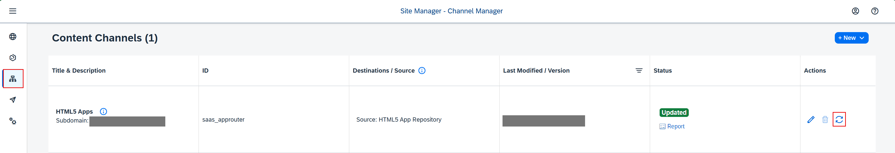

#### Add application to Content Explorer

1. Choose **Content Manager** in the menu on the left and choose the **Content Explorer** button.

    <!-- border; size:540px --> 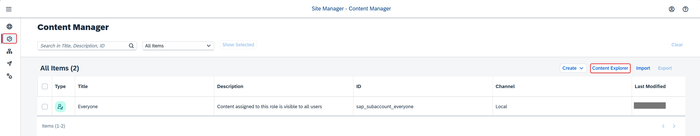

6. Select the tile **HTML5 Apps** with your respective subdomain name.

    <!-- border; size:540px --> 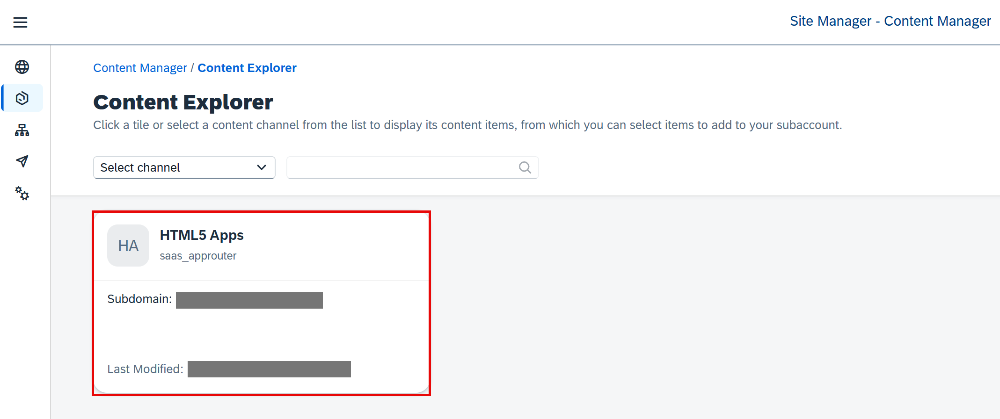

7. In the items table, set checkmark for the app **Incidents** and choose the button **Add**.

    <!-- border; size:540px --> 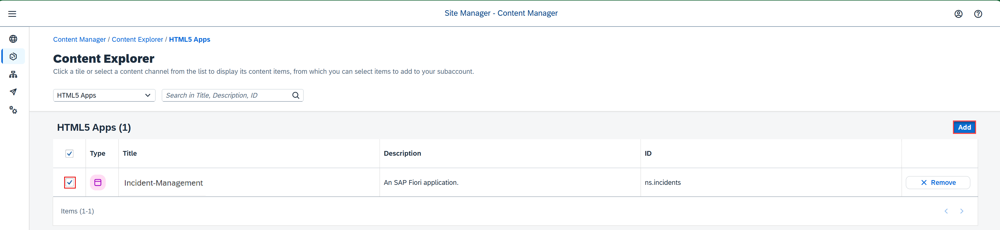

#### Create a group

1. Go back to the **Content Manager**, choose **Create** &rarr; **Group**.

    <!-- border; size:540px --> 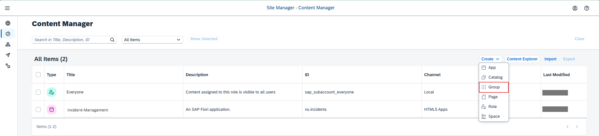

9. Add the title **Incident Management Group**.

10. In the **Assignment Status**, choose the slider to assign the **Incident-Management** app to the group.

11. Choose **Save**.

    <!-- border; size:540px --> 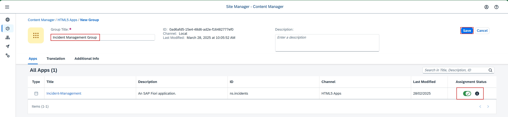

#### Add application to the Everyone role

1. Back in the **Content Manager**, choose role **Everyone** and choose **Edit**.

13. In the **Assignment Status**, choose the slider to assign the **Incident-Management** app to the role.

14. Choose **Save**.

    <!-- border; size:540px --> 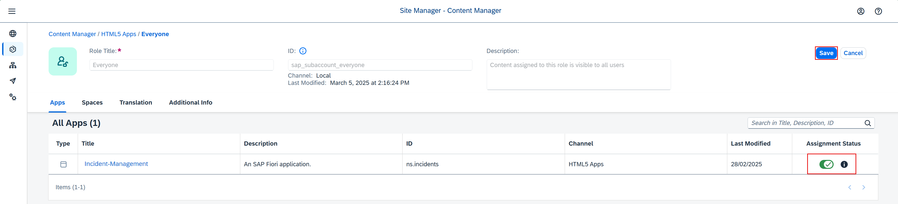

#### Create site

1. Navigate to **Site Directory** and choose **Create Site**.

    <!-- border; size:540px --> 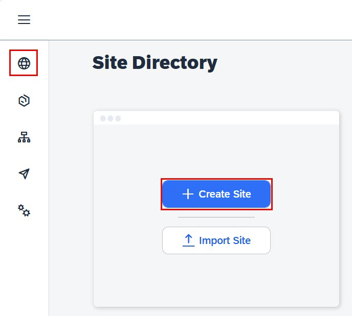

17. Enter the site name as **Incident Management Site** and choose **Create**.

    <!-- border; size:540px --> 

18. Now, you are forwarded to your created site.

[OPTION END]

[OPTION BEGIN [Common Data Model]]

The Common Data Model (CDM) is the basis for interoperability and content federation of business content from various SAP and third-party products, all integrated in a unified manner in one site that serves as a central entry point. Business content items such as roles, catalogs, groups, spaces, and pages can be included in the CDM. For this purpose, developers must specify the business content of the site in a **cdm.json** file that is part of the multitarget application (MTA) and also define design-time and runtime destinations in the **mta.yaml** file. For more information, see [Developing HTML5 Business Solutions as Content Providers](https://help.sap.com/docs/build-work-zone-advanced-edition/sap-build-work-zone-advanced-edition/developing-html5-apps-for-cross-subaccount-consumption) and [About the Common Data Model](https://help.sap.com/docs/build-work-zone-advanced-edition/sap-build-work-zone-advanced-edition/creating-cdm-json-file-for-multi-tenancy-html5-app).

#### Update the Chart.yaml file and the values.yaml file

1. Add the following code snippet to **chart/Chart.yaml** file:

    ```yaml
    - name: service-instance
      alias: html5-apps-repo-runtime
      version: ">0.0.0"
    ```

2. Run the following command to automate the setup for HTML5 application deployment:

    ```bash
    cds add html5-repo
    ```

3. Add the following configurations for creating an `html5-apps-repo-runtime` service instance in the **values.yaml** file:

    ```yaml
    html5-apps-repo-runtime: 
      serviceOfferingName: html5-apps-repo
      servicePlanName: app-runtime
    ```

4. Delete the destination configuration from **chart/values.yaml**:

    ```yaml
    destination:
      serviceOfferingName: 'destination'
      servicePlanName: 'lite'
      parameters:
        version: '1.0.0'
        HTML5Runtime_enabled: true
    ```


5. Update the `html5-apps-deployer` section:

    1. Delete the `SAP_CLOUD_SERVICE`line and the lines `destination:` and `serviceInstanceName: destination`:

        ```yaml
        html5-apps-deployer:
          env:
            SAP_CLOUD_SERVICE: incidentmanagementservice
          image:
            repository: "incident-management-html5-deployer"
          bindings:
            xsuaa:
              serviceInstanceName: xsuaa
            destination:
              serviceInstanceName: destination
        ```
    
    2. Delete `envFrom:` and the fields under it:

        ```yaml
        envFrom:
        - configMapRef:
            name: "{{ .Release.Name }}-html5-apps-deployer-configmap"
        ```

    3. Delete `backendDestinations:` and its properties.

    4. Under `env`, add the following:.

        ```yaml[2-3]
          env:
             ASYNC_UPLOAD: "true"
             destinations: '[{"forwardAuthToken":true,"name":"srv-api","url":"https://incident-management-srv-incident-management.<cluster-domain>"}]'
        ```

    > Update the placeholder `<cluster-domain>` with the domain of your Kyma cluster.
    >
    > Run the following command to get your Kyma cluster's domain:
    >
    > ```bash
    > kubectl get gateway -n kyma-system kyma-gateway \
    >        -o jsonpath='{.spec.servers[0].hosts[0]}'
    > ```
    > Add the result without the leading `*.` in the placeholder `<cluster-domain>`.

    
    > You can find the value for `<cloud-service-name>` in the **app/incidents/webapp/manifest.json** file.
    > ```json[3]
    > "sap.cloud": {
    >    "public": true,
    >    "service": "incidents"
    >}
    >```

<!-- 6. Verify. Here's how your **values.yaml** file should look like at this stage: -->
<!--     -->
<!--    ```yaml  -->
<!--    ...      -->
<!--    ```      -->

#### Create the CDM configuration

1. In the **ui-resources/resources** folder, create a new file **cdm.json** and paste the following code snippet in the file:

    ```json
    [
        {
        "_version": "3.0",
        "identification": {
            "id": "defaultCatalogId",
            "title": "{{title}}",
            "entityType": "catalog"
        },
        "payload": {
            "viz": [
            {
                "appId": "ns.incidents",
                "vizId": "incidents-display"
            }
            ]
        },
        "texts": [
            {
            "locale": "",
            "textDictionary": {
                "title": "Default Catalog Title"
            }
            }
        ]
        },
        {
        "_version": "3.0",
        "identification": {
            "id": "defaultGroupId",
            "title": "{{title}}",
            "entityType": "group"
        },
        "payload": {
            "viz": [
            {
                "appId": "ns.incidents",
                "vizId": "incidents-display"
            }
            ]
        },
        "texts": [
            {
            "locale": "",
            "textDictionary": {
                "title": "Business Apps"
            }
            }
        ]
        },
        {
        "_version": "3.0",
        "identification": {
            "id": "defaultRole",
            "entityType": "role",
            "title": "Default Role"
        },
        "payload": {
            "apps": [
            {
                "id": "ns.incidents"
            }
            ],
            "catalogs": [
            {
                "id": "defaultCatalogId"
            }
            ],
            "groups": [
            {
                "id": "defaultGroupId"
            }
            ]
        }
        }
    ]
    ```

#### Build the images and deploy your application in SAP BTP, Kyma runtime

1. Build the UI deployer image:

    ```bash
    pack build <your-container-registry>/incident-management-html5-deployer:<image-version> \
        --path ui-resources \
        --builder paketobuildpacks/builder-jammy-base \
        --publish
    ```

    > Make sure to replace `<your-container-registry>` with the link to your container registry and keep in mind that `<image version>` should be a string. 
    
    > Looking for your docker server URL?
    
    > The docker server URL is the same as the path used for docker login, so you can quickly check it by running the following command in your terminal:

    > ```json
    > cat ~/.docker/config.json
    > ```

    > In case you're using Docker Hub as your container registry, replace the placeholder `<your-container-registry>` with your Docker Hub user ID.


1. Update the productive CAP build for your application: 

    ```bash
    cds build --production
    ```

3. Deploy using the Helm command:

    ```bash
    helm upgrade --install incident-management --namespace incident-management ./gen/chart \
    --set-file xsuaa.jsonParameters=xs-security.json
    ```

    > With the ***helm upgrade --install*** command you can install a new chart as well as upgrade an existing chart.

#### Create destinations

When the application is successfully deployed, you have to configure design and runtime destinations. This enables SAP Build Work Zone, standard edition to configure sites with the application configurations like groups, roles, categories, and so on.

1. Create runtime destination:

    1. Navigate to your subaccount and choose **Connectivity** &rarr; **Destinations** on the left.

    2. Choose **Create Destination**.

          <!-- border; size:540px --> 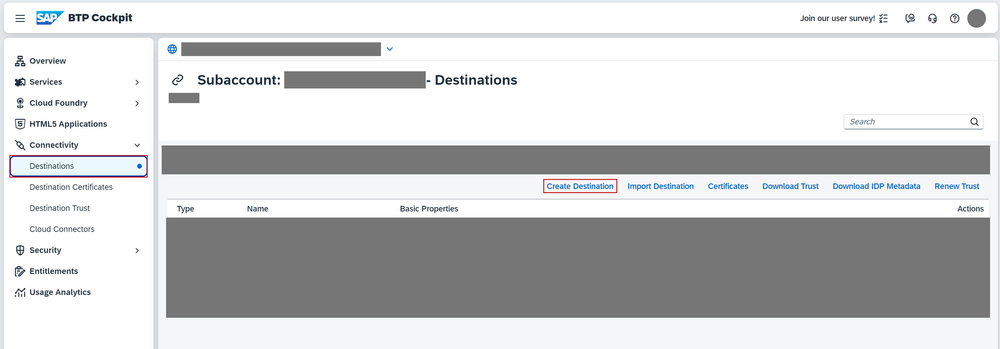

    1. Enter the following values:

        - **Name** = `incident-management-rt`
        - **Type** = `HTTP`
        - **URL** = `https://<subaccount-subdomain>.launchpad.cfapps.sap.hana.ondemand.com`
        - **Proxy Type** = `Internet`
        - **Authentication** = `NoAuthentication`

    2. Choose **New Property** on the right and add the following property:

        - **CEP.HTML5contentprovide** = `true`
    
    2. Select the **Use default JDK truststore** checkbox and choose **Save**.

          <!-- border; size:540px --> 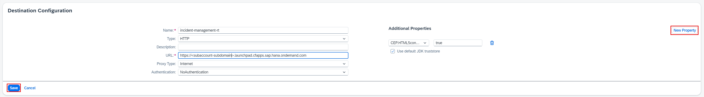

    4. Choose **Check Connection**. You should get a message `Connection to "incident-management-rt" established. Response returned: "400: Bad Request"`.


2. Create a service binding in your Kyma cluster:

    1. Navigate to your subaccount and choose **Link to dashboard** under the **Kyma Environment** tab to open the Kyma Console.

          <!-- border; size:540px --> 

    2. Choose **Namespaces** on the left and choose **incident-management**.

          <!-- border; size:540px --> 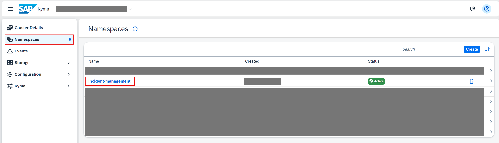 

    2. Choose **Service Management** &rarr; **Service Bindings** and choose **Create**.

          <!-- border; size:540px --> 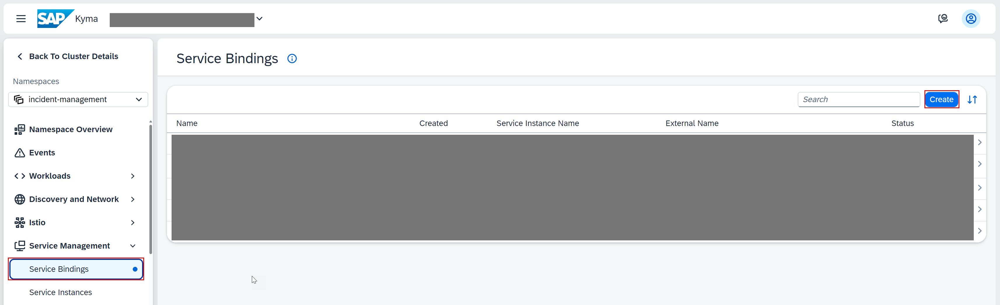 

    3. In the **Name** field, enter `incidents-runtime`.

    4. In the **Service Instance Name** dropdown, choose `incident-management-html5-apps-repo-runtime` and choose **Create**. 

          <!-- border; size:540px --> 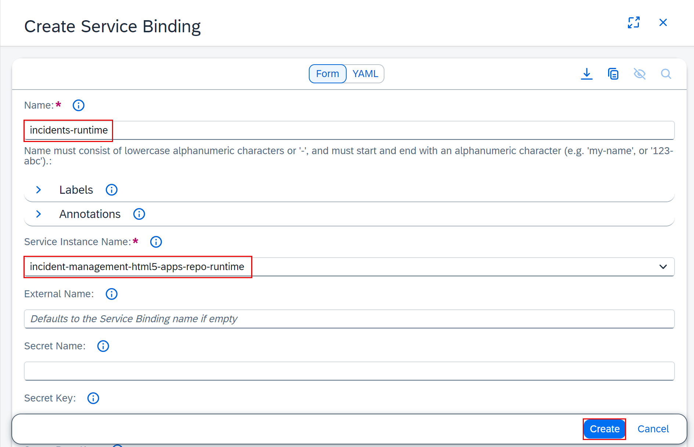 
        

    4. When the status of the service binding changes to **Provisioned**, scroll to the **Specification** section and choose the **Secret Name** **incidents-runtime**.

          <!-- border; size:540px --> 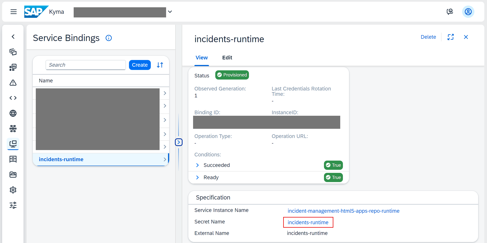 

    5. In the **incidents-runtime** secret's page, scroll to the **Data** section and choose **Decode**.

          <!-- border; size:540px --> 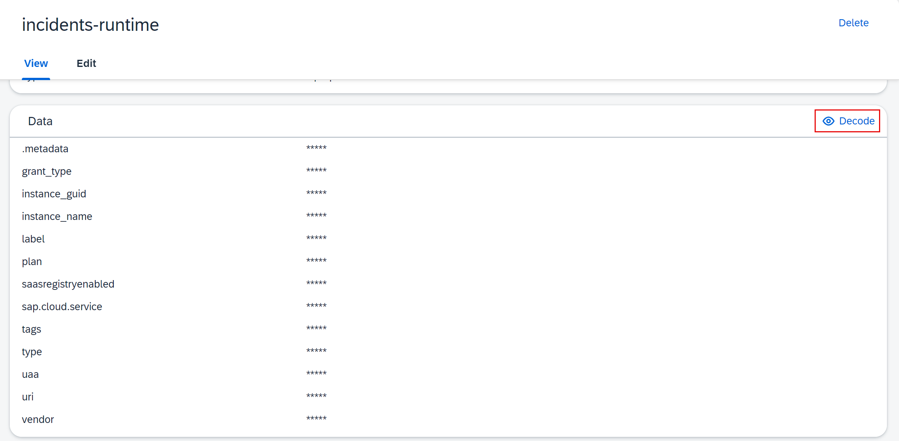 
    
    6. Keep the decoded details at hand, you will need them in the next step.


2. Create design-time destination:

    1. Navigate to your subaccount and choose **Connectivity** &rarr; **Destinations** on the left.

    2. Choose **Create Destination**.

    1. Enter the following values:

        - **Name** = `incident-management_cdm`
        - **Type** = `HTTP`
        - **URL** = `https://html5-apps-repo-rt.cfapps.<subaccount-region>.hana.ondemand.com/applications/cdm/<sap-app-id>`
        - **Proxy Type** = `Internet`
        - **Authentication** = `OAuth2ClientCredentials`
        - **Client ID** =  `<Client ID from decoded secret details>`
        - **Client Secret** =  `<Client Secret from decoded secret details>`
        - **Token Service URL** =  `<url from decoded secret details>` + `/oauth/token`

    2. Choose **New Property** on the right and add the following properties:

        - **grant_type** = `client_credentials`
        - **saasregistryenabled** = `true`
        - **sap.cloud.service** = `html5-apps-repo-rt`
        - **ServiceKeyName** = `incidents-runtime`
        - **uri** = `uri from decoded secret details`
        - **xsappname** = `xsappname from decoded secret details`

        <!-- border; size:540px --> 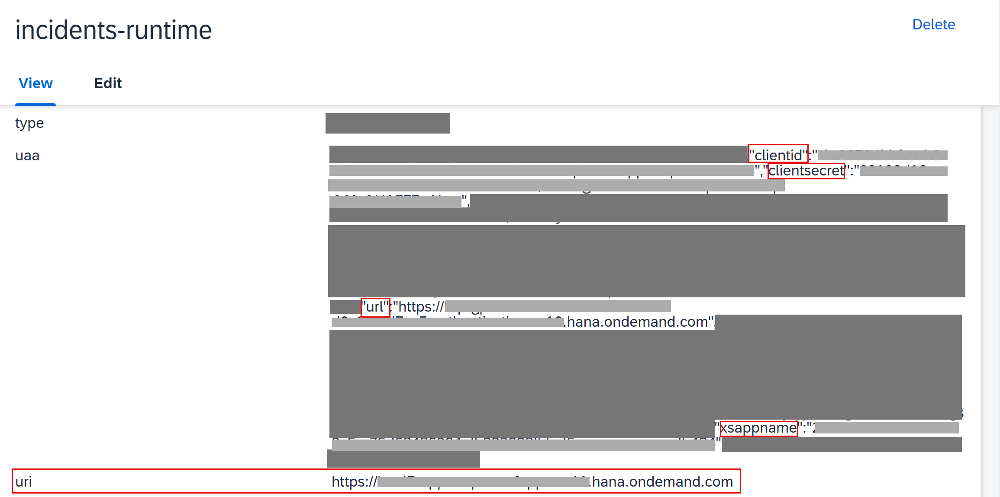
    
    2. Select the **Use default JDK truststore** checkbox.

    3. Save your settings.

    4. Choose **Check Connection**. You should get a message `Connection to "incident-management_cdm" established. Response returned: "401: Unauthorized"`.

        <!-- border; size:540px --> 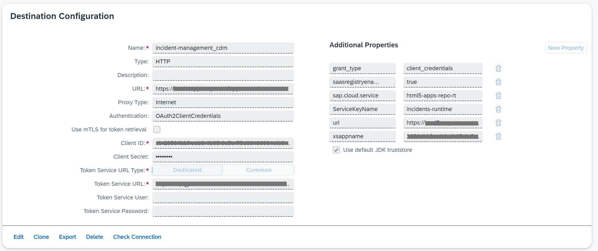

#### Create a new content provider

1. Open your subaccount and navigate to **Instances and Subscriptions**.

2. Choose the application **SAP Build Work Zone, standard edition**.

    <!-- border; size:540px --> 

3. In the menu on the left side, choose the icon for **Channel Manager**.

4. Choose **New** &rarr; **Content Provider** on the right.

    <!-- border; size:540px --> 

5. In the **New Content Provider** dialog:

    1. Enter **CDM** in the **Title** field.

    2. Choose **incident-management_cdm** from the dropdown in the **Design-Time Destination** field.

    3. Choose **incident-management-rt** from the dropdown in the **Runtime Destination** field.

    4. Choose **Save**.


     <!-- border; size:540px --> 


6. Choose the refresh icon to fetch the updated content from the **CDM** content provider. 

    <!-- border; size:540px --> 

#### Create site

1. Navigate to **Site Directory** and choose **Create Site**.

    <!-- border; size:540px --> 

17. Enter the site name as **Incident Management Site** and choose **Create**.

    <!-- border; size:540px --> 

18. When you are forwarded to your created site, choose **Edit**.

    <!-- border; size:540px --> 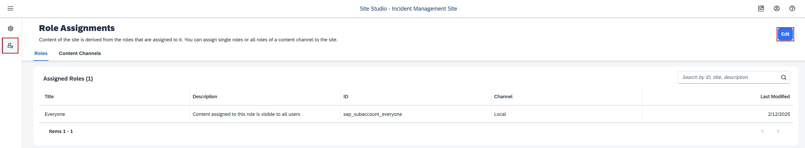

19. Choose the **Assign Items** field, add **+** the **Default Role** to your site and choose **Save**.

    <!-- border; size:540px --> 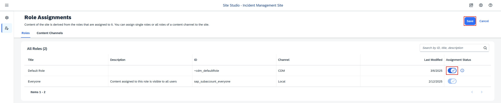

#### Assign CDM role collection

You need to assign your user to the **~cdm_defaultRole** role collection, so you are able to see the application tile when accessing the **Incident Management Site** in SAP Build Work Zone, standard edition later on.

1. Open your subaccount and navigate to **Security** &rarr; **Users**.

2. Choose your user.

4. Under **Role Collections** on the right, choose **Assign Role Collection** and assign the **~cdm_defaultRole** role collection to your user.

    <!-- border; size:540px --> 

    You've assigned the **~cdm_defaultRole** role collection to your user.

> You might need to log out and log in again to make sure your new role collection is taken into account.

[OPTION END]

### Test your site

1. Navigate to **Site Directory** and find your site.

    <!-- border; size:540px --> 

21. Choose **Go to site**. 

    <!-- border; size:540px --> 

3. Choose the Incident Management application from the launch page. 

    <!-- border; size:540px --> 

    You should be able to see the list report page.

    <!-- border; size:540px --> 

### Summary

Congratulations! You now have finished the development of your application and you have integrated SAP Build Work Zone, standard edition to have one central entry point to show all of your SAP BTP applications.
