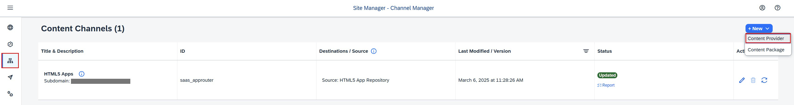
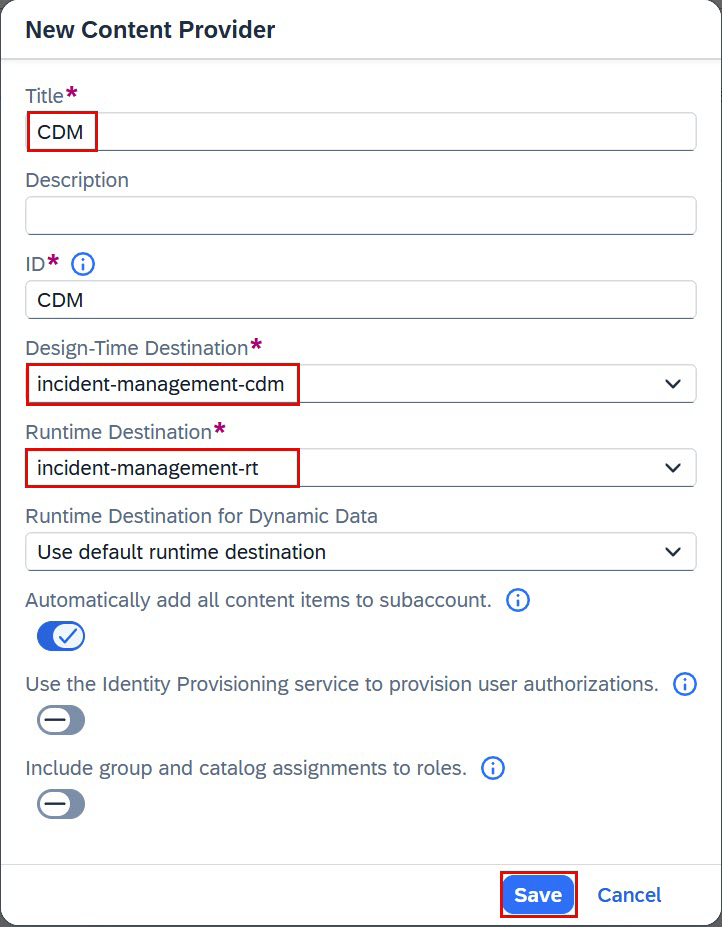
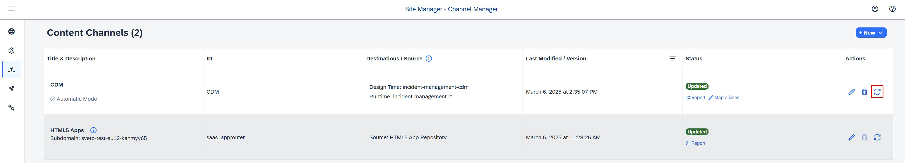
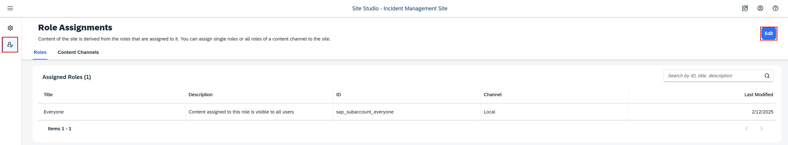
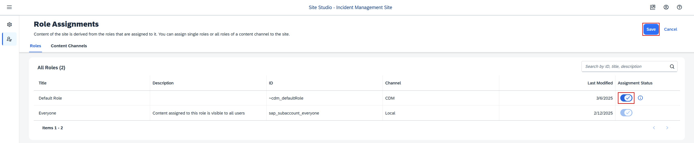

## You will learn

- How to subscribe to SAP Build Work Zone, standard edition.
- How to assign the SAP Build Work Zone, standard edition role collection to your user.
- How to integrate your application with SAP Build Work Zone, standard edition.

## Prerequisites

- You've created a role collection and assigned it to a user. Follow the steps in the [Assign the User Roles](user-role-assignment) tutorial that is part of the [Deploy a Full-Stack CAP Application in SAP BTP, Cloud Foundry Runtime Following SAP BTP Developer’s Guide](https://developers.sap.com/group.deploy-full-stack-cap-application.html) tutorial group.
- You have an [enterprise global account](https://help.sap.com/docs/btp/sap-business-technology-platform/getting-global-account#loiod61c2819034b48e68145c45c36acba6e) in SAP BTP. To use services for free, you can sign up for an SAP BTPEA (SAP BTP Enterprise Agreement) or a Pay-As-You-Go for SAP BTP global account and use the free tier services only. See [Using Free Service Plans](https://help.sap.com/docs/btp/sap-business-technology-platform/using-free-service-plans?version=Cloud).
- You have a platform user. See [User and Member Management](https://help.sap.com/docs/btp/sap-business-technology-platform/user-and-member-management).
- You're an administrator of the global account in SAP BTP.
- You have a subaccount in SAP BTP to deploy the services and applications.
- You have a tenant of SAP Cloud Identity Services. See [Get Your Tenant](https://help.sap.com/docs/cloud-identity-services/cloud-identity-services/get-your-tenant) for details how to get a tenant of SAP Cloud Identity Services if you don't have one yet.
- You've established trust between your tenant of SAP Cloud Identity Services and your SAP BTP account. This established trust allows you to use your SAP Cloud Identity Services tenant as an identity provider or a proxy to your own identity provider hosting your business users. See [Establish Trust and Federation Between SAP Authorization and Trust Management Service and SAP Cloud Identity Services](https://help.sap.com/docs/btp/sap-business-technology-platform/establish-trust-and-federation-between-uaa-and-identity-authentication).
- You have one of the following browsers that are supported for working in SAP Business Application Studio:
    - Mozilla Firefox
    - Google Chrome
    - Microsoft Edge

> This tutorial follows the guidance provided in the [SAP BTP Developer's Guide](https://help.sap.com/docs/btp/btp-developers-guide/what-is-btp-developers-guide).

### Subscribe to SAP Build Work Zone, standard edition

1. Navigate to your subaccount and choose **Services** &rarr; **Service Marketplace** on the left.

3. Search for the **SAP Build Work Zone, standard edition** tile and choose **Create**.

    <!-- border; size:540px --> 

4. Keep the default setting for **Service** and choose **free** for **Plan**.

5. Choose **Create**.

    <!-- border; size:540px --> 

You have now subscribed to the SAP Build Work Zone, standard edition.

### Assign SAP Build Work Zone, standard edition role collection

You need to assign your user to the **Launchpad_Admin** role collection, so you don't get an error accessing the **SAP Build Work Zone, standard edition** site later on.

1. Choose **Security** &rarr; **Users** on the left.

2. Choose your user.

4. Under **Role Collections** on the right, choose **Assign Role Collection** and assign the **Launchpad_Admin** role collection to your user.

    <!-- border; size:540px --> 

    You've assigned the **Launchpad_Admin** role collection to your user.

> Log out and log back in to make sure your new role collection is considered.

> See section [Initial Setup](https://help.sap.com/viewer/8c8e1958338140699bd4811b37b82ece/Cloud/en-US/fd79b232967545569d1ae4d8f691016b.html) in the SAP Build Work Zone, standard edition's documentation for more details.
   
###  Integrate your application with SAP Build Work Zone, standard edition

> There are two different ways to integrate your application with SAP Build Work Zone, standard edition. You have to choose one way or the other and follow through. It's currently not possible to mix the approaches. Both ways provide the same result. You can integrate your application with SAP Build Work Zone, standard edition through the SAP BTP cockpit or through Common Data Model. The tabs **SAP BTP cockpit** and **Common Data Model** provide detailed steps for each alternative way.  

[OPTION BEGIN [SAP BTP Cockpit]]

#### Update content

1. Open your subaccount and navigate to **Instances and Subscriptions**.

2. Choose the application **SAP Build Work Zone, standard edition**.

    <!-- border; size:540px --> 

3. In the menu on the left side, choose the icon for **Channel Manager**.

4. Fetch the updated content.

    <!-- border; size:540px --> 

#### Add application to Content Explorer

1. Choose **Content Manager** in the menu on the left and choose **Content Explorer**.

    <!-- border; size:540px --> 

6. Select the tile **HTML5 Apps** with your respective subdomain name.

    <!-- border; size:540px --> 

7. In the items table, select the checkbox for **incident-management** app and choose **Add**.

    <!-- border; size:540px --> 

#### Create a group

1. Go back to the **Content Manager** and choose **Create** &rarr; **Group**.

    <!-- border; size:540px --> 

9. In the **Group title** field, enter **Incident Management Group**.

10. Assign the **Incident-Management** app to the group.

11. Choose **Save**.

    <!-- border; size:540px --> 

#### Add application to the Everyone role

1. Back in the **Content Manager**, choose the **Everyone** role and choose **Edit**.

13. In the **Assignment Status**, assign the **Incident-Management** app to the role.

14. Choose **Save**.

    <!-- border; size:540px --> 

#### Create site

1. Navigate to **Site Directory** and choose **Create Site**.

    <!-- border; size:540px --> 

17. In the **Site Name** field, enter **Incident Management Site** and choose **Create**.

    <!-- border; size:540px --> 

18. Now, you're forwarded to your created site.

[OPTION END]

[OPTION BEGIN [Common Data Model]]

The Common Data Model (CDM) is the basis for interoperability and content federation of business content from various SAP and third-party products, all integrated in a unified manner in one site that serves as a central entry point. Business content items such as roles, catalogs, groups, spaces, and pages can be included in the CDM. For this purpose, developers must specify the business content of the site in a **cdm.json** file that is part of the multitarget application (MTA) and also define design-time and runtime destinations in the **mta.yaml** file. For more information, see [Developing HTML5 Business Solutions as Content Providers](https://help.sap.com/docs/build-work-zone-advanced-edition/sap-build-work-zone-advanced-edition/developing-html5-apps-for-cross-subaccount-consumption) and [About the Common Data Model](https://help.sap.com/docs/build-work-zone-advanced-edition/sap-build-work-zone-advanced-edition/creating-cdm-json-file-for-multi-tenancy-html5-app).


#### Create the CDM configuration

1. Create a new folder **workzone** in the root of your project.

2. Create file **cdm.json** in the **workzone** folder and paste the following code snippet in the file:

    ```json
    [
        {
        "_version": "3.0",
        "identification": {
            "id": "defaultCatalogId",
            "title": "{{title}}",
            "entityType": "catalog"
        },
        "payload": {
            "viz": [
            {
                "appId": "ns.incidents",
                "vizId": "incidents-display"
            }
            ]
        },
        "texts": [
            {
            "locale": "",
            "textDictionary": {
                "title": "Default Catalog Title"
            }
            }
        ]
        },
        {
        "_version": "3.0",
        "identification": {
            "id": "defaultGroupId",
            "title": "{{title}}",
            "entityType": "group"
        },
        "payload": {
            "viz": [
            {
                "appId": "ns.incidents",
                "vizId": "incidents-display"
            }
            ]
        },
        "texts": [
            {
            "locale": "",
            "textDictionary": {
                "title": "Business Apps"
            }
            }
        ]
        },
        {
        "_version": "3.0",
        "identification": {
            "id": "defaultRole",
            "entityType": "role",
            "title": "Default Role"
        },
        "payload": {
            "apps": [
            {
                "id": "ns.incidents"
            }
            ],
            "catalogs": [
            {
                "id": "defaultCatalogId"
            }
            ],
            "groups": [
            {
                "id": "defaultGroupId"
            }
            ]
        }
        }
    ]
    ```

#### Update the mta.yaml file

1. Add `html5-repo-runtime` under resources:

    ```yaml[3-7]
       resources:
        ...
        - name: incident-management-html5-repo-runtime
          type: org.cloudfoundry.managed-service
          parameters:
            service: html5-apps-repo
            service-plan: app-runtime
    ```

2. Update the `incident-management-destinations` module:

    1. Add the `incidents-html-repo-runtime` to the `requires` section:

        ```yaml[4-7]
        - name: incident-management-destinations
          type: com.sap.application.content
          requires:
          - name: incident-management-html5-repo-runtime
            parameters:
              service-key: 
                name: incident-management-html5-repo-runtime-service-key
        ```

    3. Add the following code snippet for subaccount destinations in the `parameters.content` section:

        ```yaml[7-12]
        - name: incident-management-destinations
          type: com.sap.application.content
          requires:
          ...
          parameters:
            content:
                subaccount:
                    destinations:
                    - Name: incident-management-cdm
                      ServiceInstanceName: incident-management-html5-repo-runtime
                      ServiceKeyName: incident-management-html5-repo-runtime-service-key
                      URL: https://html5-apps-repo-rt.${default-domain}/applications/cdm/<cloud-service-name>
                instance:
                    existing_destinations_policy: update
                    destinations:
                    ...
        ```
    
    > You can find the value for `<cloud-service-name>` in the **app/incidents/webapp/manifest.json** file.
    > ```json[3]
    > "sap.cloud": {
    >    "public": true,
    >    "service": "incidentmanagement.service"
    >}
    >```
    

4. Update the `incident-management-destination` resource:

    1. Add the following code snippet for destinations to the `parameters.config.init_data` section:

        ```[8-15]
        - name: incident-management-destination
          type: org.cloudfoundry.managed-service
          parameters:
            ...
            config:
            ...
              init_data:
                subaccount:
                  destinations:
                  - Name: incident-management-rt
                    Authentication: NoAuthentication
                    ProxyType: Internet
                    Type: HTTP
                    URL: https://<subdomain>.launchpad.${default-domain}
                    CEP.HTML5contentprovider: true
                instance:
                  existing_destinations_policy: update
                  destinations:
                  ...
        ```

        > Replace `<subdomain>` with your SAP BTP account's subdomain. You can find the subdomain in the **Overview** page in SAP BTP cockpit. 

5. Create a new module `incident-management-workzone-cdm` to add the CDM Configuration from the **cdm.json** file as part of the `incident-management-app-deployer`.

    ```yaml
      - name: incident-management-workzone-cdm
        type: html5
        path: workzone
        build-parameters:
          build-result: .
          supported-platforms:
            []
    ```

5. Update the `incident-management-app-deployer` module:

    1. Update (`path`, `build-result`, and `target-path` parameters) of the `incident-management-app-deployer` module as follows:

        ```yaml
        - name: incident-management-app-deployer
          type: com.sap.application.content
          path: gen
          ...
          build-parameters:
            build-result: app/
            requires:
              - name: incidentmanagementincidents
                artifacts:
                  - incidents.zip
                target-path: app/
        ```
        <!--  - the name of the destination inserted here should be the same as in the **xsapp.json** file `destination` parameter in the `routes` section. -->

    1. Add the following lines to the `requires` section:

        ```yaml[5-6]
          - name: incident-management-app-deployer
            type: com.sap.application.content
            path: gen
            requires:
              - name: incident-management-auth
              - name: incident-management-destination
        ```

    2. Add the following to the `build-parameters.requires  ` section:

        ```yaml
          - name: incident-management-workzone-cdm
            artifacts:
              - cdm.json
            target-path: app/
        ```

6. Verify. Here's how your **mta.yaml** file looks like at this stage:

    ```yaml
    _schema-version: 3.3.0
    ID: incident-management
    version: 1.0.0
    description: "A simple CAP project."
    parameters:
      enable-parallel-deployments: true
      deploy_mode: html5-repo
    build-parameters:
      before-all:
        - builder: custom
          commands:
            - npm ci
            - npx cds build --production
    modules:
      - name: incident-management-srv
        type: nodejs
        path: gen/srv
        parameters:
          buildpack: nodejs_buildpack
          readiness-health-check-type: http
          readiness-health-check-http-endpoint: /health
        build-parameters:
          builder: npm
        provides:
          - name: srv-api # required by consumers of CAP services (e.g. approuter)
            properties:
              srv-url: ${default-url}
        requires:
          - name: incident-management-db
          - name: incident-management-auth
          - name: incident-management-destination

      - name: incident-management-db-deployer
        type: hdb
        path: gen/db
        parameters:
          buildpack: nodejs_buildpack
        requires:
          - name: incident-management-db

        - name: incident-management-app-deployer
          type: com.sap.application.content
          path: gen
          requires:
            - name: incident-management-auth
            - name: incident-management-destination
            - name: incident-management-html5-repo-host
              parameters:
                content-target: true
          build-parameters:
            build-result: app/
            requires:
              - name: incident-management-workzone-cdm
                artifacts:
                  - cdm.json
                target-path: app/
              - name: incidentmanagementincidents
                artifacts:
                  - incidents.zip
                target-path: app/
      
      - name: incident-management-app-deployer
        type: com.sap.application.content
        path: gen
        parameters:
          config:
            destinations:
            - forwardAuthToken: true
              name: incident-management-srv-api
              url: ~{srv-api/srv-url}
            - name: ui5
              url: https://ui5.sap.com
        requires:
          - name: srv-api
          - name: incident-management-auth
          - name: incident-management-html5-repo-host
            parameters:
              content-target: true
        build-parameters:
          build-result: app/
          requires:
            - name: incident-management-workzone-cdm
              artifacts:
                - cdm.json
              target-path: app/
            - name: incidentmanagementincidents
              artifacts:
                - incidents.zip
              target-path: app/

      - name: incidentmanagementincidents
        type: html5
        path: app/incidents
        build-parameters:
          build-result: dist
          builder: custom
          commands:
            - npm ci
            - npm run build
          supported-platforms:
            []

      - name: incident-management-destinations
        type: com.sap.application.content
        requires:
          - name: incidents_html_repo_runtime
            parameters:
              service-key:
                name: incidents-html5-app-runtime-service-key
          - name: incident-management-auth
            parameters:
              service-key:
                name: incident-management-auth-key
          - name: incident-management-html5-repo-host
            parameters:
              service-key:
                name: incident-management-html5-repo-host-key
          - name: srv-api
          - name: incident-management-destination
            parameters:
              content-target: true
        build-parameters:
          no-source: true
        parameters:
          content:
            subaccount:
              existing_destinations_policy: update
              destinations:
                - Name: incident-management_cdm
                  ServiceInstanceName: incidents-html5-app-runtime-service
                  ServiceKeyName: incidents-html5-app-runtime-service-key
                  URL: https://html5-apps-repo-rt.${default-domain}/applications/cdm/<cloud-service-name>

    resources:
      - name: incident-management-db
        type: com.sap.xs.hdi-container
        parameters:
          service: hana
          service-plan: hdi-shared
      - name: incident-management-html5-repo-host
        type: org.cloudfoundry.managed-service
        parameters:
          service: html5-apps-repo
          service-plan: app-host
      - name: incident-management-auth
        type: org.cloudfoundry.managed-service
        parameters:
          service: xsuaa
          service-plan: application
          path: ./xs-security.json
          config:
            xsappname: incident-management-${org}-${space}
            tenant-mode: dedicated
      - name: incidents_html_repo_runtime
        type: org.cloudfoundry.managed-service
        parameters:
          service: html5-apps-repo
          service-name: incidents-html5-app-runtime-service
          service-plan: app-runtime
      - name: incident-management-destination
        type: org.cloudfoundry.managed-service
        parameters:
          service: destination
          service-plan: lite
          config:
            init_data:
              subaccount:
                existing_destinations_policy: update
                destinations:
                  - Authentication: NoAuthentication
                    Name: incident-management-rt
                    ProxyType: Internet
                    Type: HTTP
                    URL: https://<subdomain>.launchpad.${default-domain}
                    CEP.HTML5contentprovider: true
  
    ```

#### Deploy your application in SAP BTP, Cloud Foundry runtime

1. Open a terminal in your project's root folder and run the following commands:

    ```bash
    mbt build
    cf deploy mta_archives/incident-management_1.0.0.mtar 
    ```

#### Create a new content provider

1. Open your subaccount and navigate to **Instances and Subscriptions**.

2. Choose the application **SAP Build Work Zone, standard edition**.

    <!-- border; size:540px --> 

3. In the menu on the left side, choose the icon for **Channel Manager**.

4. Choose **New** &rarr; **Content Provider** on the right.

    <!-- border; size:540px --> 

5. In the **New Content Provider** dialog:

    1. In the **Title** field еnter **CDM**.

    2. In the **Design-Time Destination** field, choose **incident-management-cdm** from the dropdown.

    3. In the **Runtime Destination** field, choose **incident-management-rt** from the dropdown.

    4. Choose **Save**.


     <!-- border; size:540px --> 


6. Fetch the updated content from the **CDM** content provider. 

    <!-- border; size:540px --> 

#### Create site

1. Navigate to **Site Directory** and choose **Create Site**.

    <!-- border; size:540px --> 

17. In the **Site Name** field, enter **Incident Management Site** and choose **Create**.

    <!-- border; size:540px --> 

18. When you're forwarded to your created site, choose **Role Assignments** and then choose **Edit**.

    <!-- border; size:540px --> 

19. In the **Assignment status** field, switch on **Default Role** for your site and choose **Save**.

    <!-- border; size:540px --> 

#### Assign CDM role collection

You need to assign your user to the **~cdm_defaultRole** role collection, so you're able to see the application tile when accessing the **SAP Build Work Zone, standard edition** site later on.

1. Open your subaccount and navigate to **Security** &rarr; **Users**.

2. Choose your user.

4. Under **Role Collections** on the right, choose **Assign Role Collection** and assign the **~cdm_defaultRole** role collection to your user.

    <!-- border; size:540px --> 

    You've assigned the **~cdm_defaultRole** role collection to your user.

> Log out and log in again to make sure your new role collection is considered.

[OPTION END]

### Test your site

1. Navigate to **Site Directory** and find your site.

    <!-- border; size:540px --> 

21. Choose **Go to the site**. 

    <!-- border; size:540px --> 

3. Choose the Incident Management application from the launch page. 

    <!-- border; size:540px --> 

    You see the list report page.

    <!-- border; size:540px --> 

### Summary

Congratulations! You now have finished the development of your application and you've integrated SAP Build Work Zone, standard edition to have one central entry point to show all of your SAP BTP applications.
