## You will learn

- How to subscribe to SAP Build Work Zone, standard edition
- How to assign SAP Build Work Zone, standard edition role collection
- How to integrate with SAP Build Work Zone, standard

## Prerequisites

- You have an [enterprise global account](https://help.sap.com/docs/btp/sap-business-technology-platform/getting-global-account#loiod61c2819034b48e68145c45c36acba6e) in SAP BTP. To use services for free, you can sign up for a CPEA (Cloud Platform Enterprise Agreement) or a Pay-As-You-Go for SAP BTP global account and make use of the free tier services only. See [Using Free Service Plans](https://help.sap.com/docs/btp/sap-business-technology-platform/using-free-service-plans?version=Cloud).
- You have an S-user or P-user. See [User and Member Management](https://help.sap.com/docs/btp/sap-business-technology-platform/user-and-member-management).
- You are an administrator of the global account in SAP BTP.
- You have a subaccount in SAP BTP to deploy the services and applications.
- You have one of the following browsers that are supported for working in SAP Business Application Studio:
    - Mozilla Firefox
    - Google Chrome
    - Microsoft Edge
- You have created a role collection and assigned it to a user. See [Assign the User Roles](user-role-assignment).

### Subscribe to SAP Build Work Zone, standard edition

1. Navigate to your subaccount and choose **Services** &rarr; **Service Marketplace** on the left.

3. Search for the **SAP Build Work Zone, standard edition** tile and choose **Create**.

    <!-- border; size:540px --> 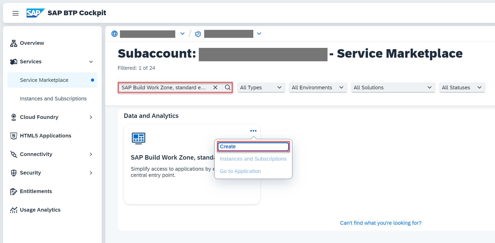

4. Keep the default setting for **Service** and choose **free** for **Plan**.

5. Choose **Create**.

    <!-- border; size:540px --> 

You have now subscribed to the SAP Build Work Zone, standard edition.

### Assign SAP Build Work Zone, standard edition role collection

You need to assign your user to the `Launchpad_Admin` role collection, so you don't get an error accessing the **SAP Build Work Zone, standard edition** site later on.

1. Choose **Security** &rarr; **Users** on the left.

2. Choose your user.

4. Under **Role Collections** on the right, choose **Assign Role Collection** and assign the **Launchpad_Admin** role collection to your user.

    <!-- border; size:540px --> 

    You've assigned the **Launchpad_Admin** role collection to your user.

> You might need to log out and log back in to make sure your new role collection is taken into account.

> See section [Initial Setup](https://help.sap.com/viewer/8c8e1958338140699bd4811b37b82ece/Cloud/en-US/fd79b232967545569d1ae4d8f691016b.html) in the SAP Build Work Zone, standard edition's documentation for more details.

###  Integrate with SAP Build Work Zone, standard edition

#### Update content

1. Open your subaccount and navigate to **Instances and Subscriptions**.

2. Choose the application **SAP Build Work Zone, standard edition**.

    <!-- border; size:540px --> 

3. In the menu on the left side, choose the icon for **Channel Manager**.

4. Choose the refresh icon to fetch the updated content.

    <!-- border; size:540px --> 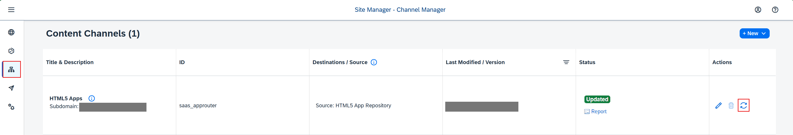

#### Add application to Content Explorer

5. Choose **Content Manager** in the menu on the left and choose the **Content Explorer** button.

    <!-- border; size:540px --> 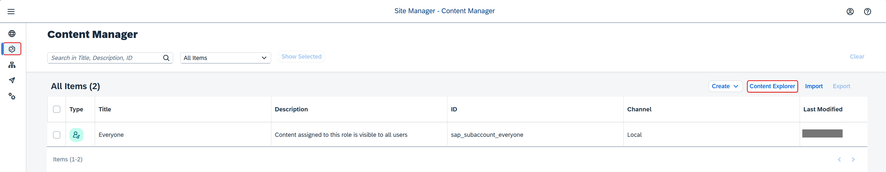

6. Select the tile **HTML5 Apps** with your respective subdomain name.

    <!-- border; size:540px --> 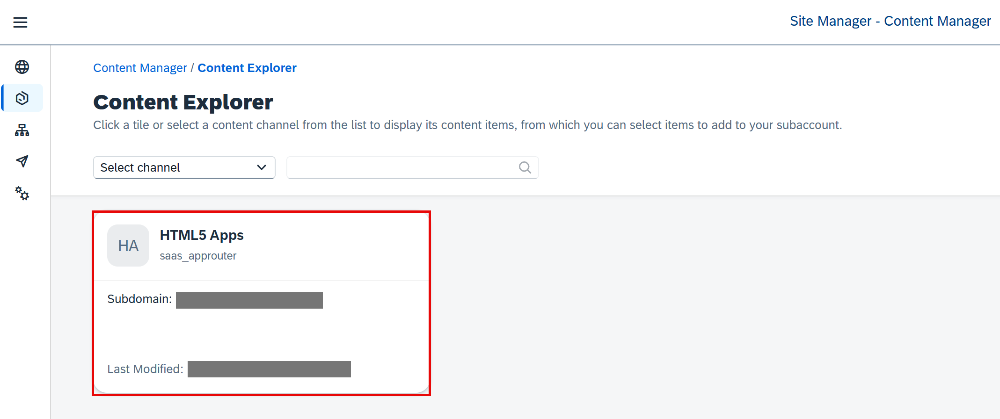

7. In the items table, set checkmark for the app **Incidents** and choose the button **Add**.

    <!-- border; size:540px --> 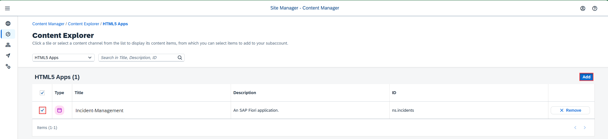

#### Create a group

8. Go back to the **Content Manager**, choose **Create** &rarr; **Group**.

    <!-- border; size:540px --> 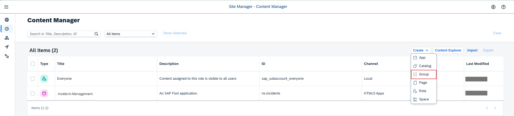

9. Add the title **Incident Management Group**.

10. In the **Assignment Status**, choose the slider to assign the **Incident-Management** app to the group.

11. Choose **Save**.

    <!-- border; size:540px --> 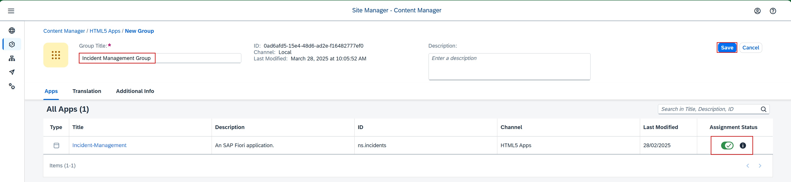

#### Add application to the Everyone role

12. Back in the **Content Manager**, choose role **Everyone** and choose **Edit**.

13. In the **Assignment Status**, choose the slider to assign the **Incident-Management** app to the role.

14. Choose **Save**.

    <!-- border; size:540px --> 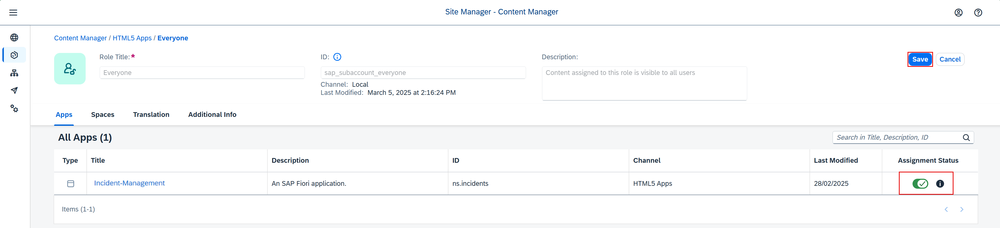

#### Create site

15. Navigate to **Site Directory** and choose **Create Site**.

    <!-- border; size:540px --> 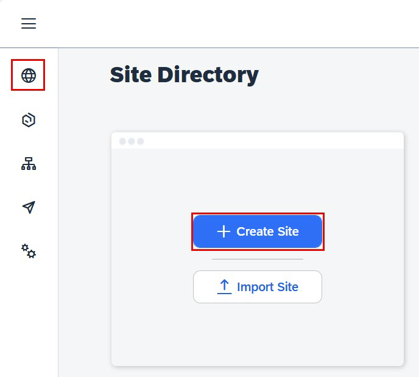

17. Enter the site name as **Incident Management Site** and choose **Create**.

    <!-- border; size:540px --> 

18. Now, you are forwarded to your created site.

#### Test your site

19. Navigate to **Site Directory** and find your site.

    <!-- border; size:540px --> 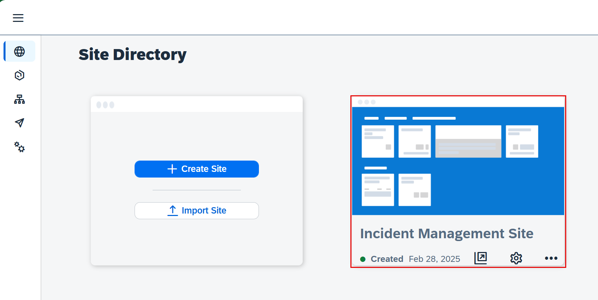

21. Choose **Go to site**. 

    <!-- border; size:540px --> 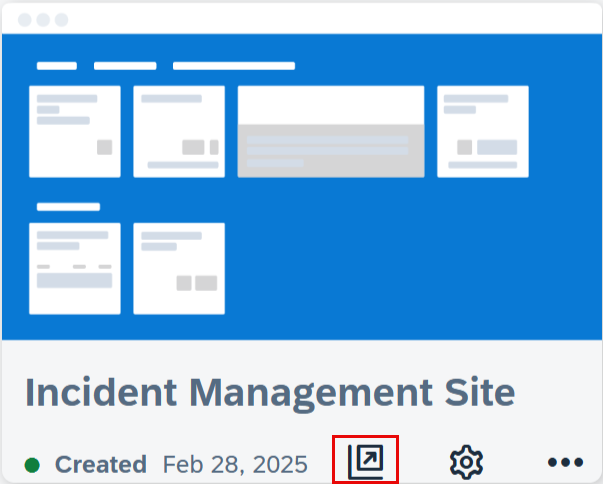

3. Choose the Incident Management application from the launch page. 

    <!-- border; size:540px --> 

    You should be able to see the list report page.

    <!-- border; size:540px --> 
 
### Summary

Congratulations! You now have finished the development of your application and you have integrated SAP Build Work Zone, standard edition service, to have one central entry point to show all of your SAP BTP applications.

**Note Sveto: Need to review all steps, add steps if missing, update screenshots, and edit all notes and summaries for consistency**.
