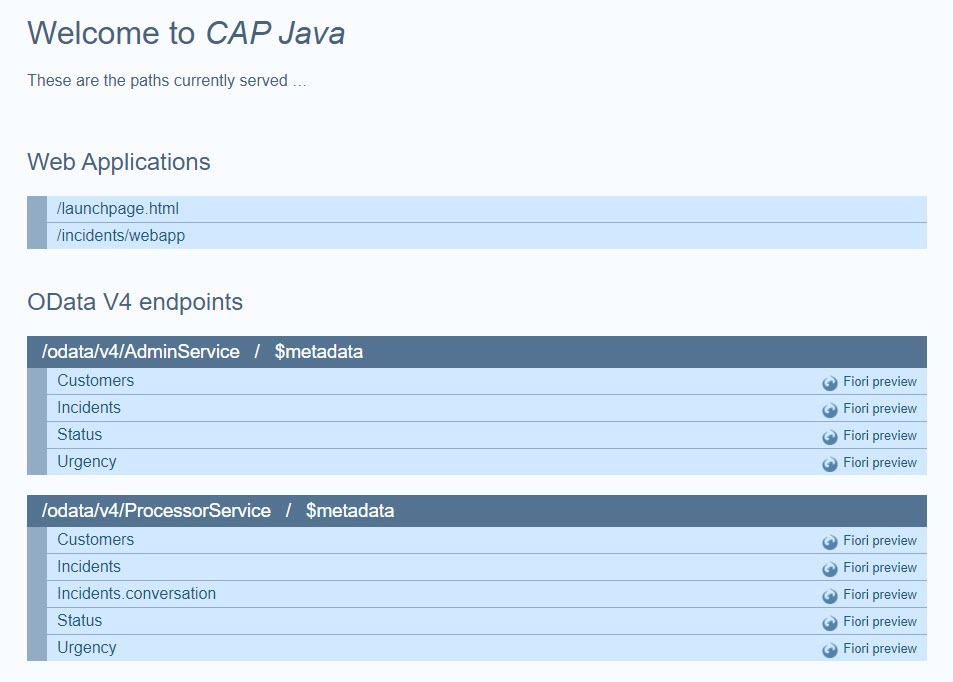

## You will learn

- How to configure SAP HANA Cloud in your project.
- How to configure the SAP Authorization and Trust Management service in your project.

## Prerequisites

You've added test cases in your application. Follow the steps in the [Add Test Cases](add-test-cases) tutorial that is part of the [Develop a Full-Stack CAP Application Following SAP BTP Developer’s Guide](https://developers.sap.com/group.cap-application-full-stack.html) tutorial group.

> This tutorial follows the guidance provided in the [SAP BTP Developer's Guide](https://help.sap.com/docs/btp/btp-developers-guide/what-is-btp-developers-guide).

### Add SAP HANA Cloud

> You can create a CAP project in either Node.js or Java. You have to choose one way or the other and follow through. The tabs **Node.js** and **Java** provide detailed steps for each alternative way.

[OPTION BEGIN [Node.js]]

1. In SAP Business Application Studio, go to your **IncidentManagement** dev space.

    > Make sure the **IncidentManagement** dev space is in status **RUNNING**.

2. From the root of the **INCIDENT-MANAGEMENT** project, choose the burger menu, and then choose **Terminal** &rarr; **New Terminal**.

3. To add an SAP HANA Cloud client to your application, run the following command:

    ```bash
    cds add hana --for production
    ```

    > The **cds add hana** command adds the `@sap/cds-hana` module that allows SAP HANA Cloud to access the **package.json** file and the database configuration `"db": "hana"` that uses SAP HANA Cloud when the application is started on production.
    >
    > The **cds add hana** command adds to the **package.json** file the `"@cap-js/hana": "^x"` dependency and the `cds.requires` `[production]` profile `"db": "hana"`.

    ```json
    {
        "name": "incident-management",
        "dependencies": {
            ...
            "@cap-js/hana": "^x"
        },
        ...
        "cds": {
            "requires": {
                ...
                "[production]": {
                    "db": "hana"
                }
            }
        }
        ...
    }
    ```
    
    > To learn more, see: 
    >
    > - [Using Databases](https://cap.cloud.sap/docs/guides/databases#get-hana)
    > - [CAP Configuration](https://cap.cloud.sap/docs/node.js/cds-env)
    >
    > By default, these profiles are available: 
    >
    > - For local testing: **development**
    > - For hybrid testing: **hybrid**
    > - For productive testing: **production** 
    >
    > Deployments are done using the **production** profile automatically. You can inspect the effective production configuration with the **cds env** command:
    > 
    > ```bash
    > cds env requires -4 production
    > ```
    >
    > The output of this command looks like this:
    >
    > ```bash
    > {
    >   middlewares: true,
    >   auth: { kind: 'jwt', vcap: { label: 'xsuaa' } },
    >   db: { impl: '@sap/cds/libx/_runtime/hana/Service.js', kind: 'hana' }
    > }
    >```

2. Verify that your application still works locally. If you closed it, choose the **Preview Application** option in the **Application Info - incidents** tab and select the **watch-incidents** npm script.

    > To open the **Application Info - incidents** tab: 
    >
    >1. Invoke the Command Palette - **View** &rarr; **Command Palette** or <kbd>Command</kbd> + <kbd>Shift</kbd> + <kbd>P</kbd> for macOS / <kbd>Ctrl</kbd> + <kbd>Shift</kbd> + <kbd>P</kbd> for Windows. 
    >2. Choose **Fiori: Open Application Info**.

[OPTION END]

[OPTION BEGIN [Java]]

1. In SAP Business Application Studio, go to your **IncidentManagement** dev space.

    > Make sure the **IncidentManagement** dev space is in status **RUNNING**.

2. From the root of the **INCIDENT-MANAGEMENT** project, choose the burger menu, and then choose **Terminal** &rarr; **New Terminal**.

3. To add an SAP HANA Cloud client to your application, run the following command:

    ```bash
    cds add hana --for production
    ```

    > The **cds add hana** command adds a dependency that contains `cds-feature-hana` dependency which is used to configure hana as production database.
    >
    > The **cds add hana** command adds to the **srv/pom.xml** file the highlighted lines:

    ```xml
    <dependency>
		        <groupId>com.sap.cds</groupId>
		        <artifactId>cds-starter-cloudfoundry</artifactId>
	      </dependency>
    ```
    
    > To learn more, see: 
    >
    > - [Using Databases](https://cap.cloud.sap/docs/guides/databases#get-hana)
    > - [CAP Configuration](https://cap.cloud.sap/docs/node.js/cds-env)
    >
    > By default, these profiles are available: 
    >
    > - For local testing: **development**
    > - For hybrid testing: **hybrid**
    > - For productive testing: **production** 
    >
    > Deployments are done using the **production** profile automatically. You can inspect the effective production configuration with the **cds env** command:
    > 
    > ```bash
    > cds env requires -4 production
    > ```
    >
    > The output of this command looks like this:
    >
    > ```bash
    > {
    >    db: {
    >      impl: '@sap/cds/libx/_runtime/hana/Service.js',
    >      kind: 'hana',
    >      'deploy-format': 'hdbtable'
    >    },
    >    auth: { strategy: 'JWT', kind: 'jwt-auth', vcap: { label: 'xsuaa' } },
    >    approuter: { kind: 'cloud-foundry' }
    >  }
    >```

2. Verify that your application still works locally. Navigate to the **srv** folder.

    ```bash
    cd srv
    ```


8. Run the following command to start a CAP Java server:


    ```bash
    mvn cds:watch
    ```

1. In the bottom right of your SAP Business Application Studio window, look for the popup **A service is listening to port 8080**.
 

2. Choose **Open in a New Tab**.

    <!-- border; size:540px --> 

3. You see the generic `index.html` page:

    <!-- border; size:540px --> 

> Stop the CAP server with <kbd>Ctrl</kbd> + <kbd>C</kbd> and start it again with the `mvn cds:watch` command.

[OPTION END]

### Configure the SAP Authorization and Trust Management service

[OPTION BEGIN [Node.js]]

1. Run the following command in the terminal:

    ```bash
    cds add xsuaa --for production
    ```

    > Running **cds add xsuaa** does two things:
    >
    >- Adds the SAP Authorization and Trust Management service (including the `"@sap/xssec": "^x"` dependency and the `cds.requires` `[production]` profile `"auth": "xsuaa"`) to the **package.json** file of the **INCIDENT-MANAGEMENT** project.
    >- Creates the SAP Authorization and Trust Management service security configuration (that is, the **xs-security.json** file) for the **INCIDENT-MANAGEMENT** project.

2. Make sure that the SAP Authorization and Trust Management configuration has been added to the **package.json** file:
    
    ```json
    {
      "name": "incident-management",
      "dependencies": {
          ...
          "@sap/xssec": "^x"
      },
      ...
      "cds": {
        "requires": {
          ...
          "[production]": {
            "db": "hana",
            "auth": "xsuaa"
          }
        ...
        }
      }
    }
    ```

    > In case any of the lines is missing, go ahead and add it manually. 

3. Check the content of the **xs-security.json** file.

    You have already added authorizations with the **requires** annotations in the CDS service model (that is the **services.cds** file in the **srv** folder). See [Add Authorization](add-authorization).

    ```CDS
    using { sap.capire.incidents as my } from '../db/schema';

    /**
    * Used by support team members to process incidents
    */
    service ProcessorService  {
      ...
    }
    annotate ProcessorService.Incidents with @odata.draft.enabled; 
    annotate ProcessorService with @(requires: 'support');

    service AdminService {
      ...
    }
    annotate AdminService with @(requires: 'admin');
    ```
    
    These authorizations are now translated into scopes and role templates for the SAP Authorization and Trust Management service. Hence, a scope and a role template are created in the **xs-security.json** file for the **support** role and for the **admin** role:

    ```json
    {
      "scopes": [
        {
          "name": "$XSAPPNAME.support",
          "description": "support"
        },
        {
          "name": "$XSAPPNAME.admin",
          "description": "admin"
        }
      ],
      "attributes": [],
      "role-templates": [
        {
          "name": "support",
          "description": "generated",
          "scope-references": [
            "$XSAPPNAME.support"
          ],
          "attribute-references": []
        },
        {
          "name": "admin",
          "description": "generated",
          "scope-references": [
            "$XSAPPNAME.admin"
          ],
          "attribute-references": []
        }
      ]
    }
    ```

You can learn more about authorization in CAP in [CDS-based Authorization](https://cap.cloud.sap/docs/guides/security/authorization).

[OPTION END]

[OPTION BEGIN [Java]]

1. Run the following command in the terminal:

    ```bash
    cds add xsuaa --for production
    ```

    > Running **cds add xsuaa** does two things:
    >
    >- Adds the SAP Authorization and Trust Management service to the **srv/pom.xml** file of the **INCIDENT-MANAGEMENT** project.
    >- Creates the SAP Authorization and Trust Management service security configuration (that is, the **xs-security.json** file) for the **INCIDENT-MANAGEMENT** project.


3. Check the content of the **xs-security.json** file.

    You have already added authorizations with the **requires** annotations in the CDS service model (that is the **services.cds** file in the **srv** folder). See [Add Authorization](add-authorization).

    ```CDS
    using { sap.capire.incidents as my } from '../db/schema';

    /**
    * Used by support team members to process incidents
    */
    service ProcessorService  {
      ...
    }
    annotate ProcessorService.Incidents with @odata.draft.enabled; 
    annotate ProcessorService with @(requires: 'support');

    service AdminService {
      ...
    }
    annotate AdminService with @(requires: 'admin');
    ```
    
    These authorizations are now translated into scopes and role templates for the SAP Authorization and Trust Management service. Hence, a scope and a role template are created in the **xs-security.json** file for the **support** role and for the **admin** role:

    ```json
    {
      "scopes": [
        {
          "name": "$XSAPPNAME.support",
          "description": "support"
        },
        {
          "name": "$XSAPPNAME.admin",
          "description": "admin"
        }
      ],
      "attributes": [],
      "role-templates": [
        {
          "name": "support",
          "description": "generated",
          "scope-references": [
            "$XSAPPNAME.support"
          ],
          "attribute-references": []
        },
        {
          "name": "admin",
          "description": "generated",
          "scope-references": [
            "$XSAPPNAME.admin"
          ],
          "attribute-references": []
        }
      ]
    }
    ```

You can learn more about authorization in CAP in [CDS-based Authorization](https://cap.cloud.sap/docs/guides/security/authorization).

[OPTION END]

### Add configuration for SAP Build Work Zone, standard edition

> You can create a CAP project in either Node.js or Java. You have to choose one way or the other and follow through. The tabs **Node.js** and **Java** provide detailed steps for each alternative way.

[OPTION BEGIN [Node.js]]

1. Run the following command in the terminal:

    ```bash
    cds add workzone-standard
    ```

2. Make sure that the lines `"destinations": true`, `"html5-repo": true`, and `"workzone": true` have been added to the **package.json** file:
    
    ```json
    {
      "name": "incident-management",
      "dependencies": {
          ...
      },
      ...
      "cds": {
        "requires": {
          ...
          "[production]": {
            ...
          },
          "destinations": true,
          "html5-repo": true,
          "workzone": true
        }
      ...
      }
    }
    ```

    > In case any of the lines is missing, go ahead and add it manually. 

1. Check the content of the **app/incidents/package.json** file:

    ```json
    {
      "name": "incidents",
      "version": "0.0.1",
      "description": "An SAP Fiori application.",
      "keywords": [
        "ui5",
        "openui5",
        "sapui5"
      ],
      "main": "webapp/index.html",
      "dependencies": {},
      "devDependencies": {
        "@ui5/cli": "^3.0.0",
        "@sap/ux-ui5-tooling": "1",
        "ui5-task-zipper": "^3"
      },
      "scripts": {
        "deploy-config": "npx -p @sap/ux-ui5-tooling fiori add deploy-config cf",
        "build": "ui5 build preload --clean-dest --config ui5-deploy.yaml",
        "build-local": "ui5 build preload --clean-dest",
        "start": "ui5 serve"
      },
      "ui5": {
        "dependencies": [
          "ui5-task-zipper"
        ]
      }
    }
    ```

2. Check the newly created file **ui5-deploy.yaml** in the folder **app/incidents/**.

    ```yaml
    # yaml-language-server: $schema=https://sap.github.io/ui5-tooling/schema/ui5.yaml.json
    specVersion: '3.1'
    metadata:
      name: incidents
    type: application
    resources:
      configuration:
        propertiesFileSourceEncoding: UTF-8
    builder:
      resources:
        excludes:
          - "/test/**"
          - "/localService/**"
      customTasks:
        - name: ui5-task-zipper
          afterTask: generateVersionInfo
          configuration:
            archiveName: incidents
            additionalFiles:
              - xs-app.json
    ```

3. Verify that the navigation target `incidents-display` and the SAP Cloud service `sap.cloud` have been correctly added to the application manifest file **app/incidents/webapp/manifest.json**:


    ```json
    "sap.app": {
      "id": "ns.incidents",
      ...
      "sourceTemplate": {
        ...
      },
      "dataSources": {
        ...
      },
      "crossNavigation": {
        "inbounds": {
          "incidents-display": {
            "semanticObject": "incidents",
            "action": "display",
            "signature": {
              "parameters": {},
              "additionalParameters": "allowed"
            }
          }
        }
      }
    ...
    "sap.cloud": {
        "public": true,
        "service": "incidentmanagement.service"
      }
    }   
    ```


4. Open **app/incidents/webapp/manifest.json** and remove the leading `/` from the `uri` parameter.

    ```json
    {
        "_version": "1.49.0",
        "sap.app": {
            "id": "ns.incidents",
            "type": "application",
            "i18n": "i18n/i18n.properties",
            ...
            "dataSources": {
                "mainService": {
                    "uri": "odata/v4/processor/",
                    "type": "OData",
                    "settings": {
                        "annotations": [],
                        "localUri": "localService/metadata.xml",
                        "odataVersion": "4.0"
                    }
                }
            },
            ...
        },
        ...
    }
    ```

    Removing the leading `/` is needed as the dataSource URIs must be relative to the base URL, which means there's no need for a slash as the first character.

    Check [Accessing Business Service UI](https://help.sap.com/docs/btp/sap-business-technology-platform/accessing-business-service-ui?locale=39723061bc4b4b679726b120cbefdf5a.html&q=base%20URL) for more information.

5. Make sure that the line `"welcomeFile": "/index.html"` in the following snippet is added to the **app/incidents/xs-app.json** file. Add if it's missing. 

    ```json
    {
      "welcomeFile": "/index.html",
      "authenticationMethod": "route",
      "routes": [
        {
          "source": "^/?odata/(.*)$",
          "target": "/odata/$1",
          "destination": "incident-management-srv-api",
          "authenticationType": "xsuaa",
          "csrfProtection": true
        },
        {
          "source": "^(.*)$",
          "target": "$1",
          "service": "html5-apps-repo-rt",
          "authenticationType": "xsuaa"
        }
      ]
    }
    ```

3. In the terminal, navigate to the **app/incidents/** folder and run the following command:

    ```bash
    npm install
    ```

[OPTION END]

[OPTION BEGIN [Java]]

1. Run the following command in the root folder of your project:

    ```bash
    cds add workzone
    ```

    You see the following output in the terminal:

    ```bash
    Adding feature 'destination'...
    Adding feature 'html5-repo'...
    Adding feature 'workzone'...
    Adding feature 'workzone-standard'...
    ```

4. Open **app/incidents/webapp/manifest.json** and remove the leading `/` from the `uri` parameter.

    ```json
    {
        "_version": "1.49.0",
        "sap.app": {
            "id": "ns.incidents",
            "type": "application",
            "i18n": "i18n/i18n.properties",
            ...
            "dataSources": {
                "mainService": {
                    "uri": "odata/v4/processor/",
                    "type": "OData",
                    "settings": {
                        "annotations": [],
                        "localUri": "localService/metadata.xml",
                        "odataVersion": "4.0"
                    }
                }
            },
            ...
        },
        ...
    }
    ```

    Removing the leading `/` is needed as the dataSource URIs must be relative to the base URL, which means there's no need for a slash as the first character.

    Check [Accessing Business Service UI](https://help.sap.com/docs/btp/sap-business-technology-platform/accessing-business-service-ui?locale=39723061bc4b4b679726b120cbefdf5a.html&q=base%20URL) for more information.

6. Navigate to the **db** folder in the terminal and run the following command:

    ```bash
    npm install
    ```

7. Navigate to the **app/incidents** folder in the terminal and run the following command:

    ```bash
    npm install
    ```

[OPTION END]

### Run a test build

[OPTION BEGIN [Node.js]]

To validate that everything is prepared as expected, run a test build. Navigate to your project's root folder in the terminal and run the following command:

```bash
cds build --production
```
You get an output like:

```bash
[cds] - build completed in 511 ms
```

[OPTION END]

[OPTION BEGIN [Java]]

To validate that everything is prepared as expected, run a test build. Navigate to your project's root folder in the terminal and run the following command:

```bash
mvn clean package
```
You get an output like:

```bash
[INFO] ------------------------------------------------------------------------
[INFO] BUILD SUCCESS
[INFO] ------------------------------------------------------------------------
[INFO] Total time:  33.848 s
[INFO] Finished at: 
[INFO] ------------------------------------------------------------------------
```

[OPTION END]

### Deployment Options

Now that you've prepared your CAP application for deployment, you can choose from the following deployment options:

- Follow the tutorials in the [Deploy a Full-Stack CAP Application in SAP BTP, Cloud Foundry Runtime Following SAP BTP Developer’s Guide](https://developers.sap.com/group.deploy-full-stack-cap-application.html) group to deploy the application in the SAP BTP, Cloud Foundry runtime.
- Follow the tutorials in the [Deploy a Full-Stack CAP Application in SAP BTP, Kyma Runtime Following SAP BTP Developer’s Guide](https://developers.sap.com/group.deploy-full-stack-cap-kyma-runtime.html) group to deploy the application in the SAP BTP, Kyma runtime.