## You will learn

- How to configure entitlements
- How to enable the Cloud Foundry runtime in your subaccount in SAP BTP
- How to create an SAP HANA Cloud service instance in the SAP BTP cockpit

## Prerequisites

- You have an [enterprise global account](https://help.sap.com/docs/btp/sap-business-technology-platform/getting-global-account#loiod61c2819034b48e68145c45c36acba6e) in SAP BTP. To use services for free, you can sign up for a CPEA (Cloud Platform Enterprise Agreement) or a Pay-As-You-Go for SAP BTP global account and make use of the free tier services only. See [Using Free Service Plans](https://help.sap.com/docs/btp/sap-business-technology-platform/using-free-service-plans?version=Cloud).
- You have an S-user or P-user. See [User and Member Management](https://help.sap.com/docs/btp/sap-business-technology-platform/user-and-member-management).
- You are an administrator of the global account in SAP BTP.
- You have a subaccount in SAP BTP to deploy the services and applications.
- You have one of the following browsers that are supported for working in SAP Business Application Studio:
    - Mozilla Firefox
    - Google Chrome
    - Microsoft Edge
- You have configured SAP HANA Cloud and SAP Authorization and Trust Management service in your project in SAP Business Application Studio. See [Prepare for Production](prep-for-prod).

<!-- Assign Entitlements start -->

### Configure the entitlements

In this section, you will set up the SAP BTP Cloud Foundry runtime for deploying CAP applications.

To deploy the Incident Management applications, you need the following entitlements:

| Service     |      Plan      |  Quota required |
| ------------- | :-----------: | ----: |
| Cloud Foundry runtime | free (Environment) |   1 |
| SAP Build Work Zone, standard edition    |  free (Application)    |   1 |
| SAP HANA Cloud |   hana-free    |   1 |
| SAP HANA Cloud |   tools (Application)   |   1 |
| SAP HANA Schemas & HDI Containers |   hdi-shared   |   1 |
| SAP Continuous Integration and Delivery | free (Application) |   1 |

Follow the steps below to add the entitlements.

1. Log in to SAP BTP cockpit.

2. Navigate to your subaccount and choose **Entitlements** &rarr; **Edit**.

      <!-- border; size:540px --> 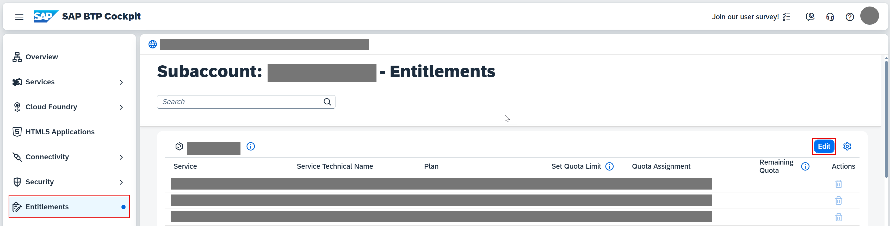

3. Choose **Add Service Plans**.

      <!-- border; size:540px --> 

2. Search for **Cloud Foundry Environment** and select the **free (Environment)** plan.

      <!-- border; size:540px --> 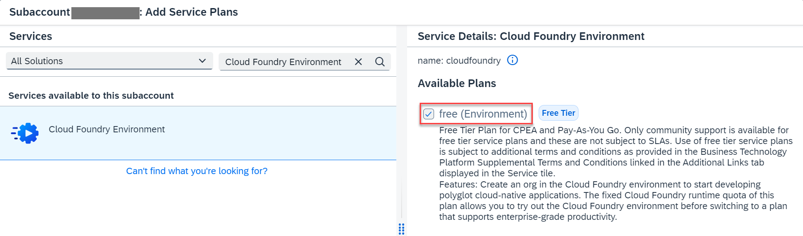

2. Search for **SAP Build Work Zone, standard edition** and select the **free (Application)** plan.

      <!-- border; size:540px --> 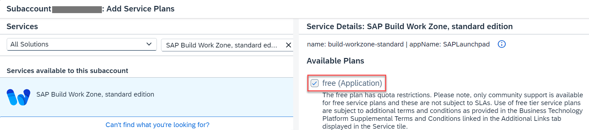

3. Search for **SAP HANA Cloud** and select the **tools (Application)** service plan and the **hana-free** service plan.

      <!-- border; size:540px --> 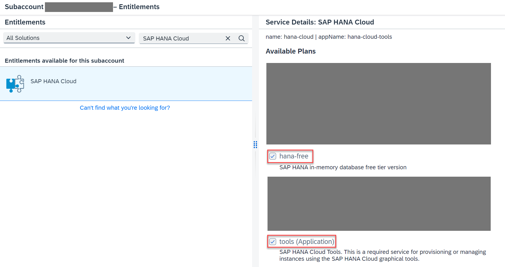

4. Search for **SAP HANA Schemas & HDI containers** and select the **hdi-shared** service plan.

      <!-- border; size:540px --> 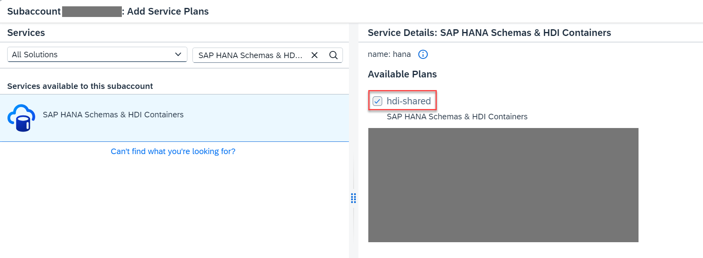

5. Search for **Continuous Integration & Delivery**, select the **free (Application)** plan, and choose **Add 6 Service Plans**.

      <!-- border; size:540px --> 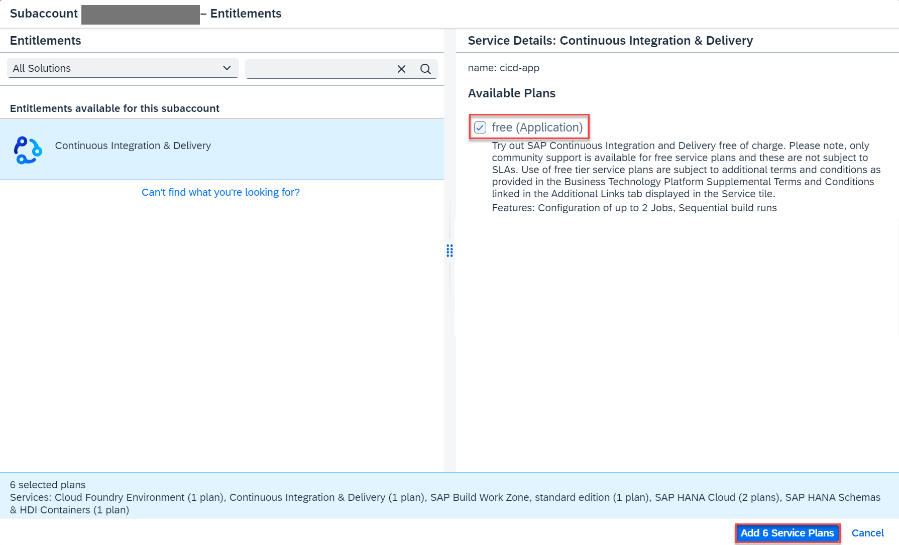

6. Choose **Save**.

<!-- Assign Entitlements end -->

### Enable Cloud Foundry Runtime

This creates a Cloud Foundry (CF) Org in your subaccount. There’s always one Cloud Foundry org per subaccount. Later on, when you log on to Cloud Foundry, it asks you which Cloud Foundry org you want to log on to. For any development in your subaccount, you need to choose this org for your subaccount.

2. Navigate to your subaccount and choose **Enable Cloud Foundry**.

      <!-- border; size:540px --> 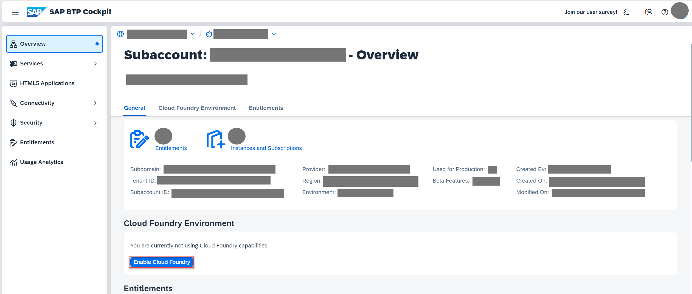 

3. In the **Enable Cloud Foundry** popup, change the values for **Instance Name** and **Org Name** as needed and choose **Create**.

      <!-- border; size:540px --> 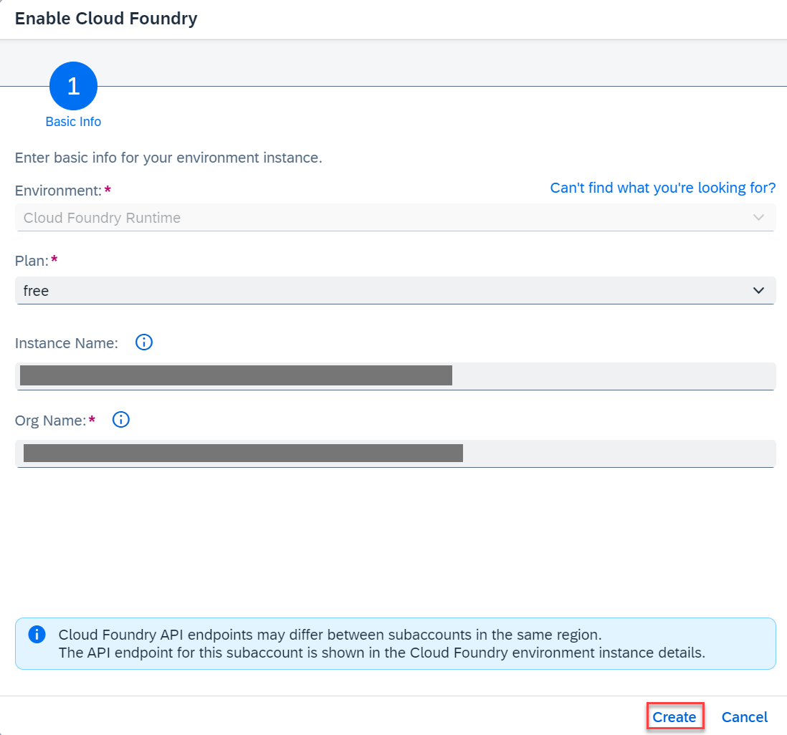 


    > Make sure the instance name is CLI-friendly. This will make it easier to manage your instances with the SAP BTP command line interface as well.
    >
    > A CLI-friendly name is a short string (up to 32 characters) that contains only alphanumeric characters (A-Z, a-z, 0-9), periods, underscores, and hyphens. It can't contain white spaces.
    >
    > When enabling the runtime, you'll notice that the instance name is generated automatically for you. You can use that name or replace it with the name of your choice.


3. Navigate to **Cloud Foundry** &rarr; **Spaces** and choose **Create Space**.

      <!-- border; size:540px --> 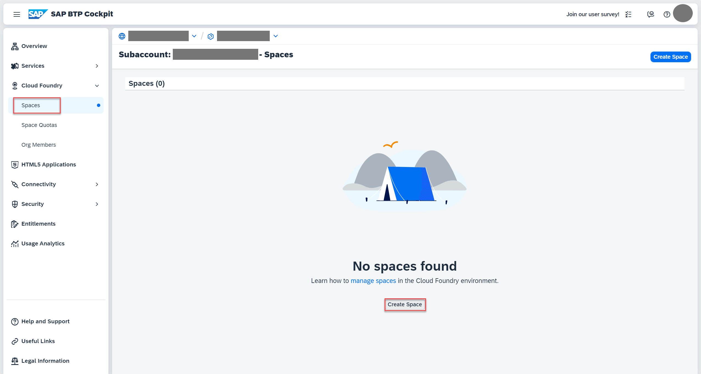

4. Enter a space name (for example, **dev**) and choose **Create**.

      <!-- border; size:540px --> 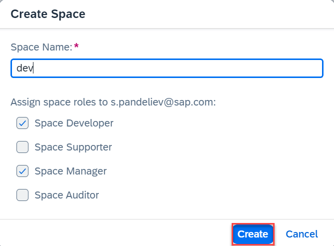


<!-- New Set Up HANA Cloud start -->

### Subscribe to SAP HANA Cloud Administration Tools

1. Navigate to your subaccount and choose **Services** &rarr; **Service Marketplace** on the left.

2. Type **SAP HANA Cloud** in the search box and choose **Create**.

      <!-- border; size:540px --> 

2. In the **New Instance or Subscription** popup, select **tools** from the dropdown in the **Plan** field and choose **Create**.

      <!-- border; size:540px --> 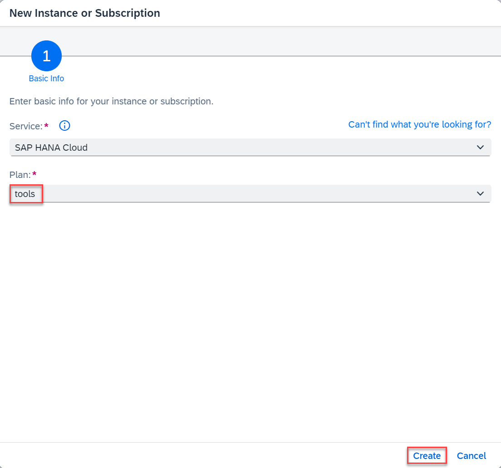

7. Choose **View Subscription** and wait until the status changes to **Subscribed**.

    <!-- border; size:540px --> 

    <!-- border; size:540px --> 

8. In your SAP BTP subaccount, choose **Security** &rarr; **Role Collections** in the left-hand pane.

9. Choose role collection **SAP HANA Cloud Administrator**.

10. Choose **Edit**.

    <!-- border; size:540px --> 

11. In the **Users** section, enter your user and select the icon to add the user.

    <!-- border; size:540px --> 

    > Keep the setting `Default Identity Provider` unless you have a custom identity provider configured.

13. Choose **Save**.

      You've assigned the **SAP HANA Cloud Administrator** role collection to your user.

> You might need to log out and log back in to make sure your new role collection is taken into account.

### Create an SAP HANA Cloud service instance

SAP HANA Cloud is used as a persistence layer.

Follow these steps to create an SAP HANA Cloud service instance in the SAP BTP cockpit:

1. In your SAP BTP subaccount, navigate to **Services** &rarr; **Instances and Subscriptions** in the left-hand pane.

2. Choose **SAP HANA Cloud**. You'll be redirected to SAP HANA Cloud multi-environment administration tools. Sign in with your SAP BTP cockpit username/e-mail if required.

    <!-- border; size:540px --> 

3. In SAP HANA Cloud Central, choose **Create Instance**.

      <!-- border; size:540px --> 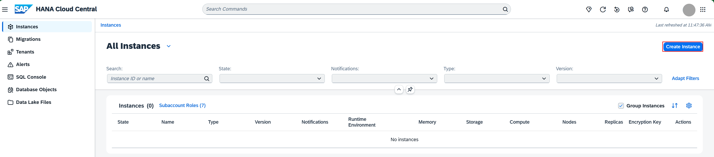

7. Choose **SAP HANA Cloud**, **SAP HANA Database**, and then choose **Next Step**.

      <!-- border; size:540px --> 

8. In the **Instance Name** field, enter **incident-management**.

9. In the **Administrator Password** and **Confirm Administrator Password** fields, enter a password for DBADMIN. Choose **Next Step**.

      <!-- border; size:540px --> 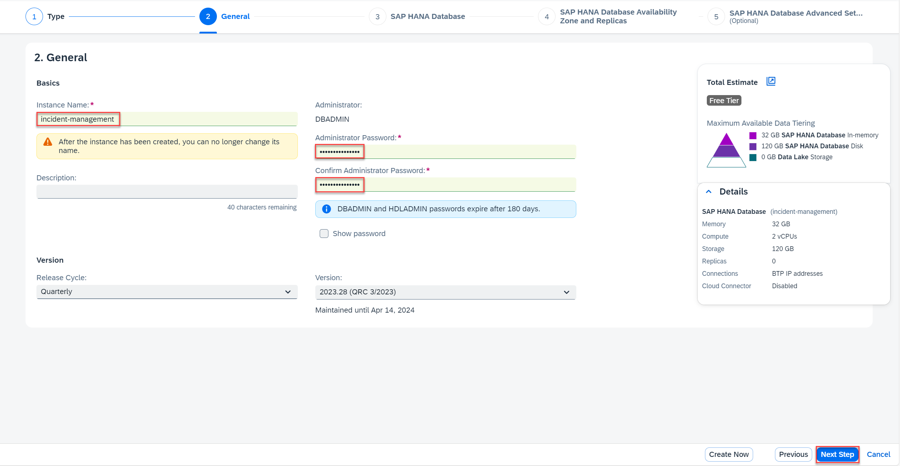

10. The default settings should be sufficient for the Incident Management application. Choose **Next Step**.

11. At **SAP HANA Database Availability Zone and Replicas**, choose again **Next Step**.

12. Select the **Allow all IP addresses** radio button, and choose **Review and Create** to review your SAP HANA Cloud instance configuration.

      <!-- border; size:540px --> 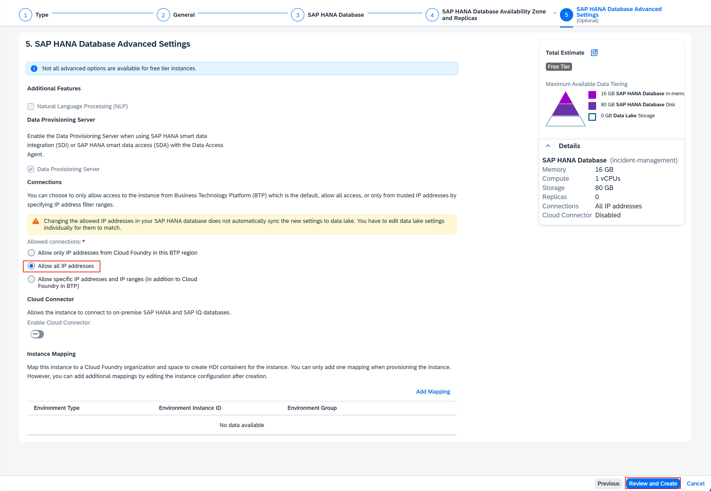

13. Choose **Create Instance**.

The creation of the database instance can take some minutes to complete.

> Your SAP HANA Cloud service instance will be automatically stopped overnight, according to the server region time zone. That means you need to restart your instance every day before you start working with it.
>
> You can either use SAP BTP cockpit or the terminal in the SAP Business Application Studio to restart the stopped instance:
>
> ```bash
> cf update-service incident-management -c '{"data":{"serviceStopped":false}}'
> ```

### Map your SAP HANA Cloud service instance to your Cloud Foundry organization

1. Go to SAP HANA Cloud Central. If you have closed it, open it again by following these steps: 

      - In your SAP BTP subaccount, navigate to **Services** &rarr; **Instances and Subscriptions**.
      - Choose **SAP HANA Cloud**. You'll be redirected to SAP HANA Cloud multi-environment administration tools. Sign in with your SAP BTP cockpit username/e-mail if required.

2. For the **incident-management** instance, choose **Manage Configuration**.

      <!-- border; size:540px --> 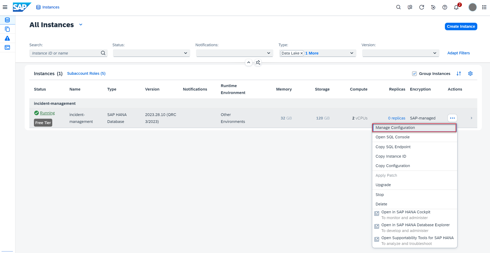

3. Select the **Instance Mapping** tab and choose **Add Mapping**.

      <!-- border; size:540px --> 

4. Choose **Cloud Foundry** from the dropdown under **Environment Type**.

5. Under **Environment Instance ID**, paste the GUID of your Cloud Foundry organization. Here's how to find it:

      - Open a new terminal in SAP Business Application Studio and log in with `cf login`.
      - Run the command `cf org <Your-Cloud-Foundry-Org> --guid`. You'll get the GUID of your Cloud Foundry organization in response.

      <!-- border; size:540px --> 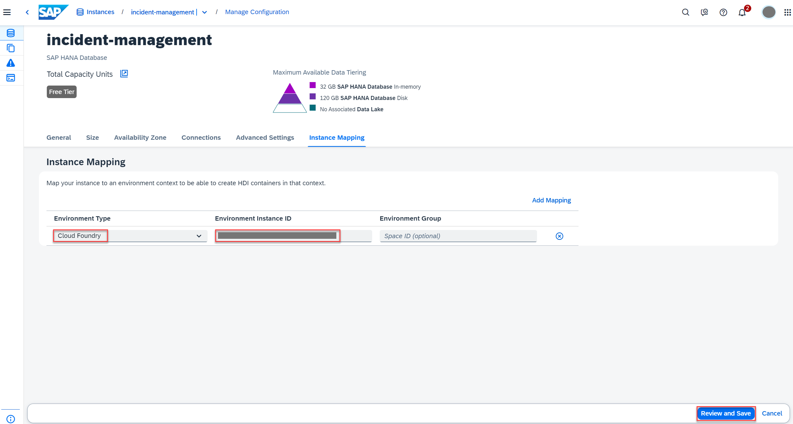
    
    > If you only specify the organization GUID, the instance is mapped to all spaces in that organization.

5. Choose **Review and Save** and then choose **Save Changes with Restart** in the popup. 

      <!-- border; size:540px --> 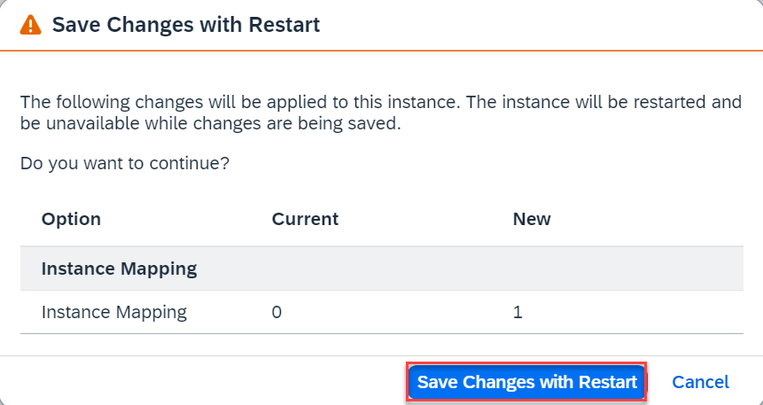

      You have mapped your SAP HANA Cloud service instance to your Cloud Foundry organization.

    > For more information, see [Map an SAP HANA Database to another Environment Context](https://help.sap.com/docs/HANA_CLOUD/9ae9104a46f74a6583ce5182e7fb20cb/1683421d02474567a54a81615e8e2c48.html) to add a new Cloud foundry mapping.

<!-- New Set Up HANA Cloud end -->