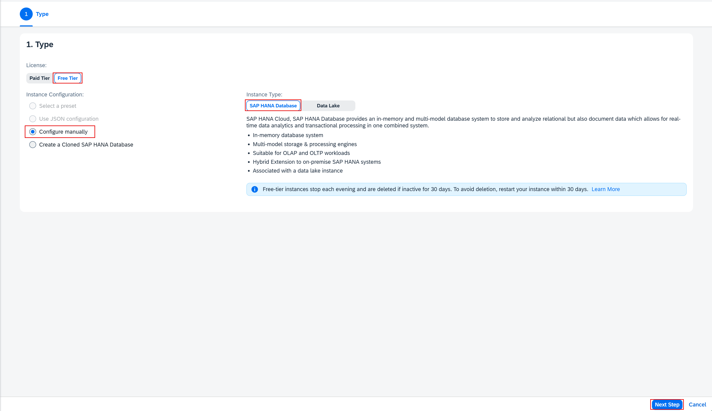
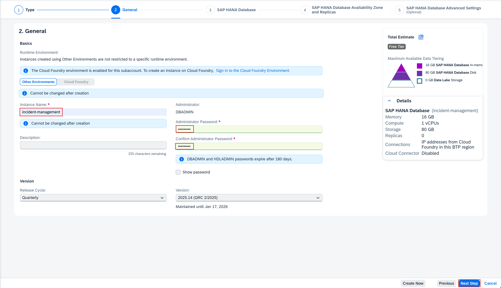

## You will learn

- How to configure entitlements
- How to enable the Cloud Foundry runtime in your subaccount in SAP BTP
- How to create an SAP HANA Cloud service instance in the SAP BTP cockpit

## Prerequisites

- You have an [enterprise global account](https://help.sap.com/docs/btp/sap-business-technology-platform/getting-global-account#loiod61c2819034b48e68145c45c36acba6e) in SAP BTP. To use services for free, you can sign up for a CPEA (Cloud Platform Enterprise Agreement) or a Pay-As-You-Go for SAP BTP global account and make use of the free tier services only. See [Using Free Service Plans](https://help.sap.com/docs/btp/sap-business-technology-platform/using-free-service-plans?version=Cloud).
- You have an S-user or P-user. See [User and Member Management](https://help.sap.com/docs/btp/sap-business-technology-platform/user-and-member-management).
- You are an administrator of the global account in SAP BTP.
- You have a subaccount in SAP BTP to deploy the services and applications.
- You have one of the following browsers that are supported for working in SAP Business Application Studio:
    - Mozilla Firefox
    - Google Chrome
    - Microsoft Edge
- You have configured SAP HANA Cloud and SAP Authorization and Trust Management service in your project in SAP Business Application Studio. See [Prepare for Production](../../prep-for-prod.html)

<!-- Assign Entitlements start -->

### Configure the entitlements

In this section, you will set up the SAP BTP Cloud Foundry runtime for deploying CAP applications.

**Prerequisite:** You must have an administrator role for SAP BTP.

To deploy the Incident Management applications, you need the following entitlements:

| Service     |      Plan      |  Quota required |
| ------------- | :-----------: | ----: |
| Cloud Foundry runtime | free (Environment) |   1 |
| SAP Build Work Zone, standard edition    |  free (Application)    |   1 |
| SAP HANA Cloud |   hana-free    |   1 |
| SAP HANA Cloud |   tools (Application)   |   1 |
| SAP HANA Schemas & HDI Containers |   hdi-shared   |   1 |
| SAP Continuous Integration and Delivery | free (Application) |   1 |

Follow the steps below to add the entitlements.

1. Log in to SAP BTP cockpit.

2. Navigate to your subaccount and choose **Entitlements** &rarr; **Configure Entitlements**.

      <!-- border; size:540px --> 

3. Choose **Add Service Plans**.

      <!-- border; size:540px --> 

2. Search for **Cloud Foundry Runtime** and select the **free (Environment)** plan.

      <!-- border; size:540px --> 

2. Search for **SAP Build Work Zone, standard edition** and select the **free (Application)** plan.

      <!-- border; size:540px --> 

3. Search for **SAP HANA Cloud** and select the **tools (Application)** service plan and **hana-free** service plan.

      <!-- border; size:540px --> 

4. Search for **SAP HANA Schemas & HDI containers** and select the **hdi-shared** service plan.

      <!-- border; size:540px --> 

5. Search for **SAP Continuous Integration & Delivery**, select the **free (Application)** plan, and choose **Add 6 Service Plans**.

      <!-- border; size:540px --> 

6. Choose **Save**.

<!-- Assign Entitlements end -->

### Enable Cloud Foundry Runtime

This creates a Cloud Foundry (CF) Org in your subaccount. There’s always one Cloud Foundry org per subaccount. Later on, when you log on to Cloud Foundry, it asks you which Cloud Foundry org you want to log on to. For any development in your subaccount, you need to choose this org for your subaccount.

2. Navigate to your subaccount and choose **Enable Cloud Foundry**.

      <!-- border; size:540px -->  

3. In the **Enable Cloud Foundry** popup, change the values for **Instance Name** and **Org Name** as needed and choose **Create**.

      <!-- border; size:540px -->  

3. Navigate to **Cloud Foundry** &rarr; **Spaces** and choose **Create Space**.

      <!-- border; size:540px --> 

4. Enter a space name (for example, **dev**) and choose **Create**.

      <!-- border; size:540px --> 

<!-- Set Up HANA Cloud start -->

### Create an SAP HANA Cloud service instance

SAP HANA Cloud is used as a persistence layer.

> If you already have an SAP HANA Cloud instance in your subaccount, directly navigate to **Step: Map an existing SAP HANA Cloud service instance below**.

Follow these steps to create an SAP HANA Cloud service instance in the SAP BTP cockpit:

1. In the SAP BTP cockpit, navigate to your subaccount.

2. Choose **Cloud Foundry** &rarr; **Spaces**.

3. Choose the space where you want to deploy the Incident Management application.

      <!-- border; size:540px --> 

4. Choose **SAP HANA Cloud**.

5. Choose **Create** &rarr; **SAP HANA database**. The SAP HANA Cloud Central tool opens.

      <!-- border; size:540px --> 

6. Sign in with your SAP BTP cockpit username/e-mail.

7. Choose **SAP HANA Cloud**, **SAP HANA Database**, and then choose **Next Step**.

      <!-- border; size:540px --> 

8. The values in the **Organization** and **Space** dropdown menus will be filled automatically. In the **Instance Name** field, enter the **incident-management**.

9. In the **Administrator Password** and **Confirm Administrator Password** fields, enter a password for DBADMIN. Choose **Next Step**.

      <!-- border; size:540px --> 

10. The default settings should be sufficient for the Incident Management application. Choose **Next Step**.

11. At **SAP HANA Database Availability Zone and Replicas**, choose again **Next Step**.

12. Select the **Allow all IP addresses** radio button, and choose **Review and Create** to review your SAP HANA Cloud instance configuration.

      <!-- border; size:540px --> 

13. Choose **Create Instance**.

The creation of the database instance can take some minutes to complete. The final result looks like this in SAP BTP cockpit:

> Your SAP HANA Cloud service instance will be automatically stopped overnight, according to the server region time zone. That means you need to restart your instance every day before you start working with it.
> You can either use SAP BTP cockpit or the terminal in the SAP Business Application Studio to restart the stopped instance:
>
> ```bash
> cf update-service incident-management -c '{"data":{"serviceStopped":false}}'
> ```

### Map an existing SAP HANA Cloud service instance

1. Go to SAP HANA Cloud Central. If you have closed it, open it again by following these steps: 

      - In the SAP BTP cockpit, navigate to your subaccount.
      - Choose **Cloud Foundry** &rarr; **Spaces**.
      - Choose the Space where you want to deploy the Incident Management application.
      - Choose **SAP HANA Cloud**.
      - Choose **Manage SAP HANA Cloud**. The SAP HANA Cloud Central tool opens.

2. On the **All Instances** page, choose the **incident-management** instance.

3. Choose **Create Mapping**.

4. In the **Add Mapping** wizard:

      - In the **Org ID** dropdown menu, select your Cloud Foundry organization.
      - In the **Space ID** dropdown menu, select your Cloud Foundry space.

5. Choose **Add**. You have your incident-management SAP HANA database instance mapped to Cloud Foundry.

    > For more information, see [Map an SAP HANA Database to another Environment Context](https://help.sap.com/docs/HANA_CLOUD/9ae9104a46f74a6583ce5182e7fb20cb/1683421d02474567a54a81615e8e2c48.html) to add a new Cloud foundry or Kyma mapping.

<!-- Set Up HANA Cloud end -->