## You will learn

- How to configure entitlements
- How to enable the SAP BTP, Kyma runtime in your subaccount in SAP BTP
- How to create an SAP HANA Cloud service instance in the SAP BTP cockpit

## Prerequisites

- You have an [enterprise global account](https://help.sap.com/docs/btp/sap-business-technology-platform/getting-global-account#loiod61c2819034b48e68145c45c36acba6e) in SAP BTP. To use services for free, you can sign up for a CPEA (Cloud Platform Enterprise Agreement) or a Pay-As-You-Go for SAP BTP global account and make use of the free tier services only. See [Using Free Service Plans](https://help.sap.com/docs/btp/sap-business-technology-platform/using-free-service-plans?version=Cloud).
- You have an S-user or P-user. See [User and Member Management](https://help.sap.com/docs/btp/sap-business-technology-platform/user-and-member-management).
- You are an administrator of the global account in SAP BTP.
- You have a subaccount in SAP BTP to deploy the services and applications.
- You have one of the following browsers that are supported for working in SAP Business Application Studio:
    - Mozilla Firefox
    - Google Chrome
    - Microsoft Edge
- You have configured SAP HANA Cloud and SAP Authorization and Trust Management service in your project in SAP Business Application Studio. See [Prepare for Production](../../prep-for-prod.html).

### Configure the entitlements

In this section, you will set up the SAP BTP Kyma runtime for deploying CAP applications.

To deploy the Incident Management applications, you need the following entitlements:

| Service     |      Plan      |  Quota required |
| ------------- | :-----------: | ----: |
| Kyma runtime | free (Environment) |   1 |
| SAP Build Work Zone, standard edition    |  free (Application)    |   1 |
| SAP HANA Cloud |   hana-free    |   1 |
| SAP HANA Cloud |   tools (Application)   |   1 |
| SAP HANA Schemas & HDI Containers |   hdi-shared   |   1 |
| SAP Continuous Integration and Delivery | free (Application) |   1 |

Follow the steps below to add the entitlements.

1. Log in to SAP BTP cockpit.

2. Navigate to your subaccount and choose **Entitlements** &rarr; **Configure Entitlements**.

      <!-- border; size:540px --> 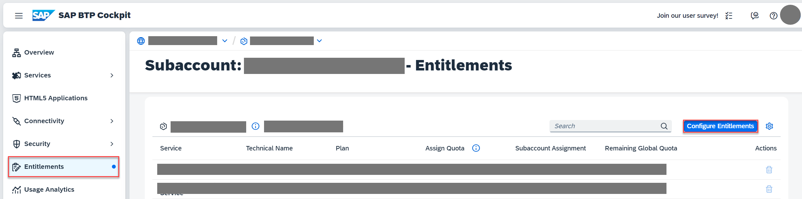

3. Choose **Add Service Plans**.

      <!-- border; size:540px --> 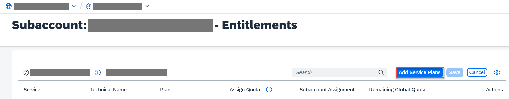

2. Search for **Kyma Runtime** and select the **free (Environment)** plan.

      <!-- border; size:540px --> 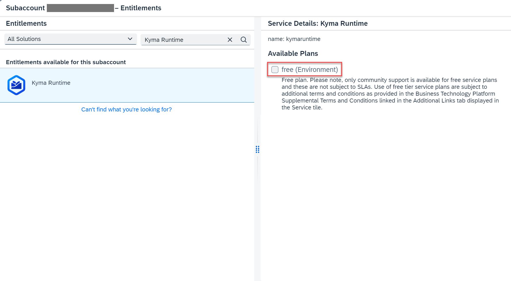

2. Search for **SAP Build Work Zone, standard edition** and select the **free (Application)** plan.

      <!-- border; size:540px --> 

3. Search for **SAP HANA Cloud** and select the **tools (Application)** service plan and **hana-free** service plan.

      <!-- border; size:540px --> 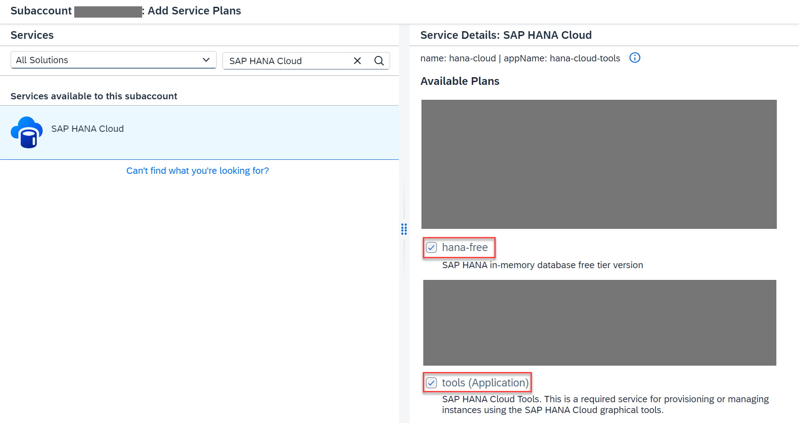

4. Search for **SAP HANA Schemas & HDI containers** and select the **hdi-shared** service plan.

      <!-- border; size:540px --> 

5. Search for **SAP Continuous Integration & Delivery**, select the **free (Application)** plan, and choose **Add 6 Service Plans**.

      <!-- border; size:540px --> 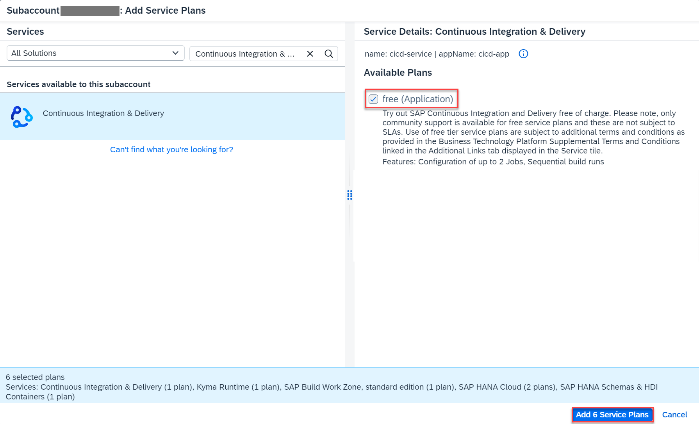

6. Choose **Save**.

### Enable SAP BTP, Kyma runtime

This enables your subaccount to use the Kyma runtime.

2. Navigate to your subaccount and choose **Enable Kyma** under the **Kyma Environment** tab.

      <!-- border; size:540px --> 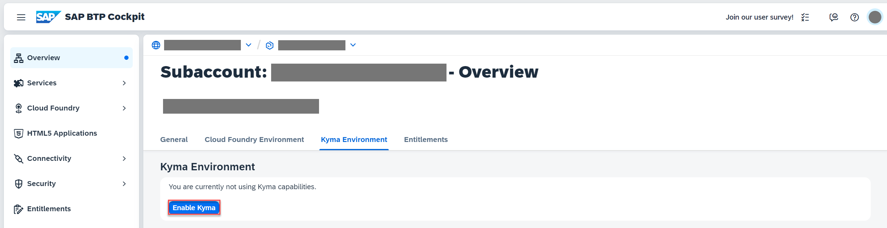

2. In the **Enable Kyma** popup, change the values for **Instance Name** and **Cluster Name** as needed and choose **Create**.

      <!-- border; size:540px --> 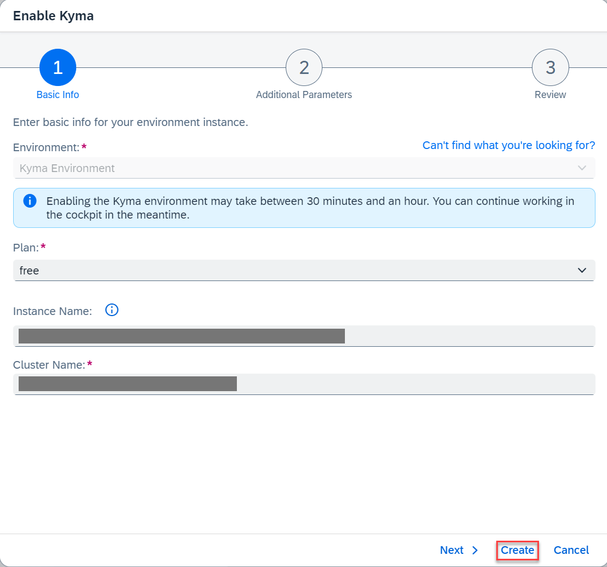


    > Make sure the instance name is CLI-friendly. This will make it easier to manage your instances with the SAP BTP command line interface as well.
    >
    > A CLI-friendly name is a short string (up to 32 characters) that contains only alphanumeric characters (A-Z, a-z, 0-9), periods, underscores, and hyphens. It can't contain white spaces.
    >
    > When enabling the runtime, you'll notice that the instance name is generated automatically for you. You can use that name or replace it with the name of your choice.


<!-- New Set Up HANA Cloud start -->

### Subscribe to SAP HANA Cloud Administration Tools

1. Navigate to your subaccount and choose **Services** &rarr; **Service Marketplace** on the left.

2. Type **SAP HANA Cloud** in the search box and choose **Create**.

      <!-- border; size:540px --> 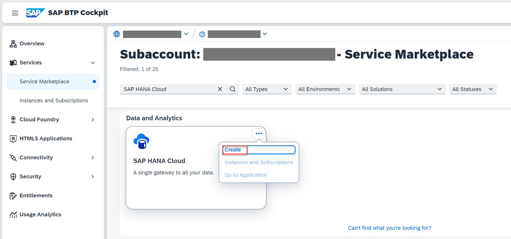

2. In the **New Instance or Subscription** popup, select **tools** from the dropdown in the **Plan** field and choose **Create**.

      <!-- border; size:540px --> 

7. Choose **View Subscription** and wait until the status changes to **Subscribed**.

    <!-- border; size:540px --> 

    <!-- border; size:540px --> 

8. In your SAP BTP subaccount, choose **Security** &rarr; **Role Collections** in the left-hand pane.

9. Choose role collection **SAP HANA Cloud Administrator**.

10. Choose **Edit**.

    <!-- border; size:540px --> 

11. In the **Users** section, enter your user and select the icon to add the user.

    <!-- border; size:540px --> 

    > Keep the setting `Default Identity Provider` unless you have a custom identity provider configured.

13. Choose **Save**.

### Create an SAP HANA Cloud service instance

SAP HANA Cloud is used as a persistence layer.

Follow these steps to create an SAP HANA Cloud service instance in the SAP BTP cockpit:

1. In your SAP BTP subaccount, navigate to **Services** &rarr; **Instances and Subscriptions** in the left-hand pane.

2. Choose **SAP HANA Cloud**. You'll be redirected to SAP HANA Cloud multi-environment administration tools. Sign in with your SAP BTP cockpit username/e-mail if required.

    <!-- border; size:540px --> 

3. In SAP HANA Cloud Central, choose **Create Instance**.

      <!-- border; size:540px --> 

7. Choose **SAP HANA Cloud**, **SAP HANA Database**, and then choose **Next Step**.

      <!-- border; size:540px --> 

8. In the **Instance Name** field, enter **incident-management**.

9. In the **Administrator Password** and **Confirm Administrator Password** fields, enter a password for DBADMIN. Choose **Next Step**.

      <!-- border; size:540px --> 

10. The default settings should be sufficient for the Incident Management application. Choose **Next Step**.

11. At **SAP HANA Database Availability Zone and Replicas**, choose again **Next Step**.

12. Select the **Allow all IP addresses** radio button, and choose **Review and Create** to review your SAP HANA Cloud instance configuration.

      <!-- border; size:540px --> 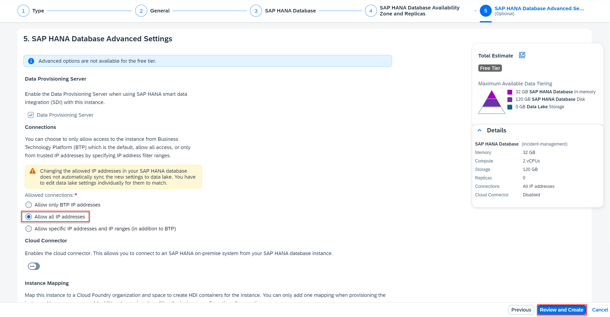

13. Choose **Create Instance**.

The creation of the database instance can take some minutes to complete.

> Your SAP HANA Cloud service instance will be automatically stopped overnight, according to the server region time zone. That means you need to restart your instance every day before you start working with it.
>
> You can either use SAP BTP cockpit or the terminal in the SAP Business Application Studio to restart the stopped instance:
>
> ```bash
> cf update-service incident-management -c '{"data":{"serviceStopped":false}}'
> ```

### Enable the btp-operator module for your Kyma cluster

You need to enable the **btp-operator** module for your Kyma cluster so you can map your SAP HANA Cloud service instance to the Kyma cluster. Follow the steps below:

1. Navigate to your subaccount and choose **Link to dashboard** under the **Kyma Environment** tab to open the Kyma Console.

      <!-- border; size:540px --> 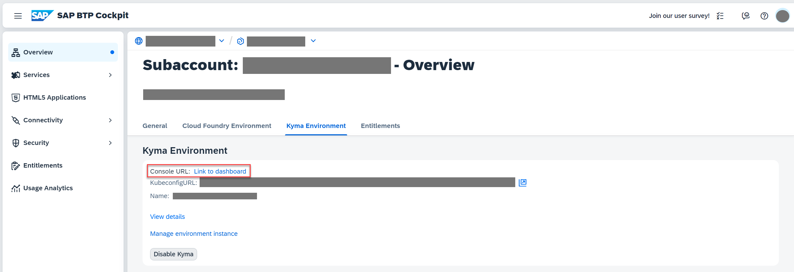

2. Choose **Namespaces** on the left and choose **kyma-system**.

      <!-- border; size:540px --> 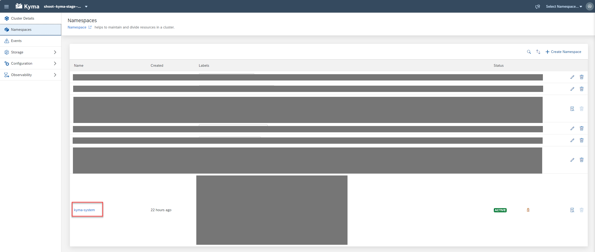

3. Choose **Kyma** &rarr; **Kyma** on the left and choose **default**.

      <!-- border; size:540px --> 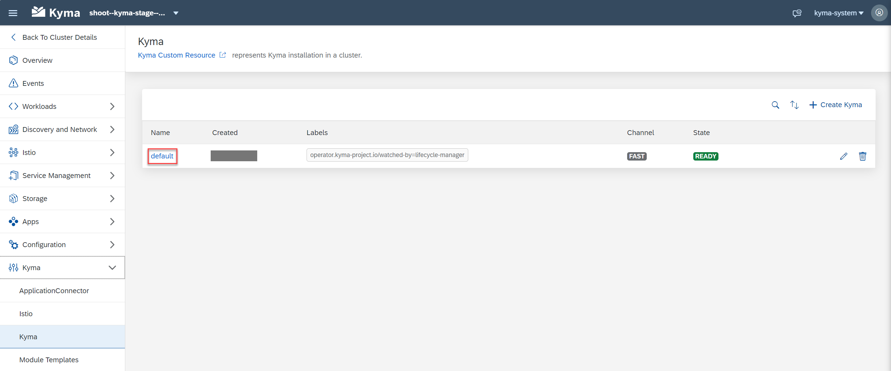

4. Choose **Edit**.

      <!-- border; size:540px --> 

4. Select the checkbox for **btp-operator** under **Modules** and choose **Update**.

      <!-- border; size:540px --> 

> You can find more info in [Enable and Disable a Kyma Module](https://help.sap.com/docs/btp/sap-business-technology-platform/enable-and-disable-kyma-module).

### Map your SAP HANA Cloud service instance to your Kyma cluster

1. Go to SAP HANA Cloud Central. If you have closed it, open it again by following these steps: 

      - In your SAP BTP subaccount, navigate to **Services** &rarr; **Instances and Subscriptions**.
      - Choose **SAP HANA Cloud**. You'll be redirected to SAP HANA Cloud multi-environment administration tools. Sign in with your SAP BTP cockpit username/e-mail if required.

2. For the **incident-management** instance, choose **Manage Configuration**.

      <!-- border; size:540px --> 

3. Select the **Instance Mapping** tab and choose **Add Mapping**.

      <!-- border; size:540px --> 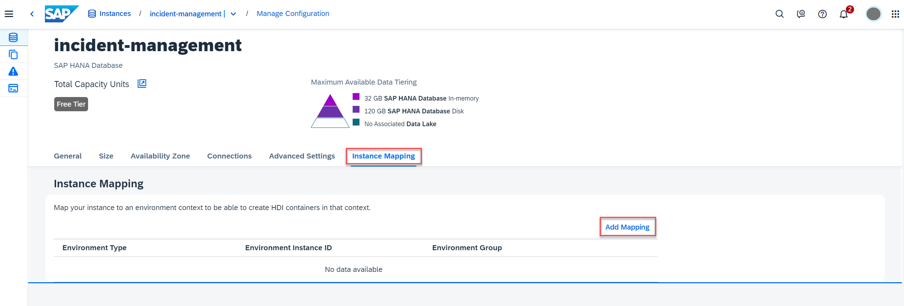

4. Choose **Kyma** from the dropdown under **Environment Type**.

5. Under **Environment Instance ID**, paste the GUID of your Kyma cluster. Here's how to find it:

      - Open you Kyma Console.
      - Choose **Namespaces** on the left and choose **kyma-system**. 
      - Navigate to **Configuration** &rarr; **Config Maps** and choose **sap-btp-operator-config**.
      - You can see the GUID of your Kyma cluster in the **CLUSTER_ID** section.

      <!-- border; size:540px --> 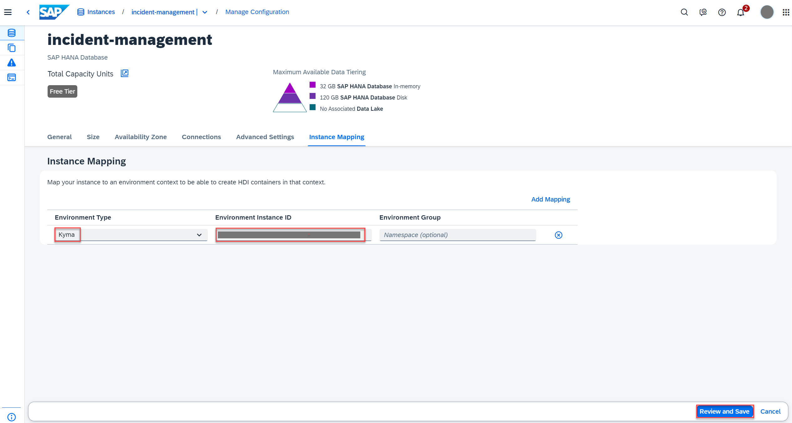
    
    > If no namespace is provided, the instance is mapped to all namespaces in the cluster.

5. Choose **Review and Save** and then choose **Save Changes with Restart** in the popup. 

      <!-- border; size:540px --> 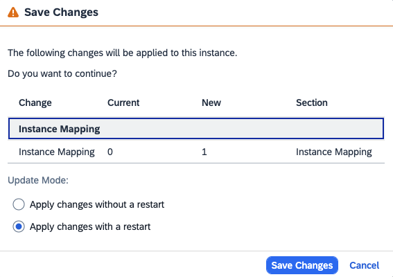

      You have mapped your SAP HANA Cloud service instance to your Kyma cluster.

    > For more information, see [Map an SAP HANA Database to another Environment Context](https://help.sap.com/docs/HANA_CLOUD/9ae9104a46f74a6583ce5182e7fb20cb/1683421d02474567a54a81615e8e2c48.html) to add a new Cloud foundry or Kyma mapping.

<!-- Set Up HANA Cloud end -->
