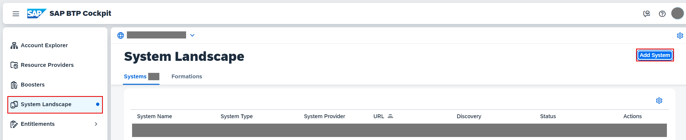
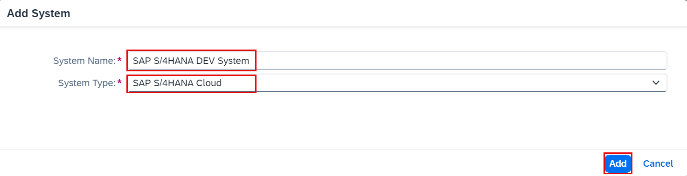
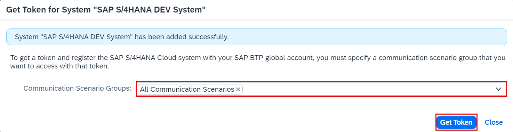
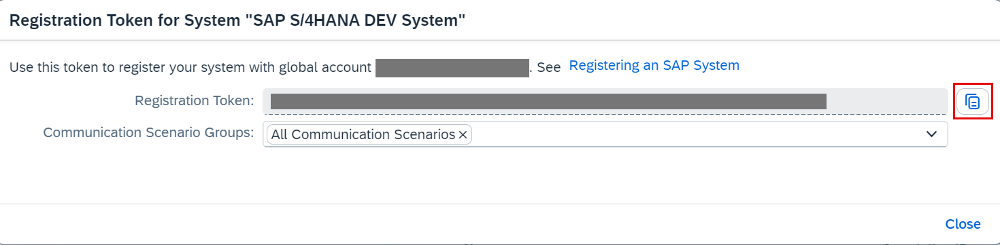
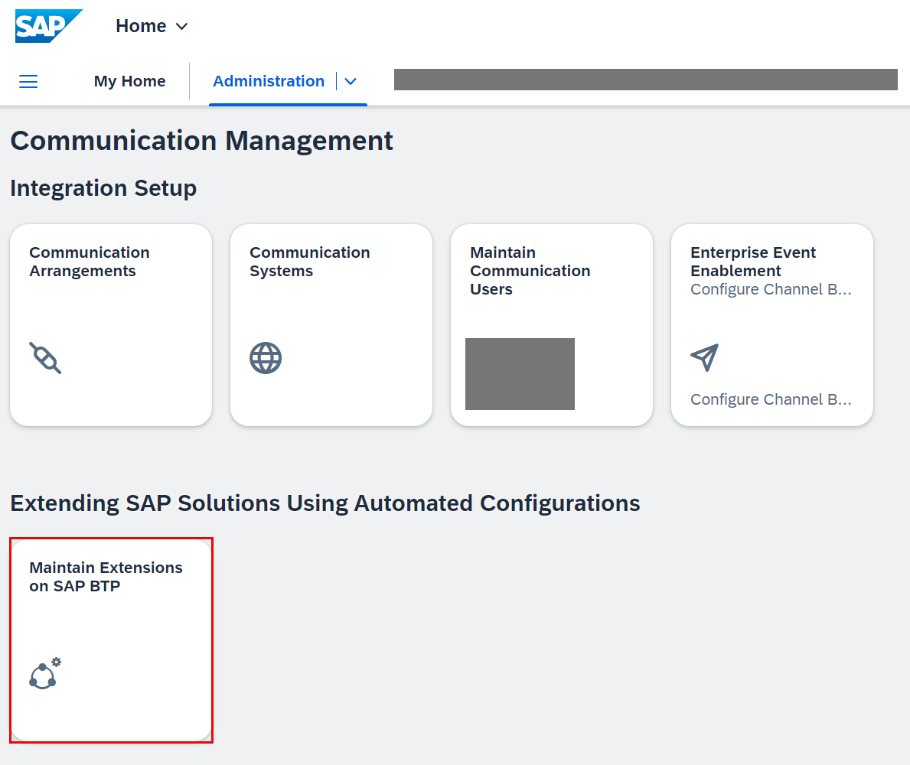
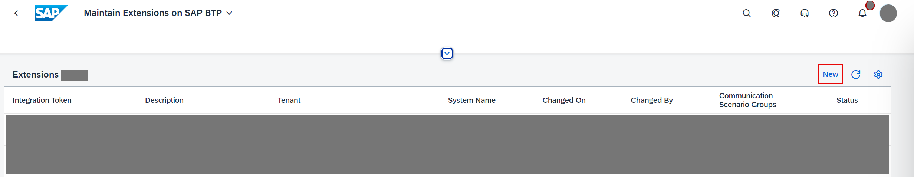
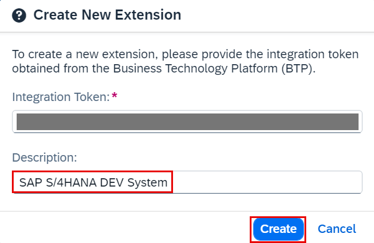
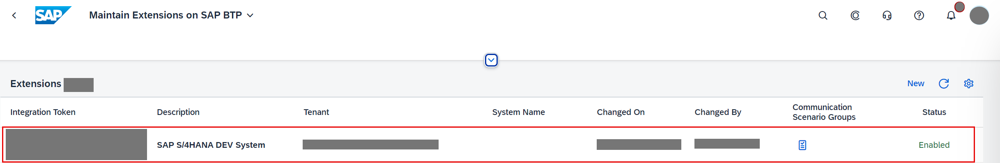
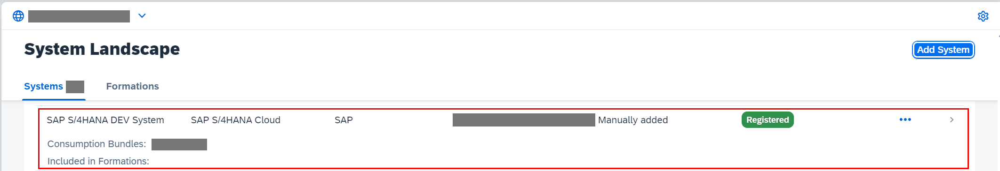
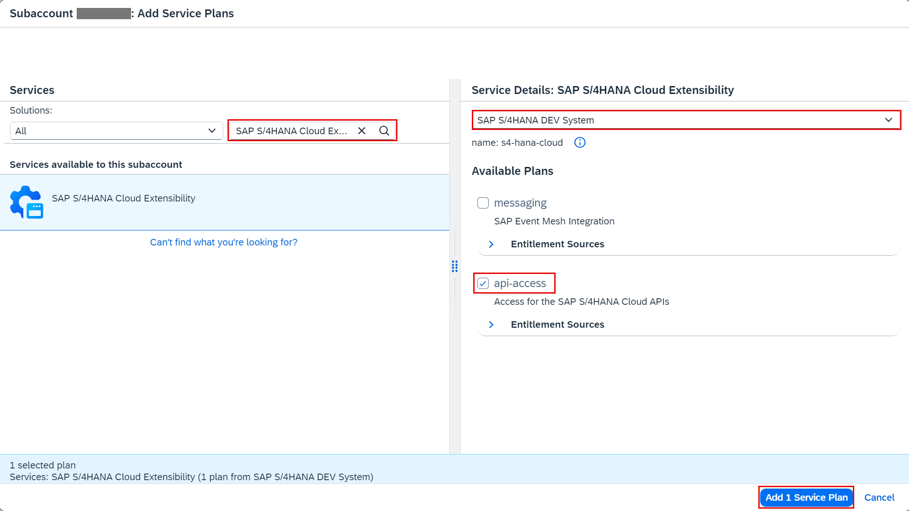

## You will learn

 - How to acquire an SAP BTP integration token.
 - How to add integration token to SAP S/4HANA Cloud system.
 - How to set up entitlements for your SAP BTP subaccount.

## Prerequisites

 - You have tested the extended Incident Management application with the Business Partner API. See [Test the Extended Incident Management Application with the Business Partner API](remote-service-run-dev-test).
 - On SAP BTP side:
    - You have an [enterprise](https://help.sap.com/viewer/65de2977205c403bbc107264b8eccf4b/Cloud/en-US/171511cc425c4e079d0684936486eee6.html) global account in SAP BTP.
    - You must be an administrator of the SAP BTP global account where you want to register your SAP S/4HANA Cloud system.
 - On SAP S/4HANA Cloud side:
    - You have a dedicated SAP S/4HANA Cloud tenant.
    - You must be an administrator of the SAP S/4HANA Cloud system.
    - You need to connect this system to your SAP BTP global account, if you'd like to build extension applications for your SAP S/4HANA Cloud system.

### Add a system to your SAP BTP account

1. In **SAP BTP cockpit**, open your global account and choose **System Landscape**.

2. In the **System Landscape** screen, choose **Systems** and then **Add System**.

     <!-- border; size:540px --> 

3. In the **Add System** dialog box, enter a name for the SAP S/4HANA Cloud system you want to connect.

    > Use a name that uniquely identifies this system. For example, **SAP S/4HANA DEV System**.

4. Select **SAP S/4HANA Cloud** from the dropdown in the **Type** field and choose **Add**. 

     <!-- border; size:540px --> 

6. In the **Get Token for System "S/4HANA DEV System"**, select **All Communication Scenarios** from the dropdown in the **Communication Scenario Groups** field and choose **Get Token**.

     <!-- border; size:540px --> 

     SAP BTP generates an integration token so the SAP S/4HANA Cloud system administrator can configure integration with SAP BTP from your SAP S/4HANA Cloud system. 

9. Copy the generated token and close the dialog box. You will need the token in the following procedure.

     <!-- border; size:540px --> 

  

### Add integration token to SAP S/4HANA Cloud system

1. Log on to your SAP S/4HANA Cloud tenant.

2. Choose **Administration** &rarr; **Communication Management** and choose the tile **Maintain Extensions on SAP BTP**.

     <!-- border; size:540px --> 

3. On the **Maintain Extensions on SAP BTP** screen in the **Extensions** section, choose **New**.

     <!-- border; size:540px --> 

4. In the **Integration Token** field, paste the integration token you previously generated.

5. Enter a **Description** for your system integration token and choose **Create**.

     <!-- border; size:540px --> 

    > Use the same name that you entered in SAP BTP cockpit when you generated the token. For example, **SAP S/4HANA DEV System**.
     

6. Choose **Yes** to approve the creation, and wait until the status displayed for your newly registered system switches to **Enabled** – it’s possible that you would need to refresh your page.

     <!-- border; size:540px --> 

     At the same time, you will see the system status updated to **Registered** on the SAP BTP side. You might need to refresh the page for the satus to be updated.

     <!-- border; size:540px --> 

For more details about registering an SAP S/4HANA Cloud system, see [Register an SAP S/4HANA Cloud System in a Global Account in SAP BTP](https://help.sap.com/viewer/65de2977205c403bbc107264b8eccf4b/Cloud/en-US/28171b629f3549af8c1d66d7c8de5e18.html) on the SAP Help Portal.

### Set up entitlements for your SAP BTP subaccount

After you have connected the SAP S/4HANA Cloud system to SAP BTP (with status **Enabled** in your SAP S/4HANA Cloud tenant), you need to configure entitlements to make this system accessible in the SAP BTP subaccount in which you want to build your extension application. You configure the entitlements and assign the corresponding quota and service plans to the subaccount in which the extension application will reside.

1. Enter your **Global Account**.

2. Choose **Entitlements** &rarr; **Entity Assignments**.

3. Select your subaccount from the value help in the **Subaccounts/Directories** field.

5. Choose **Edit** &rarr; **Add Service Plans**.

     <!-- border; size:540px --> 

6. In the **Subaccount `<your-subaccount-name>`: Add Service Plans** dialog box, select the service **SAP S/4HANA Cloud Extensibility**.

7. In the **Service Details: SAP S/4HANA Cloud Extensibility** screen area, select your newly registered system name from the dropdown help to list the **Available Plans**.

      - **messaging** – to consume SAP S/4HANA Cloud events and create event-based extensions using the event bus from SAP Event Mesh Integration

      - **api-access** – for generic access for SAP S/4HANA Cloud APIs

8. Select **api-access** service plan.

9. Choose **Add 1 Service Plans** to add these entitlements for the SAP S/4HANA Cloud Extensibility service for your SAP S/4HANA Cloud system registered to your subaccount.

     <!-- border; size:540px --> 

10. Choose **Save**.