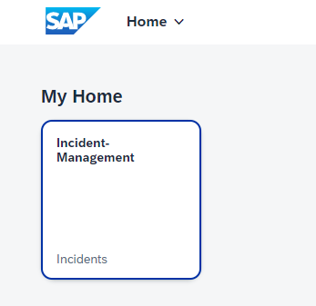
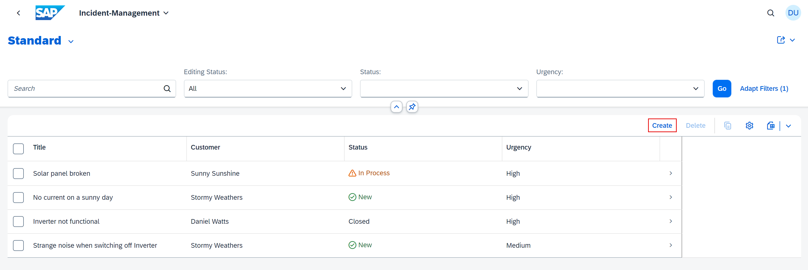
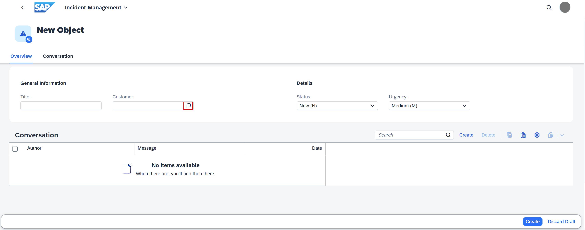
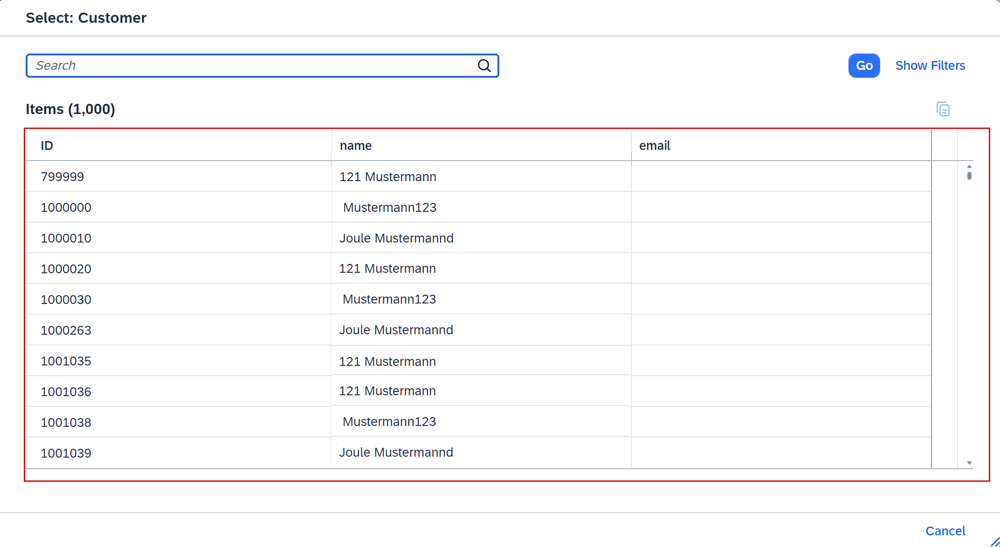

## You will learn

- How to connect to your SAP S/4HANA Cloud system.
- How to extend the existing Helm chart with the settings for SAP S/4HANA Cloud extension service.
- How to test the application with your SAP S/4HANA Cloud system.

## Prerequisites

- You have set up the connection to an SAP S/4HANA Cloud system. Follow the steps in the [Configure Connectivity Between SAP S/4HANA Cloud and SAP Business Technology Platform](remote-service-configure-connectivity) tutorial that is part of the [Consume Remote Services from S/4HANA Cloud in Your Full-Stack CAP Application Following the SAP BTP Developer's Guide and Deploy in SAP BTP, Kyma Runtime](link-to-new-group-goes-here) tutorial group. 
- You have an [enterprise global account](https://help.sap.com/docs/btp/sap-business-technology-platform/getting-global-account#loiod61c2819034b48e68145c45c36acba6e) in SAP BTP. To use services for free, you can sign up for an SAP BTPEA (SAP BTP Enterprise Agreement) or a Pay-As-You-Go for SAP BTP global account and make use of the free tier services only. See [Using Free Service Plans](https://help.sap.com/docs/btp/sap-business-technology-platform/using-free-service-plans?version=Cloud).
- You have a platform user. See [User and Member Management](https://help.sap.com/docs/btp/sap-business-technology-platform/user-and-member-management).
- You are an administrator of the global account in SAP BTP.
- You have a subaccount in SAP BTP to deploy the services and applications.

> This tutorial follows the guidance provided in the [SAP BTP Developer's Guide](https://help.sap.com/docs/btp/btp-developers-guide/what-is-btp-developers-guide).

### Prepare the Incident Management application

First, you create a service instance for the SAP S/4HANA Cloud Extensibility service with plan `api-access`. The SAP S/4HANA Cloud system provides pre-defined communication scenarios that contain one or multiple APIs. When creating the service instance, the communication scenario needs to be specified along with some configuration. Under the hood, a communication arrangement based on the given scenario is created in the SAP S/4HANA Cloud system.

1. Create a new file **bupa.json** in the root folder of the project and paste the following code snippet in it:

    ```json
    {
        "systemName": "<SYSTEM_NAME>",
        "communicationArrangement": {
            "communicationArrangementName": "<COMM_NAME>",
            "scenarioId": "SAP_COM_0008",
            "inboundAuthentication": "BasicAuthentication",
            "outboundAuthentication": "BasicAuthentication",
            "outboundServices": [
                {
                    "name": "Replicate Customers from S/4 System to Client",
                    "isServiceActive": false
                },
                {
                    "name": "Replicate Suppliers from S/4 System to Client",
                    "isServiceActive": false
                },
                {
                    "name": "Replicate Company Addresses from S/4 System to Client",
                    "isServiceActive": false
                },
                {
                    "name": "Replicate Workplace Addresses from S/4 System to Client",
                    "isServiceActive": false
                },
                {
                    "name": "Replicate Personal Addresses from S/4 System to Client",
                    "isServiceActive": false
                },
                {
                    "name": "Business Partner - Replicate from SAP S/4HANA Cloud to Client",
                    "isServiceActive": false
                },
                {
                    "name": "Business Partner Relationship - Replicate from SAP S/4HANA Cloud to Client",
                    "isServiceActive": false
                },
                {
                    "name": "Business Partner - Send Confirmation from SAP S/4HANA Cloud to Client",
                    "isServiceActive": false
                },
                {
                    "name": "BP Relationship - Send Confirmation from SAP S/4HANA Cloud to Client",
                    "isServiceActive": false
                }
            ],
            "communicationSystem": {
                "communicationSystemHostname": "default.com",
                "outboundCommunicationUser": {
                    "username": "DefaultUser",
                    "password": "DefaultPassword"
                }
            }
        }
    }
    ```

     - For **systemName**, enter the name of your registered SAP S/4HANA Cloud system. For example, `SAP S/4HANA DEV System`.
     - For **communicationArrangementName**, enter a name for the communication arrangement that will be created for the SAP S/4HANA Cloud tenant. For example, `INCIDENT_MANAGEMENT_0008`.


    > For more information, see [Communication Arrangement JSON/YAML File - Properties](https://help.sap.com/viewer/65de2977205c403bbc107264b8eccf4b/Cloud/en-US/553a4c6b98be4c1ba7d1dfa0e9df8669.html).

2.  Navigate to the **package.json** file in the root folder of the application. Add the following code snippet to the settings for **API_BUSINESS_PARTNER**:

    ```json[4-9]
    "API_BUSINESS_PARTNER": {
        "kind": "odata-v2",
        "model": "srv/external/API_BUSINESS_PARTNER",
        "[production]": {
            "credentials": {
                "destination": "incident-management-s4-hana-cloud",
                "path": "/sap/opu/odata/sap/API_BUSINESS_PARTNER"
            }
        }
    }
    ```
    <!-- If you are deploying to Cloud Foundry, the **destination** is `incidents-api-access`. For Kyma, the **destination** is `incident-management-s4-hana-cloud`. -->


2. Open the **chart/Chart.yaml** file and add the following code snippet to it:

    ```yaml
    - name: service-instance
      alias: s4-hana-cloud
      version: ">0.0.0"
    ```

4. Open the **chart/values.yaml** file and add the following code snippet to it:
   
    ```yaml
    s4-hana-cloud:
      serviceOfferingName: s4-hana-cloud
      servicePlanName: api-access
    ....
    ```

### Build images

>- Make sure you're logged in to your Kyma cluster. See [Login to your Kyma cluster](https://developers.sap.com/tutorials/deploy-to-kyma.html#a6e029c1-6e72-408b-bf5f-3b9dffba3499) for detailed steps how to log in.
>
>- Make sure you're logged in to your container registry.
>
>- If you're using any device with a non-x86 processor (e.g. MacBook M1/M2) you need to instruct Docker to use x86 images by setting the **DOCKER_DEFAULT_PLATFORM** environment variable using the command `export DOCKER_DEFAULT_PLATFORM=linux/amd64`. Check [Environment variables](https://docs.docker.com/engine/reference/commandline/cli/#environment-variables) for more info.


3. Create the productive CAP build for your application: 

    ```bash
    cds build --production
    ```

    The CAP build writes to the **gen/srv** folder.

4. Build a new version of the CAP Node.js image:

    ```bash
    pack build <your-container-registry>/incident-management-srv:<new-image-version> \
        --path gen/srv \
        --builder paketobuildpacks/builder-jammy-base \
        --publish
    ```

    >- Make sure to replace `<your-container-registry>` with your docker server URL. 
    > 
    >- Keep in mind that `<new-image-version>` should be a string that is different from the string defined in [Deploy in SAP BTP, Kyma Runtime](deploy-to-kyma) to reflect the changes in the Incident Management app. 

    > Looking for your docker server URL?
    
    > The docker server URL is the same as the path used for docker login, so you can quickly check it by running the following command in your terminal:

    > ```json
    > cat ~/.docker/config.json
    > ```

    > In case you're using Docker Hub as your container registry, replace the placeholder `<your-container-registry>` with your Docker Hub user ID.

    > The pack CLI builds the image that contains the build result in the **gen/srv** folder and the required npm packages by using the [Cloud Native Buildpack for Node.JS](https://github.com/paketo-buildpacks/nodejs) provided by Paketo.


7. In the VS Code terminal, navigate to the **ui-resources** folder and run the following command:

    ```bash
    npm install && npm run package
    ```

    This will build and copy the archive **nsincidents.zip** inside the **ui-resources/resources** folder.

8. In the VS Code terminal, navigate back to the root folder of your project:

    ```bash
    cd ..
    ```

9. Build the UI deployer image:

    ```bash
    pack build <your-container-registry>/incident-management-html5-deployer:<image-version> \
        --path ui-resources \
        --builder paketobuildpacks/builder-jammy-base \
        --publish
    ```

    > Make sure to replace `<your-container-registry>` with the link to your container registry and keep in mind that `<image-version>` should be a string. 
    
    > Looking for your docker server URL?
    
    > The docker server URL is the same as the path used for docker login, so you can quickly check it by running the following command in your terminal:

    > ```json
    > cat ~/.docker/config.json
    > ```

    > In case you're using Docker Hub as your container registry, replace the placeholder `<your-container-registry>` with your Docker Hub user ID.

You haven't made any changes to the database image so you don't need to build it again.


### Deploy the Incident Management application

1. Check your container image settings to your **chart/values.yaml** file:

    ```yaml[6,7]
    global:
      domain: 
      imagePullSecret:
        name: 
      image:
        registry: <your-container-registry>
        tag: <image-version>
    ```

    > Make sure to replace `<your-container-registry>` with the link to your container registry and keep in mind that `<image version>` should be a string. 


2. Overwrite the global image version for the CAP Node.js image:
    
    ```yaml[4]
    srv:
      image:
        repository: incident-management-srv
        tag: <new-image-version>
    ```

3. Update the productive CAP build for your application: 

    ```bash
    cds build --production
    ```

4. Make sure your SAP HANA Cloud instance is running. Free tier HANA instances are stopped overnight.

    > Your SAP HANA Cloud service instance will be automatically stopped overnight, according to the server region time zone. That means you need to restart your instance every day before you start working with it.
    >
    > You can either use SAP BTP cockpit or the terminal in the SAP Business Application Studio to restart the stopped instance:
    >
    > ```bash
    > cf update-service incident-management -c '{"data":{"serviceStopped":false}}'
    > ```

5. Deploy using the Helm command:

    ```bash
    helm upgrade --install incident-management --namespace incident-management ./chart \
   --set-file xsuaa.jsonParameters=xs-security.json --set-file s4-hana-cloud.jsonParameters=bupa.json
    ```

    This installs the Helm chart from the **chart** folder with the release name **incident-management** in the namespace **incident-management**.


### Test the Incident Management application

When creating new entries in the Incident Management application, you should be able to see all values from your SAP S/4HANA Cloud system in the value help of the **Customer** field.

> Before you continue with this step, don’t forget to perform the steps from the tutorials [Assign the User Roles](https://developers.sap.com/tutorials/user-role-assignment.html) and [Integrate Your Application with SAP Build Work Zone, Standard Edition](https://developers.sap.com/tutorials/integrate-with-work-zone.html).

1. Open your SAP Build Work Zone, standard edition site as described in [Integrate Your Application with SAP Build Work Zone, Standard Edition](https://developers.sap.com/tutorials/integrate-with-work-zone.html).

6. Choose the Incident Management tile.

    <!-- border; size:540px --> 

9. Choose **Create** to start creating a new incident.
  
    <!-- border; size:540px --> 

11. Open the value help for the **Customer** field. 

    <!-- border; size:540px --> 

12. Verify that customer data is fetched from the SAP S/4HANA Cloud system. 

    <!-- border; size:540px --> 


Congratulations! You have successfully developed, configured, and deployed the Incident Management application using an external service and an SAP S/4HANA Cloud system.