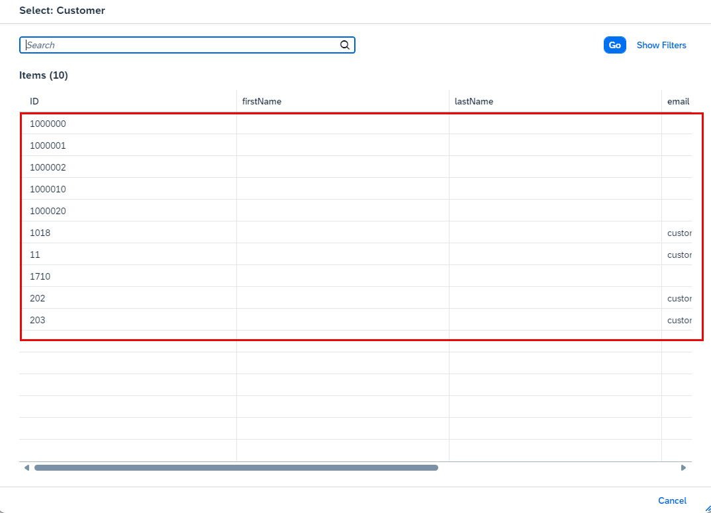

## You will learn

- How to deploy and the Incident Management application in the SAP BTP, Cloud Foundry runtime.
- How to test the application with the mock server that you have installed.

## Prerequisites

- You have tested the extended Incident Management sample application. Follow the steps in the [Test the Extended Incident Management Application with the Business Partner API](remote-service-run-dev-test) tutorial that is part of the [Consume Remote Services from a Mock Server in Your Full-Stack CAP Application Following the SAP BTP Developer's Guide and Deploy in SAP BTP, Cloud Foundry Runtime](https://developers.sap.com/group.sap-mock-consume-remote-services.html) tutorial group.
- You have installed a mock server in your Cloud Foundry space in the SAP BTP, Cloud Foundry runtime. Follow the steps in the [Install a Mock Server in the SAP BTP, Cloud Foundry Runtime](remote-service-set-up-mock) tutorial that is part of the [Consume Remote Services from a Mock Server in Your Full-Stack CAP Application Following the SAP BTP Developer's Guide and Deploy in SAP BTP, Cloud Foundry Runtime](https://developers.sap.com/group.sap-mock-consume-remote-services.html) tutorial group.
- You have an [enterprise global account](https://help.sap.com/docs/btp/sap-business-technology-platform/getting-global-account#loiod61c2819034b48e68145c45c36acba6e) in SAP BTP. To use services for free, you can sign up for an SAP BTPEA (SAP BTP Enterprise Agreement) or a Pay-As-You-Go for SAP BTP global account and make use of the free tier services only. See [Using Free Service Plans](https://help.sap.com/docs/btp/sap-business-technology-platform/using-free-service-plans?version=Cloud).
- You have a platform user. See [User and Member Management](https://help.sap.com/docs/btp/sap-business-technology-platform/user-and-member-management).
- You are an administrator of the global account in SAP BTP.
- You have a subaccount in SAP BTP to deploy the services and applications.
- You have one of the following browsers that are supported for working in SAP Business Application Studio:
    - Mozilla Firefox
    - Google Chrome
    - Microsoft Edge

> This tutorial follows the guidance provided in the [SAP BTP Developer's Guide](https://help.sap.com/docs/btp/btp-developers-guide/what-is-btp-developers-guide).

### Deploy the Incident Management application

1. In SAP Business Application Studio, navigate to the Incident Management application folder and add the following snippet to the **package.json** file:

    ```json[4-9]
      "API_BUSINESS_PARTNER": {
        "kind": "odata", 
        "model": "srv/external/API_BUSINESS_PARTNER", 
        "[production]": { 
          "credentials": { 
            "destination": "<destination_name>",
            "path": "odata/v2/api-business-partner"
          }
        }
      }
    ```

    > Replace **<destination_name>** with the name of the destination that you created at **Step 5: Create a destination to the mock server** of [Install a Mock Server in the SAP BTP, Cloud Foundry Runtime](remote-service-set-up-mock).

2. In the **mta.yaml** file, look for the **incident-management-srv** module's **requires** section, and make sure that the following line is added:

    ```yaml[7]
    - name: incident-management-srv
      type: nodejs
      path: gen/srv
      requires:
      - name: incident-management-auth
      - name: incident-management-db
      - name: incident-management-destination
    ....
    ```

4. Log in to your subaccount in SAP BTP:

    ```bash
    cf api <API-ENDPOINT>
    cf login
    cf target -o <ORG> -s <SPACE>
    ```

    > You can find the API endpoint in the **Overview** section of your subaccount in the SAP BTP cockpit.

5. Run the following commands to build and deploy your project to the SAP BTP, Cloud Foundry runtime:

    ```bash
    mbt build
    cf deploy mta_archives/incident-management_1.0.0.mtar 
    ```

### Test the Incident Management application

When creating new entries in the Incident Management application, you should be able to see all values from the mock server in the value help of the **Customer** field.

> Before you continue with this step, don’t forget to perform the steps from the tutorials [Assign the User Roles](https://developers.sap.com/tutorials/user-role-assignment.html) and [Integrate Your Application with SAP Build Work Zone, Standard Edition](https://developers.sap.com/tutorials/integrate-with-work-zone.html).

1. Open your SAP Build Work Zone, standard edition site as described in [Integrate Your Application with SAP Build Work Zone, Standard Edition](https://developers.sap.com/tutorials/integrate-with-work-zone.html).

6. Choose the **Incident Management** tile.

    <!-- border; size:540px --> 

9. Choose **Create** to start creating a new incident.
  
    <!-- border; size:540px --> 

11. Open the value help for the **Customer** field. 

    <!-- border; size:540px --> 

12. Verify that customer data is fetched from the mock server. 

    <!-- border; size:540px --> 

Congratulations! You have successfully developed, configured, and deployed the Incident Management application using an external service and a mock server.
