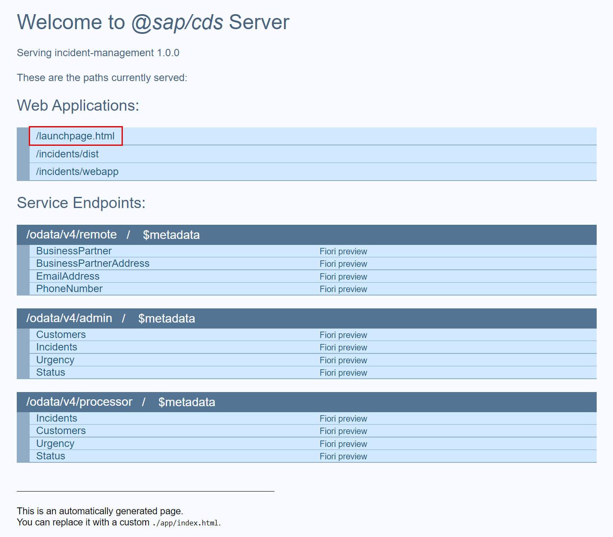
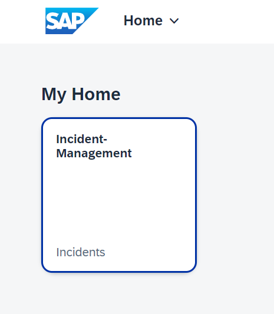
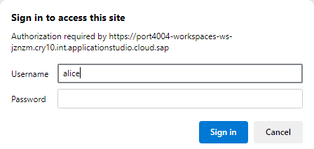
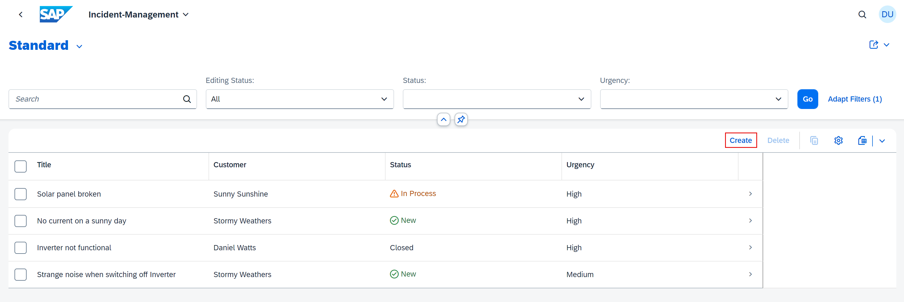
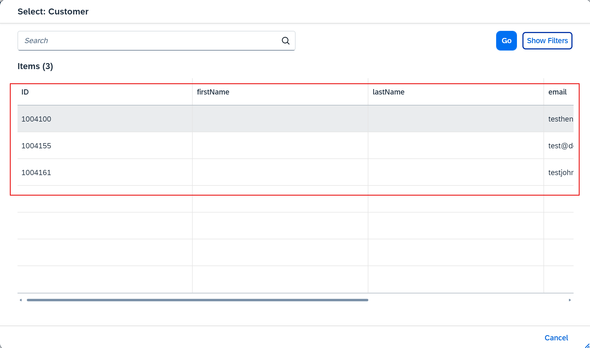

## You will learn

- How to increase your development speed by running and testing your implementation in a local environment.
- How to set up and use a local mock server for running your development tests for the extended Incident Management application.

## Prerequisites

- You have got the Business Partner API from SAP S/4HANA Cloud and have extended the functionality of the Incident Management application. Follow the steps in the [Get the Business Partner API and Extend the Incident Management Application](remote-service-extend-cf) tutorial.

### Create mock data for the new entities

Since you already have an SQLite in-memory database that was automatically created in the previous step, let's now fill it in with some test data.

1. In SAP Business Application Studio, navigate to the Incident Management application project and in the **srv/external** folder, create a new folder called **data**.

2. In the **data** folder, create a new file **API_BUSINESS_PARTNER-A_BusinessPartner.csv** and add the following data to it:

    ```csv
    BusinessPartner;FirstName;LastName;BusinessPartnerName;BusinessPartnerIsBlocked;
    1004155;Daniel;Watts;Daniel Watts;false
    1004161;Stormy;Weathers;Stormy Weathers;false
    1004100;Sunny;Sunshine;Sunny Sunshine;true
    ```

3. In the **data** folder, create a new file **API_BUSINESS_PARTNER-A_BusinessPartnerAddress.csv** and add the following data to it:

    ```csv
    BusinessPartner;AddressID;
    1004155;123
    1004161;345
    1004100;456
    ```

4. In the **data** folder, create a new file **API_BUSINESS_PARTNER-A_AddressEmailAddress.csv** and add the following data to it:

    ```csv
    AddressID;EmailAddress;Person;OrdinalNumber
    123;test@demo.com;Williams;123
    345;testjohn@demo.com;Smith;222
    456;testhencry@demo.com;johnson;333
    ```

5. In the **data** folder, create a new file **API_BUSINESS_PARTNER-A_AddressPhoneNumber.csv** and add the following data to it:

    ```csv
    AddressID;PhoneNumber;Person;OrdinalNumber
    123;+44-555-123;Daniel;123
    345;+01-555-688;Stormy;222
    456;+01-555-789;Sunny;333
    ```

### Run and test the Incident Management application locally

1. Install dependencies.

    ```bash
    npm i
    ```

2. Run the mock server locally.

    ```bash
    cds mock API_BUSINESS_PARTNER
    ```

3. In the terminal, you should see the following output:

    ```cds
    [cds] - connect using bindings from: { registry: '~/.cds-services.json' }
    [cds] - connect to db > sqlite { url: ':memory:' }
       > init from db/data/sap.capire.incidents-Urgency.csv 
       > init from db/data/sap.capire.incidents-Status.csv 
       > init from db/data/sap.capire.incidents-Incidents.csv 
       > init from db/data/sap.capire.incidents-Customers.csv 
       > init from db/data/sap.capire.incidents-Conversations.csv 
       > init from srv/external/data/API_BUSINESS_PARTNER-A_BusinessPartnerAddress.csv 
       > init from srv/external/data/API_BUSINESS_PARTNER-A_BusinessPartner.csv 
       > init from srv/external/data/API_BUSINESS_PARTNER-A_AddressPhoneNumber.csv 
       > init from srv/external/data/API_BUSINESS_PARTNER-A_AddressEmailAddress.csv  
    ```

    > If the API_BUSINESS_PARTNER doesn't show up, remove the **.cds-services.json** file that resides in the user root folder, for example, **/home/user/.cds-services.json**.

4. Open a new terminal and run `cds watch`. This will start the application connected to the running mock server.

5. Open a browser and open the server URL: `http://localhost:4004`.

6. Choose **/launchpage.html**.

    <!-- border; size:540px --> 

    **/launchpage.html** uses a [local launchpage](!https://pages.github.tools.sap/cap/golden-path/develop/Launchpage/Launchpage), while **/incidents/webapp/index.html** uses the **index.html** from [ui5 app](!https://pages.github.tools.sap/cap/golden-path/develop/btp-app-create-ui-fiori-elements/btp-app-create-ui-fiori-elements).

7. Choose the **Incident Management** tile.

    <!-- border; size:540px --> 

7. When you are prompted to authenticate, use the following credentials:

    - Username: `alice`
    - Password: Empty / No Password

    <!-- border; size:540px --> 

    > You find the user settings in the **.cdsrc.json** file.

9. Choose **Create** to start creating a new incident.
  
    <!-- border; size:540px --> 

11. Open the value help for the **Customer** field.

    <!-- border; size:540px --> 

12. Verify that customer data is fetched from the mock server.

    <!-- border; size:540px --> 

    To test the scenario, the value help for customers loads data from the mock server while creating a new incident.

By using a local mock server, you can easily test your implementation in a local environment. You find more details at [Local Mocking](https://cap.cloud.sap/docs/guides/using-services#local-mocking) in the CAP documentation.
