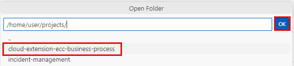
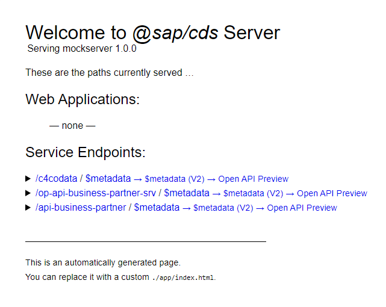

## You will learn

- How to install a mock server in the SAP BTP, Cloud Foundry runtime.
- How to create a destination to the mock server in the same subaccount.

## Prerequisites

- You have an [enterprise global account](https://help.sap.com/docs/btp/sap-business-technology-platform/getting-global-account#loiod61c2819034b48e68145c45c36acba6e) in SAP BTP. To use services for free, you can sign up for an SAP BTPEA (SAP BTP Enterprise Agreement) or a Pay-As-You-Go for SAP BTP global account and make use of the free tier services only. See [Using Free Service Plans](https://help.sap.com/docs/btp/sap-business-technology-platform/using-free-service-plans?version=Cloud).
- You have a platform user. See [User and Member Management](https://help.sap.com/docs/btp/sap-business-technology-platform/user-and-member-management).
- You are an administrator of the global account in SAP BTP.
- You have a subaccount in SAP BTP to deploy the services and applications.
- You have one of the following browsers that are supported for working in SAP Business Application Studio:
    - Mozilla Firefox
    - Google Chrome
    - Microsoft Edge

> This tutorial follows the guidance provided in the [SAP BTP Developer's Guide](https://help.sap.com/docs/btp/btp-developers-guide/what-is-btp-developers-guide).

### Use a mock server instead of an SAP S/4HANA Cloud tenant

If you don't have access to an SAP backend system (SAP ECC, SAP S/4HANA Cloud or an SAP on-premise system) but still need OData services with some data, you can use this [mock server application](https://github.com/SAP-samples/cloud-extension-ecc-business-process/blob/mock/README.md). It contains entities of SAP OData services with sample data.

You need to:

1. Install the mock server using SAP Business Application Studio.

2. Create a destination to the mock server in the same subaccount in SAP BTP.

> The installation of the mock server is only needed if you want to test an application deployed in Cloud Foundry. For local development testing, you can use the local mock server.

### Clone the mock server repository

1. In SAP Business Application Studio, go to your **IncidentManagement** dev space.

    > Make sure the **IncidentManagement** dev space is in status **RUNNING**.

2. Choose the burger menu and choose **Terminal** &rarr; **New Terminal**.

    <!-- border; size:540px --> 

3. Navigate to the **projects** folder:

    - From the root directory run `cd projects` in the terminal.

    - From the **incident-management** folder run `cd ..` in the terminal.

2. Clone the mock server GitHub repository:

    ```bash
    git clone -b mock https://github.com/SAP-samples/cloud-extension-ecc-business-process.git
    ```

3. In the menu, choose **File** &rarr; **Open Folder...**.

4. Type `/home/user/projects/` in the field and select `cloud-extension-ecc-business-process`. Choose **OK** to open the project in SAP Business Application Studio.

    <!-- border; size:540px --> 

### Log in to SAP BTP, Cloud Foundry runtime in SAP Business Application Studio

**In SAP BTP cockpit:**

1. Navigate to your subaccount and choose **Overview**.

2. Copy the values from the **Org Name** and **API Endpoint** parameters in a text editor of your choice.

3. In the left-hand navigation, choose **Cloud Foundry** &rarr; **Spaces**, copy the Space name and write it in a text editor of your choice.

**In SAP Business Application Studio:**

1. Invoke the Command Palette - **View** &rarr; **Command Palette** or <kbd>Command</kbd> + <kbd>Shift</kbd> + <kbd>P</kbd> for macOS / <kbd>Ctrl</kbd> + <kbd>Shift</kbd> + <kbd>P</kbd> for Windows.

2. Search for **CF Login** and select **CF: Login to Cloud Foundry**.

3. Enter the Cloud Foundry API endpoint you have copied from the SAP BTP cockpit or take the default API endpoint that is suggested.

4. When prompted, enter the email and password for your global account in SAP BTP.

5. Select the Cloud Foundry Org you have copied from the SAP BTP cockpit.

6. Select the Cloud Foundry Space you have copied from the SAP BTP cockpit.

7. Once you have selected the Org and the Space, open a new terminal in SAP Business Application Studio and log in with `cf login`.

You have successfully created a workspace and connected it to your desired Cloud Foundry Org and Space.

### Build and deploy the mock server application

5. In the project folder, right-click on the **mta.yaml** file and choose **Build MTA Project**.

    When the project is built successfully, you will see a new **mta_archives** folder in your project with the **Mockserver_1.0.0.mtar** file inside.

6. Right-click on the **mta_archives/Mockserver_1.0.0.mtar** file and choose **Deploy MTA Archive**.

Now you need to create a destination to the the mock server.

### Create a destination to the mock server

1. In SAP BTP cockpit, go to your subaccount and navigate to the space where you have deployed the mock server. In the **Applications** section, choose the **mock-srv** application.

2. In the application overview screen, copy the value of the **Application Route** of the mock server.

3. Go back to the SAP BTP cockpit, navigate to your subaccount overview and choose **Connectivity** &rarr; **Destination**. Then, choose **Create Destination**.

1. Enter the following values:

      - **Name** = `your-destination-name`
      - **Type** = `HTTP`
      - **URL** = `The application route of the mock server`
      - **Proxy Type** = `Internet`
      - **Authentication** = `NoAuthentication`

2. Select the **Use default JDK truststore** checkbox.

3. Save your settings.

4. Choose **Check Connection**. You should get a `200 OK` message.

    <!-- border; size:540px --> 

### Test the mock server

1. Paste the application route you have copied in the address bar of the browser.

2. Verify that there are a few API endpoints that display data.

    <!-- border; size:540px --> 
