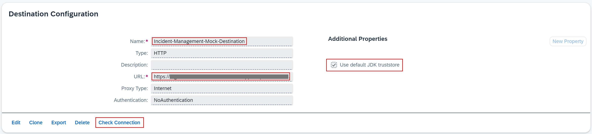

## You will learn

- How to install a mock server in the SAP BTP, Kyma runtime.
- How to create a destination to the mock server in the same subaccount.

## Prerequisites

- You have an [enterprise global account](https://help.sap.com/docs/btp/sap-business-technology-platform/getting-global-account#loiod61c2819034b48e68145c45c36acba6e) in SAP BTP. To use services for free, you can sign up for an SAP BTPEA (SAP BTP Enterprise Agreement) or a Pay-As-You-Go for SAP BTP global account and use the free tier services only. See [Using Free Service Plans](https://help.sap.com/docs/btp/sap-business-technology-platform/using-free-service-plans?version=Cloud).
- You have a platform user. See [User and Member Management](https://help.sap.com/docs/btp/sap-business-technology-platform/user-and-member-management).
- You're an administrator of the global account in SAP BTP.
- You have a subaccount in SAP BTP to deploy the services and applications.

> This tutorial follows the guidance provided in the [SAP BTP Developer's Guide](https://help.sap.com/docs/btp/btp-developers-guide/what-is-btp-developers-guide).

### Use a mock server instead of an SAP S/4HANA Cloud tenant

If you don't have access to an SAP back end system (SAP ECC, SAP S/4HANA Cloud or an SAP on-premise system) but still need OData services with some data, you can use this [mock server application](https://github.com/SAP-samples/cloud-extension-ecc-business-process/blob/mock/README.md). It contains entities of SAP OData services with sample data.

You need to:

1. Install the mock server in the SAP BTP, Kyma runtime.

2. Create a destination to the mock server in the same subaccount in SAP BTP.

> The installation of the mock server is only needed if you want to test an application deployed in the SAP BTP, Kyma runtime. For local development testing, you can use the local mock server.

### Clone the mock server repository

2. Clone the mock server GitHub repository:

    ```bash
    git clone -b mock https://github.com/SAP-samples/cloud-extension-ecc-business-process.git
    ```

3. Navigate to the mock server project:

    ```bash
    cd cloud-extension-ecc-business-process
    ```

4. Open the project in VS Code:

    ```bash
    code .
    ```

### Build and deploy the mock server application

>- Make sure you're logged in to your Kyma cluster. See [Login to your Kyma cluster](https://developers.sap.com/tutorials/deploy-to-kyma.html#a6e029c1-6e72-408b-bf5f-3b9dffba3499) for detailed steps how to log in.
>
>- Make sure you're logged in to your container registry.
>
>- If you're using any device with a non-x86 processor (for example, MacBook M1/M2), you need to instruct Docker to use x86 images by setting the **DOCKER_DEFAULT_PLATFORM** environment variable using the command `export DOCKER_DEFAULT_PLATFORM=linux/amd64`. Check [Environment variables](https://docs.docker.com/engine/reference/commandline/cli/#environment-variables) for more info.

5. Create the productive CAP build for the mock server application:

    ```bash
    cds build --production
    ```

6. Build the mock server application image:

    ```bash
    pack build <your-container-registry>/mockserver-srv:<image version> --path gen/srv --builder paketobuildpacks/builder-jammy-base --publish
    ```

    > Make sure to replace `<your-container-registry>` with your docker server URL and keep in mind that `<image version>` is a string. 

    > Looking for your docker server URL?
    
    > The docker server URL is the same as the path used for docker login, so you can quickly check it by running the following command in your terminal:

    > ```json
    > cat ~/.docker/config.json
    > ```

    > In case you're using Docker Hub as your container registry, replace the placeholder `<your-container-registry>` with your Docker Hub user ID.


1. Add Helm chart: 

    ```bash
    cds add helm --y
    ```

    CAP provides a configurable Helm chart for Node.js applications. As a result from running the command, you see a newly created **chart** folder in your project. The **chart** folder holds the helm configuration, including the **values.yaml** file where you add your container image settings later on.

2. Change the **chart/values.yaml** file:

    1. Remove the lines `messaging:` and `serviceInstanceName: event-mesh` from the `srv.bindings` section:

        ```yaml
        srv:
          bindings:
            destination:
              serviceInstanceName: 'destination'
            messaging:
              serviceInstanceName: event-mesh
          image:
            repository: mockserver-srv
        ...
        ```
    2. Remove the `event-mesh` section:

        ```yaml[7-9]
        ...
        destination:
          serviceOfferingName: 'destination'
          servicePlanName: 'lite'
          parameters:
            version: '1.0.0'
        event-mesh:
          serviceOfferingName: enterprise-messaging
          servicePlanName: default
        ```

    4. Run the following command to get the domain name of your Kyma cluster:

        ```bash
        kubectl get gateway -n kyma-system kyma-gateway \
                -o jsonpath='{.spec.servers[0].hosts[0]}'
        ```

        The result looks like this:

        ```bash
        *.<xyz123>.kyma.ondemand.com
        ```

        > `<xyz123>` is a placeholder for a string of characters that's unique for your cluster.

    5. In the **chart/values.yaml** file, add the result without the leading `*.` in the `domain` property so that the URL of your CAP service can be generated:

        ```yaml[2]
        global:
            domain: <your-cluster-domain>
        ...
        ```

1. Open the **chart/Chart.yaml** file and remove the dependency for `event-mesh` (last 3 lines) from it:

    ```yaml
     dependencies:
       - name: web-application
         alias: srv
         version: ">0.0.0"
       - name: service-instance
         alias: destination
         version: ">0.0.0"
       - name: service-instance
         alias: event-mesh
         version: ">0.0.0"
    ```

1. Update the productive CAP build for your application: 

    ```bash
    cds build --production
    ```

2. Deploy the mock server in the same namespace as your application (for example, **incident-management**):

    ```bash
    helm upgrade --install mock ./gen/chart -n incident-management
    ```

    > The mock server must be deployed in the same namespace as your application. If you've followed the [Deploy a Full-Stack CAP Application in SAP BTP, Kyma Runtime Following SAP BTP Developer’s Guide](https://developers.sap.com/group.deploy-full-stack-cap-kyma-runtime.html) group of tutorial, you've created a namespace **incident-management** already. In case you haven't created a namespace yet, run the following command to create it now:
    
    > ```bash
    > kubectl create namespace incident-management
    > kubectl label namespace incident-management istio-injection=enabled
    > ```

3. Copy the application route (URL) of the mock server from the CLI output:

    ```bash[6]
    Thank you for installing mockserver version 1.0.0.

    The release mock is installed in namespace incident-management.

    Your services are available at:
        srv - https://mock-srv-incident-management.<xyz123>.kyma.ondemand.com
    ```

    > `<xyz123>` is a placeholder for a string of characters that's unique for your cluster.

### Create a destination to the mock server

3. Go back to the SAP BTP cockpit, navigate to your subaccount overview, and choose **Connectivity** &rarr; **Destination**. Then, choose **Create Destination**.

1. Enter the following values:

      - **Name** = `your-destination-name`
      - **Type** = `HTTP`
      - **URL** = `The application route of the mock server`
      - **Proxy Type** = `Internet`
      - **Authentication** = `NoAuthentication`

2. Select the **Use default JDK truststore** checkbox.

3. Save your settings.

4. Choose **Check Connection**. You get a `200 OK` message.

    <!-- border; size:540px --> 

### Test the mock server

1. Paste the application route that you've copied in the address bar of the browser.

2. Verify that there are a few API endpoints that display data.

    <!-- border; size:540px --> 
