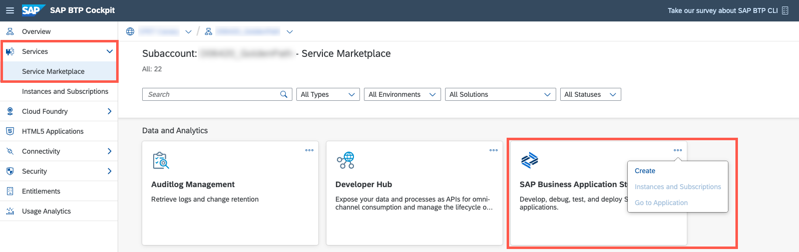
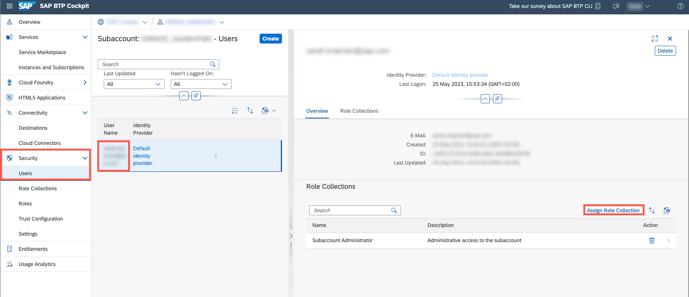
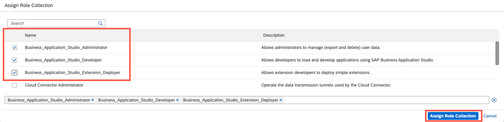

## You will learn

- How to subscribe to SAP Business Application Studio
- How to launch SAP Business Application Studio

## Prerequisites

- You have an [enterprise global account](https://help.sap.com/docs/btp/sap-business-technology-platform/getting-global-account#loiod61c2819034b48e68145c45c36acba6e) in SAP BTP. To use services for free, you can sign up for a CPEA (Cloud Platform Enterprise Agreement) or a Pay-As-You-Go for SAP BTP global account and make use of the free tier services only. See [Using Free Service Plans](https://help.sap.com/docs/btp/sap-business-technology-platform/using-free-service-plans?version=Cloud).
- You have an S-user or P-user. See [User and Member Management](https://help.sap.com/docs/btp/sap-business-technology-platform/user-and-member-management).
- You are an administrator of the global account in SAP BTP.
- You have a subaccount in SAP BTP to deploy the services and applications.
- You have one of the following browsers that are supported for working in SAP Business Application Studio:
    - Mozilla Firefox
    - Google Chrome
    - Microsoft Edge

### Configure entitlements for SAP Business Application Studio

> This task is usually done by the administrator of the global account in SAP BTP. Developers then need to create their personal development space by following the instructions in **Step 4: Launch SAP Business Application Studio** below.
  
1. In the SAP BTP cockpit, choose **Entitlements** &rarr; **Entity Assignments**.

2. In the **Select Entities** field, select the subaccount you have already created.

3. Choose **Configure Entitlements** and then choose **Add Service Plans**.

4. In the **Entitlements** dialog, search for **SAP Business Application Studio** and select plan **free (Application)**.

    > The plan **free (Application)** has the following restrictions:
    >
    >- A user can only have up to 2 dev spaces.
    >- A user can only have 1 dev space in the **RUNNING** state at a time.
    >- When working in the **Full-Stack Application Using Productivity Tools** dev space, a user can deploy a maximum of 2 times.
    >- The maximum size limit of a dev space is 4 GB. 

5. Choose **Add 1 Service Plan** and save your changes.

    <!-- border; size:540px --> 

### Subscribe to the SAP Business Application Studio

> This task is usually done by the administrator of the global account in SAP BTP. Developers then need to create their personal development space by following the instructions in **Step 4: Launch SAP Business Application Studio** below.

1. Navigate to your subaccount and choose **Services** &rarr; **Service Marketplace**.

2. Search for the **SAP Business Application Studio** tile and choose **Create**.

    <!-- border; size:540px --> 

3. In the **Plan** dropdown menu, select **free** and choose **Create**.

    > Creating your new subscription might take some minutes. You can check the current status of the submission on the **Service Instances and Subscriptions** page.

### Assign the necessary roles to your user

> This task is usually done by the administrator of the global account in SAP BTP. Developers then need to create their personal development space by following the instructions in **Step 4: Launch SAP Business Application Studio** below.

1. Navigate to your subaccount and choose **Security** &rarr; **Users**.

2. Select your user from the list and choose **Assign Role Collection**.

    <!-- border; size:540px --> 

3. Select the **Business_Application_Studio_Developer** role collection and choose **Assign Role Collection**.

    <!-- border; size:540px --> 

    > You can find an overview about the role collections in [Manage Role Collections](https://help.sap.com/docs/bas/sap-business-application-studio/manage-role-collections) on the SAP Help Portal.

### Launch SAP Business Application Studio

1. Navigate to your subaccount and choose **Services** &rarr; **Service Instances and Subscriptions**.

2. Choose **SAP Business Application Studio**. SAP Business Application Studio opens in a new tab of the browser.

3. Choose **Create Dev Space**.

    If you haven't created a dev space, the welcome page for SAP Business Application Studio loads.

    <!-- border; size:540px --> 

    If this isn't the first dev space, the dev space manager for SAP Business Application Studio loads.

    <!-- border; size:540px --> 

    > If you create a bookmark to this page, it's easy to get back to SAP Business Application Studio later.

4. Choose a **Dev Space Name** (For example, `IncidentManagement`).

5. Choose the **Full Stack Cloud Application** template and then choose **Create Dev Space**.

    <!-- border; size:540px --> 

    > Creating your dev space might take some minutes.

6. As soon as your dev space is in status **Running**, you can click its name to open it.

    <!-- border; size:540px --> 

With this, you've successfully completed the setup of SAP Business Application Studio.
