## You will learn

- How to initialize a repository in VS Code.
- How to set up your CI/CD pipeline

## Prerequisites

- You have prepared your application for deployment in SAP BTP, Kyma runtime. Follow the steps in the [Deploy in SAP BTP, Kyma Runtime](deploy-to-kyma) tutorial that is part of the [Deploy a Full-Stack CAP Application in SAP BTP, Kyma Runtime Following SAP BTP Developer’s Guide](https://developers.sap.com/group.deploy-full-stack-cap-kyma-runtime.html) tutorial group.
- You have an [enterprise global account](https://help.sap.com/docs/btp/sap-business-technology-platform/getting-global-account#loiod61c2819034b48e68145c45c36acba6e) in SAP BTP. To use services for free, you can sign up for an SAP BTPEA (SAP BTP Enterprise Agreement) or a Pay-As-You-Go for SAP BTP global account and make use of the free tier services only. See [Using Free Service Plans](https://help.sap.com/docs/btp/sap-business-technology-platform/using-free-service-plans?version=Cloud).
- You have a platform user. See [User and Member Management](https://help.sap.com/docs/btp/sap-business-technology-platform/user-and-member-management).
- You are an administrator of the global account in SAP BTP.
- You have a subaccount in SAP BTP to deploy the services and applications.
- You have one of the following browsers that are supported for working in SAP Business Application Studio:
    - Mozilla Firefox
    - Google Chrome
    - Microsoft Edge

> This tutorial follows the guidance provided in the [SAP BTP Developer's Guide](https://help.sap.com/docs/btp/btp-developers-guide/what-is-btp-developers-guide).

### Create a repository

To be able to perform the steps for setting up a CI/CD pipeline, you will need a public repository. Currently, SAP Continuous Integration and Delivery supports [GitHub](https://github.com/) and [Bitbucket](https://bitbucket.org/) repositories.

For real application development, you need to consider the right place for your repository, of course.

In this example, we'll be creating a repository on GitHub. You'll need a [GitHub](https://github.com/) account for this step. Go ahead and create one if you don't have it yet.

1. Create a new GitHub repository in your GitHub account.

1. Under **Repository name**, enter **incident-management**.

2. Choose **Create repository**.

    <!-- border; size:540px --> 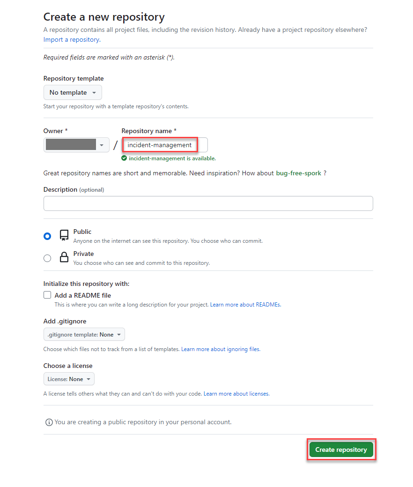

3. You'll be directed to the **Quick Setup** page of your new repository. Make sure to copy the URL of the repository as you'll need it in the next steps.

    <!-- border; size:540px --> 

### Initialize a repository in VS Code

1. Make sure you've opened the **incident-management** folder in VS Code.

2. Navigate to the **.gitignore** file in your project's root folder and replace the contents of the file with the following code snippet:

    ```
    node_modules/
    package-lock.json
    gen/

    *.mtar
    mta_archives/
    mta.yaml
    ```
    
    > If **.gitignore** doesn't exist, create it and paste the code snippet above in the newly-created file.

    
        

1. In VS Code, navigate to **Source Control** on the left and choose **Initialize Repository**.

    <!-- border; size:540px --> 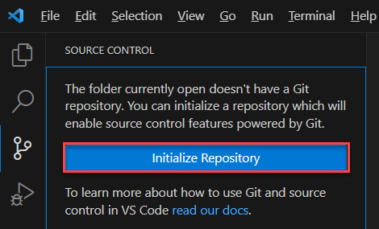

3. Open the three dots menu next to **Source Control** and choose **Remote** &rarr; **Add Remote...**.

    <!-- border; size:540px --> 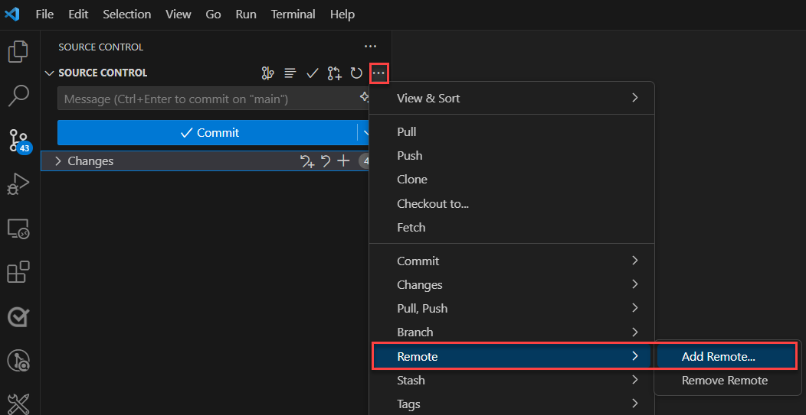

4. Paste the URL of your repository in the **Provide repository URL** field and press <kbd>Enter<kbd>.

    <!-- border; size:540px --> 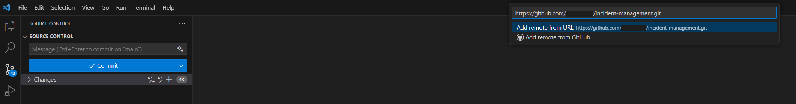

5. Provide a remote name and press <kbd>Enter<kbd>.

    <!-- border; size:540px --> 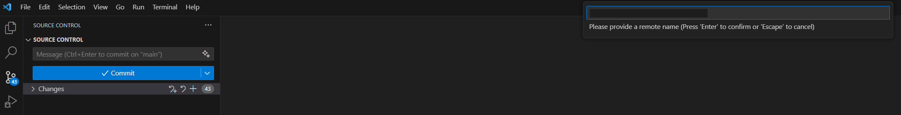

6. Stage your changes, add a commit message and choose **Publish Branch**.

    <!-- border; size:540px --> 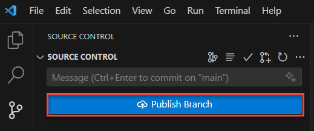

7. Provide your GitHub username and password when prompted. When the changes are pushed, you'll be able to see your project in your GitHub repository.


### Enable SAP Continuous Integration and Delivery service

1. Navigate to your subaccount and choose **Services** &rarr; **Service Marketplace** on the left.


4. Type **Continuous Integration & Delivery** in the search box and choose **Create**.

    <!-- border; size:540px --> 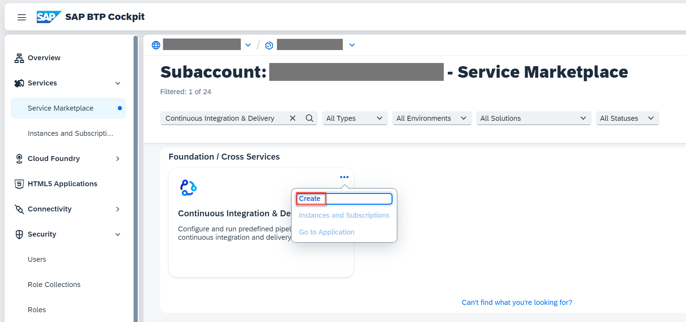

6. Choose **Create** in the **New Instance or Subscription** popup without changing any values.

    <!-- border; size:540px --> 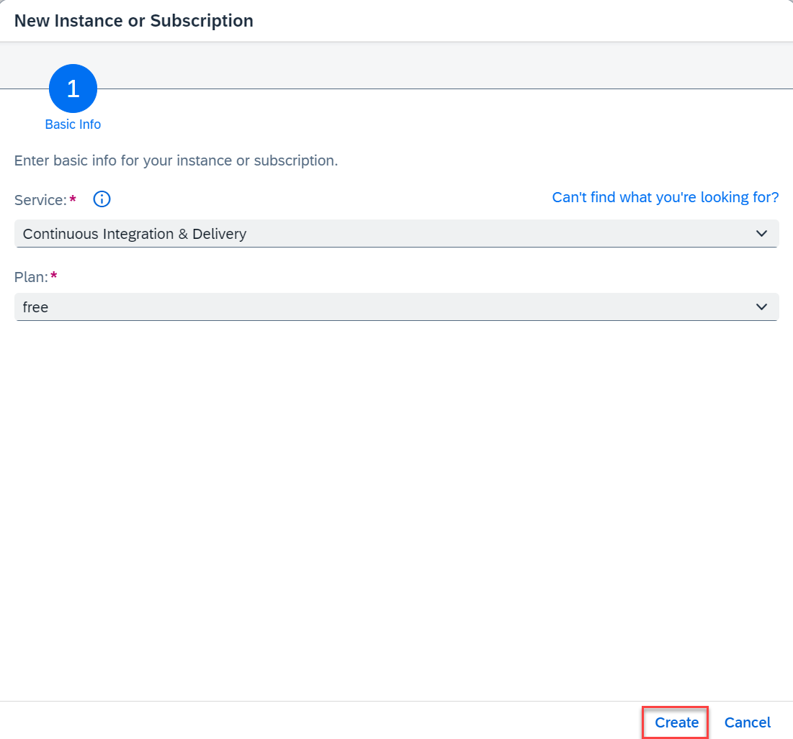

7. Choose **View Subscription** and wait until the status changes to **Subscribed**.

    <!-- border; size:540px --> 

    <!-- border; size:540px --> 

8. In your SAP BTP subaccount, choose **Security** &rarr; **Role Collections** in the left-hand pane.

9. Choose role collection **CICD Service Administrator**.

10. Choose **Edit**.

    <!-- border; size:540px --> 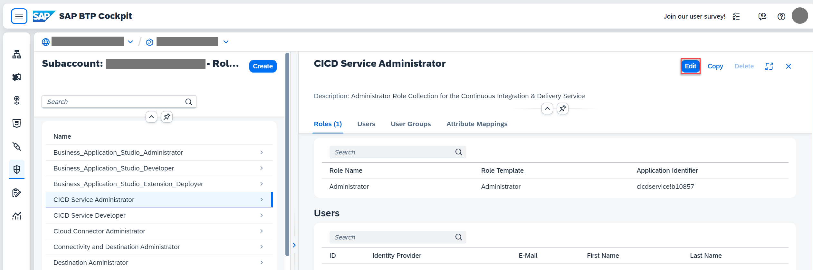

11. In the **Users** section, enter your user and select the icon to add the user.

    <!-- border; size:540px --> 

    > Keep the setting `Default Identity Provider` unless you have a custom identity provider configured.

13. Choose **Save**.

    You've assigned the **CICD Service Administrator** role collection to your user.

> You might need to log out and log back in to make sure your new role collection is taken into account.
    
> See [Initial Setup](https://help.sap.com/docs/CONTINUOUS_DELIVERY/99c72101f7ee40d0b2deb4df72ba1ad3/719acaf61e4b4bf0a496483155c52570.html) for more details on how to enable the service.
 

### Create a Service Account

In order to run the pipeline using the SAP Continuous Integration and Delivery service, you need to create a service account. This is a non-human account that provides a distinct identity in your Kyma cluster. The service account will authenticate your CI/CD pipeline to access your Kyma cluster. See [Service Accounts](https://kubernetes.io/docs/concepts/security/service-accounts/).

1. Navigate to your subaccount and choose **Link to dashboard** under the **Kyma Environment** tab to open the Kyma Console.

      <!-- border; size:540px --> 

2. Choose **Namespaces** &rarr; **Create**.

    <!-- border; size:540px --> 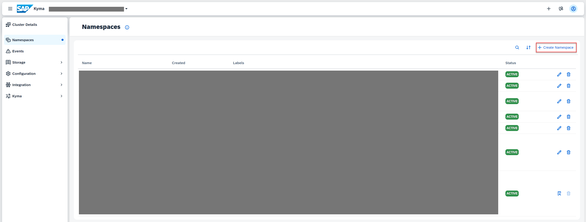

3. Enter a name for your namespace (for example, **incident-management-namespace**), switch the **Side Car Injection** toggle **ON**, and choose **Create**.

    <!-- border; size:540px --> 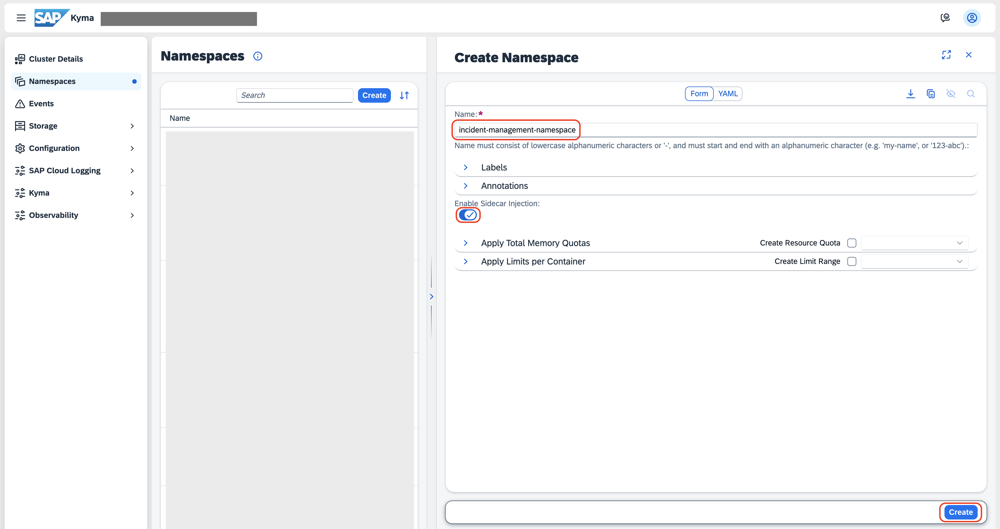

4. Navigate to the namespace **incident-management-namespace** and choose **Configuration** &rarr; **Service Accounts** on the left.

    <!-- border; size:540px --> 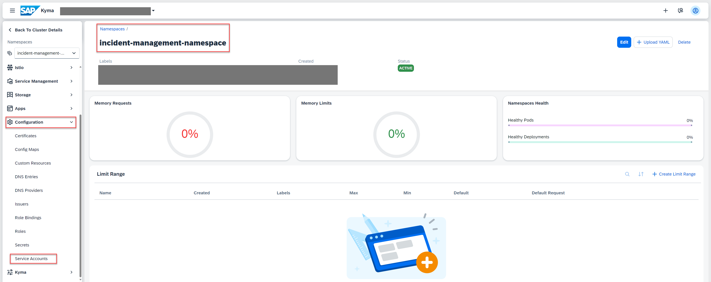

5. Choose **Create**.

    <!-- border; size:540px --> 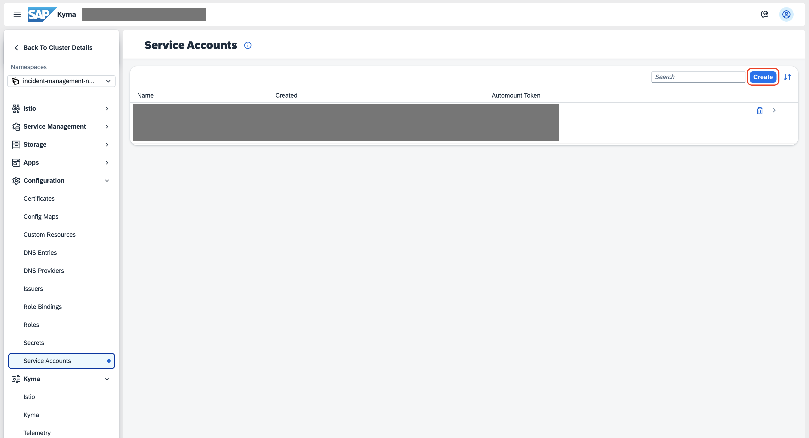

6. Enter a name for the service account (for example, **incident-management-namespace-service-account**) and choose **Create**.

    <!-- border; size:540px --> 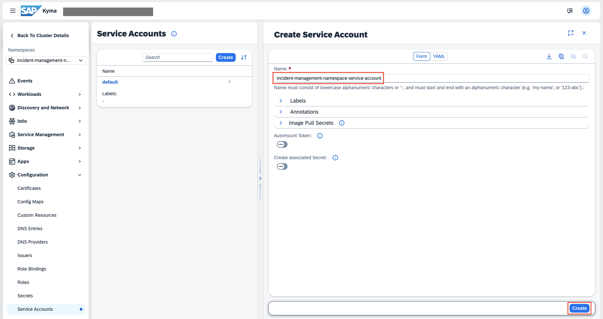

7. Navigate to the service account **incident-management-namespace-service-account** and choose **Generate TokenRequest**.

    <!-- border; size:540px --> 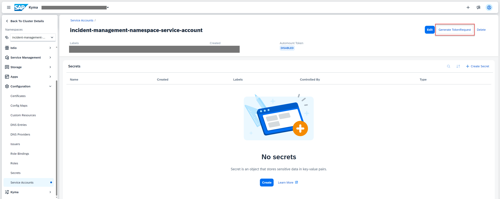

    This will generate a set of configurations that represent the **kubeconfig** file of the service account.

8. Choose a longer period from the dropdown in the **Expiration seconds** field and copy the **TokenRequest** value. You'll need it in the steps below. 

    <!-- border; size:540px --> 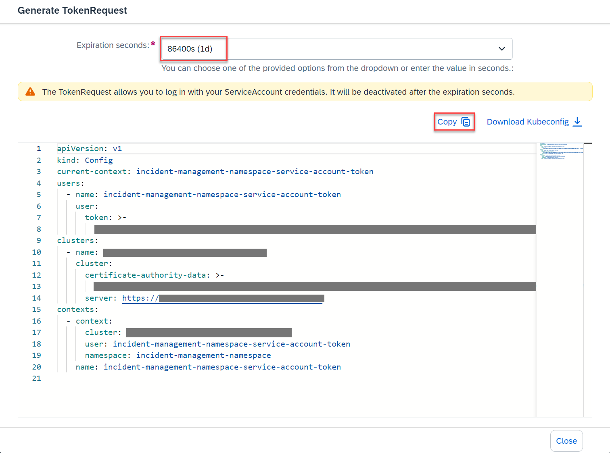

9. Navigate to the **Cluster Details** page and choose **Configuration** &rarr; **Cluster Role Bindings**.

    <!-- border; size:540px --> 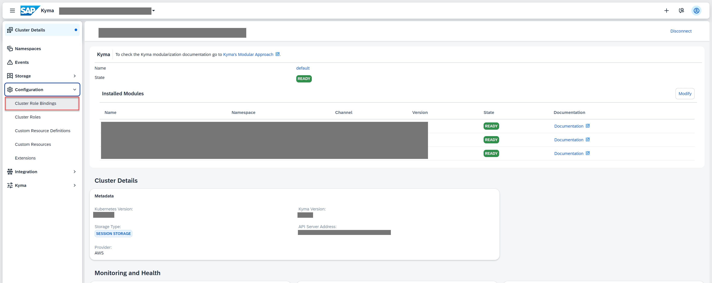

10. Choose **Create**.

    <!-- border; size:540px --> 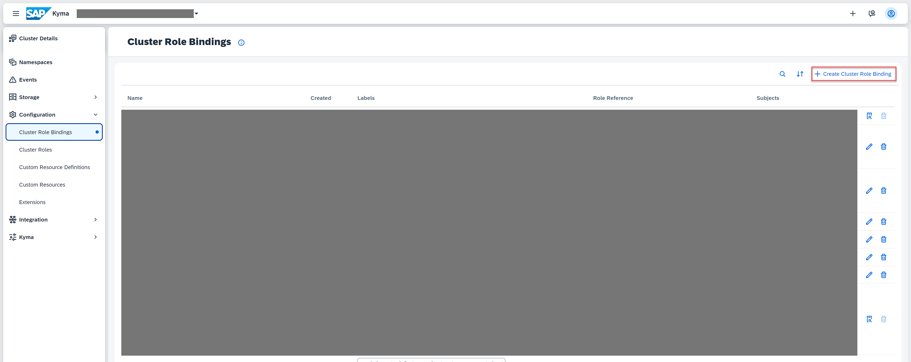

11. In the **Create Cluster Role Binding** dialog:

    - Enter a unique name in the **Name** field. For example, **incident-management-namespace-admin**.
    - Select **cluster-admin** from the dropdown in the **Role** field.
    - Select **ServiceAccount** from the dropdown in the **Kind** field.
    - Select **incident-management-namespace** from the dropdown in the **Service Account Namespace** field.
    - Select **incident-management-namespace-service-account** from the dropdown in the **Service Account Name** field.
    - Choose **Create**.

    <!-- border; size:540px --> 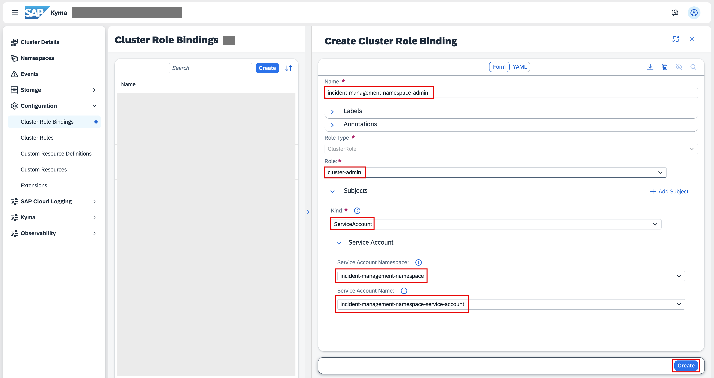


### Access SAP Continuous Integration and Delivery service

1. In your SAP BTP subaccount, navigate to **Services** &rarr; **Instances and Subscriptions** in the left-hand pane.

2. Choose **Continuous Integration & Delivery**.

    <!-- border; size:540px --> 

3. Use your SAP BTP global user name and global password to log in to the application.


### Add Credentials

1. Choose the **Credentials** tab and choose the icon to add a new credential.

    <!-- border; size:540px --> 

2. Under **Create Credentials** on the right:

    - Enter **github** in the **Credential Name** field.
    - Select **Basic Authentication** from the dropdown in the **Type** field.
    - Enter your GitHub user name in the **Username** field.
    - Enter your GitHub password (or GitHub access token if you have created one) in the **Password** field.
    - Choose **Create**. 

    <!-- border; size:540px --> 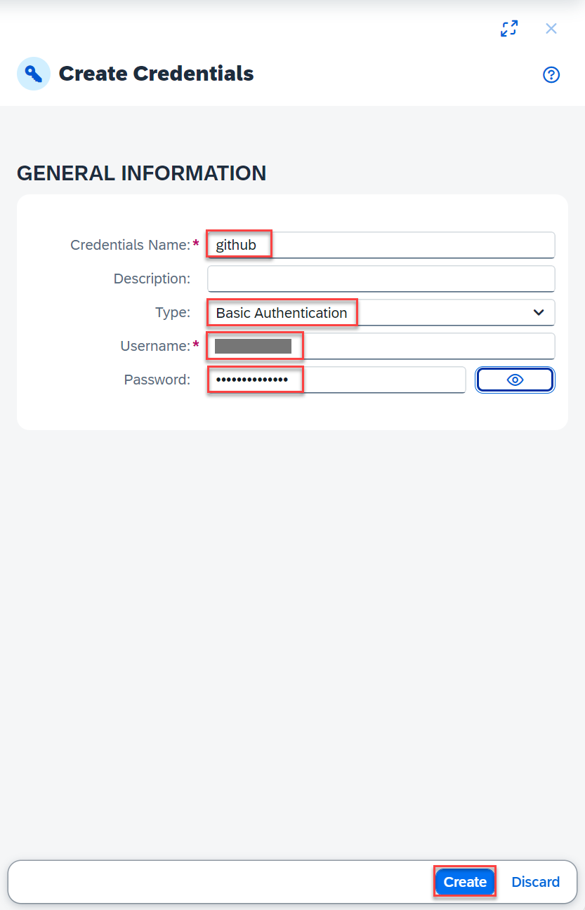

3. Choose the icon to add a new credential again and create a credential for Kyma.

    - Enter **kube-config** in the **Credentials Name** field.
    - Select **Kubernetes Configuration** from the dropdown in the **Type** field.
    - Paste the **TokenRequest** value that you copied in Step 4 above in the **Content** field.
    - Choose **Create**.

    <!-- border; size:540px --> 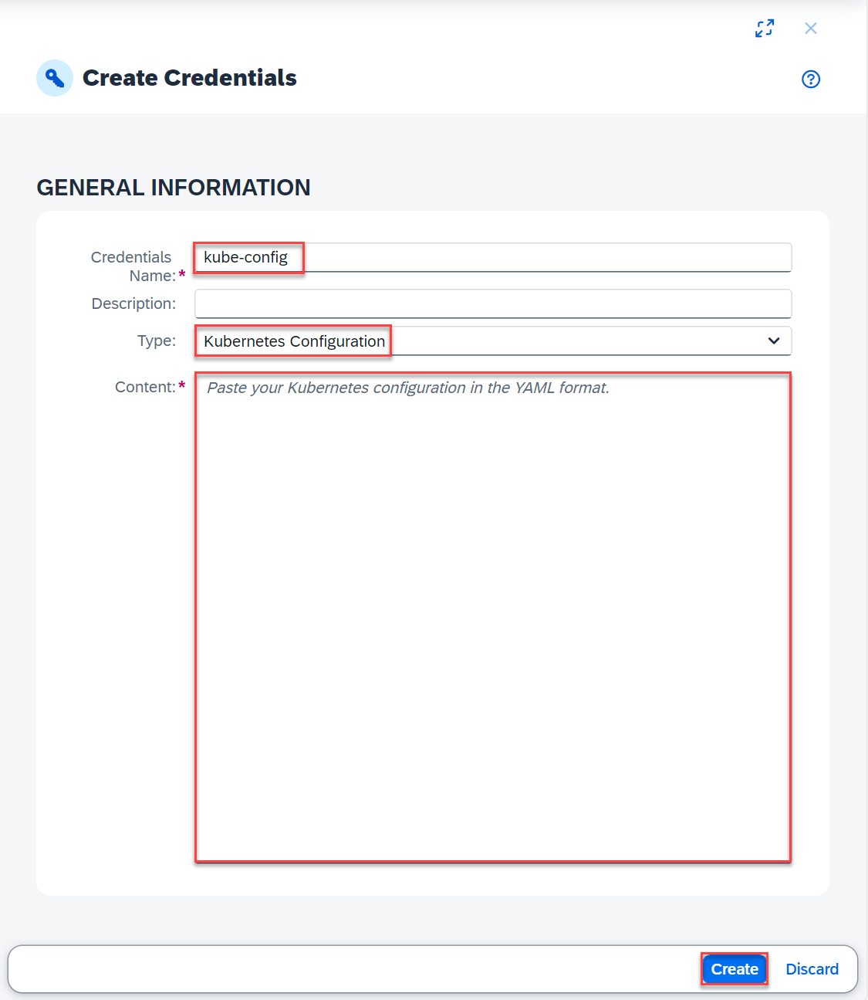

4. Choose the icon to add a new credential again and create a credential for your container registry.

    - Enter **container-registry-credentials** in the **Credentials Name** field.
    - Select **Container Registry Configuration** from the dropdown in the **Type** field.
    - Paste your container registry credentials in the **Content** field, removing the `https://` and `/v1/` from the container registry URL in the `auths` object.
    - Choose **Create**.

    <!-- border; size:540px --> 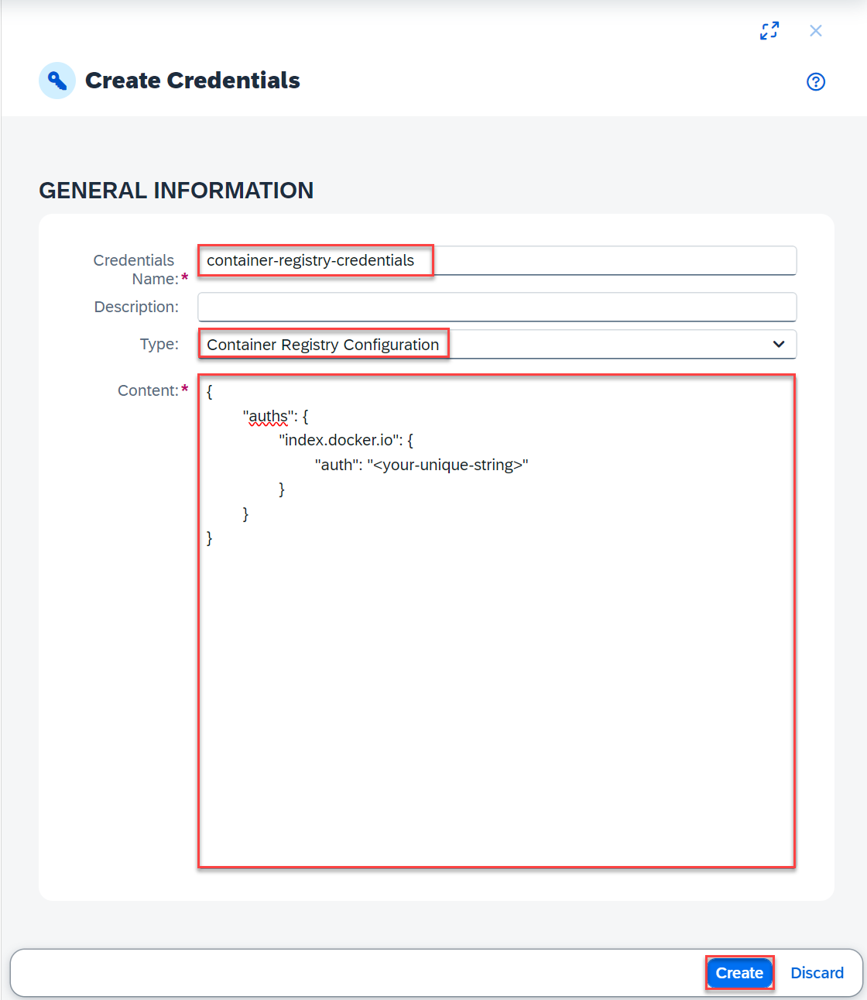


    >Here's how to get your container registry credentials in the required format:
    >
    >1. Run `docker --config /tmp login docker.io` in a terminal to login to your container registry.
    >
    >1. Run `cat /tmp/config.json` to print your container registry credentials. This is how the output should look like this:
    >
    >       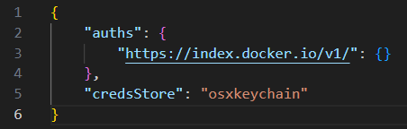
    >
    >2. Open the `/tmp/config.json` in a text editor and delete the `credsStore` key-value pair. 
    >
    >3. Run the `docker --config /tmp login docker.io` command and provide your container registry login credentials.
    >
    >4. Print your container registry credentials again with `cat /tmp/config.json`. This is how the output should look like now:
    >
    >       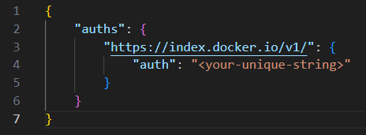


### Prepare package.json

1. Open the **package.json** file in your project root folder.

2. Add the following lines to the **package.json** file:

    ```json[8, 13]
    {
        "name": "incident-management",
        ...
        "dependencies": {
            ...
        },
        "devDependencies": {
            "@cap-js/sqlite": "^1",
            ...
        },
        "scripts": {
            ...
            "cds-build": "npm install --include=dev && cds build --production"
        },
        ...
    }
    ```
3. In VS Code, choose **Terminal** &rarr; **New Terminal** and run `npm add -D @sap/cds-dk` to add `@sap/cds-dk` as a `devDependency` in the **package.json** file.

4. Make sure to commit and push your changes to the remote repository.


### Add a CI/CD job

1. Navigate to the **Jobs** tab and choose the icon to add a new job.

    <!-- border; size:540px --> 

2. Enter **Incident-Management** in the **Job Name** field.

#### Add repository 

3. Open the value help for the **Repository** field. 

    <!-- border; size:540px --> 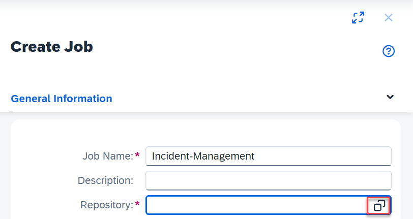

2. In the **Select Repository** popup, choose **Add Repository**. A popup opens.

    <!-- border; size:540px --> 

3. In the **Add Repository** popup, enter details for the repository you created in **Step 1: Create a repository**:

    - Enter **incident-management** in the **Name** field.
    - Enter your repository's URL in the **Clone URL** field.
    - Open the value help in the **Credentials** field and choose the credential **github** that you created in **Step 6: Add credentials**. 
    - Remove the **Webhook Event Receiver** section.

    <!-- border; size:540px --> 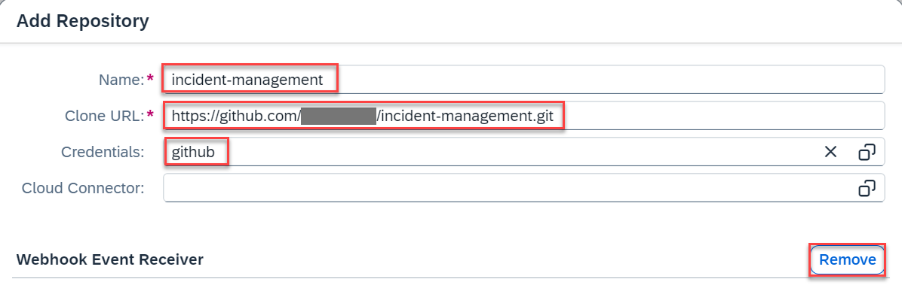


4. Choose **Add** to complete the addition of a repository.

    <!-- border; size:540px --> 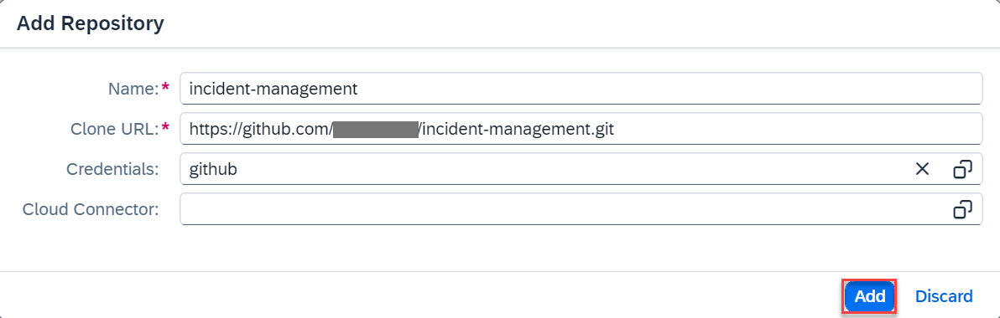

#### Configure pipeline and stages

1. Back in the **General Information** tab, enter **main** in the **Branch** field.

2. Select **Kyma Runtime** from the dropdown in the **Pipeline** field.

    <!-- border; size:540px --> 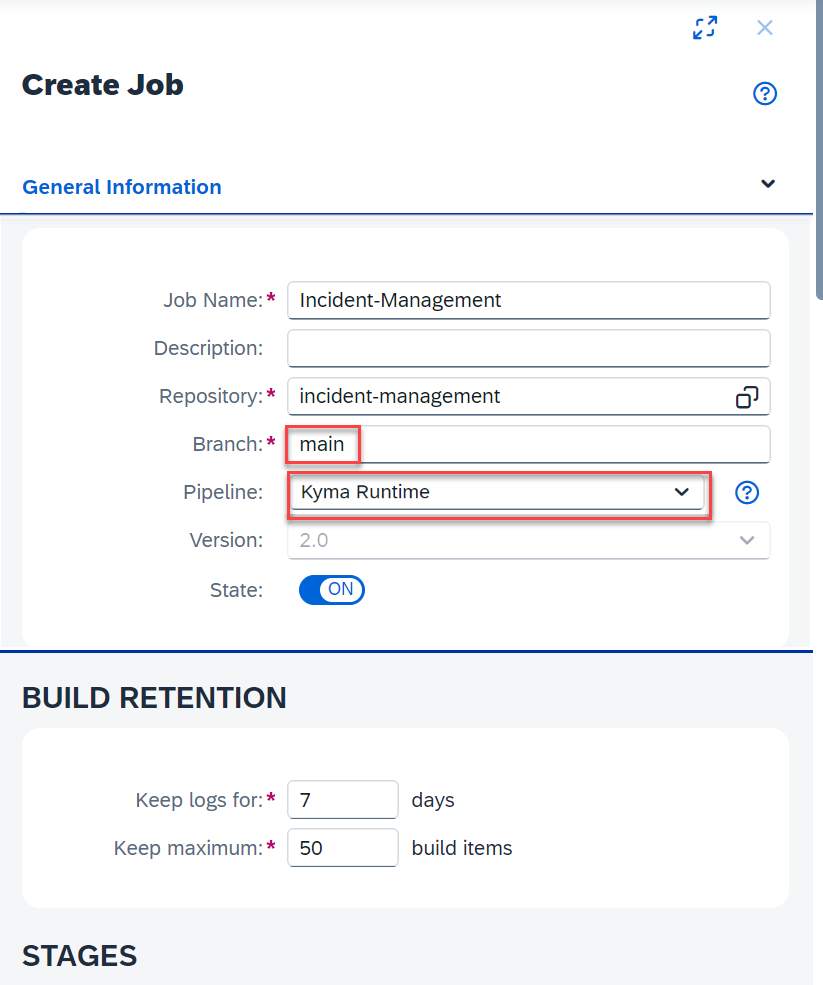

3. In the **Stages** tab, enter **chart** in the **Helm Chart Path** field.

4. Choose **+** to add container images:

    <!-- border; size:540px --> 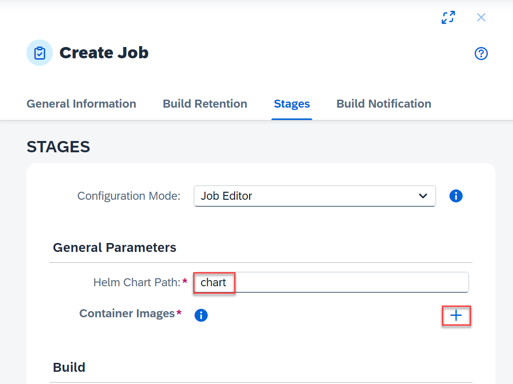

    - Enter **`<your-container-registry>/incident-management-srv`** in the **Container Image Name** field.
    - Enter **gen/srv** in the **Project Subdirectory Path** field.
    - Choose **OK**.

    <!-- border; size:540px --> 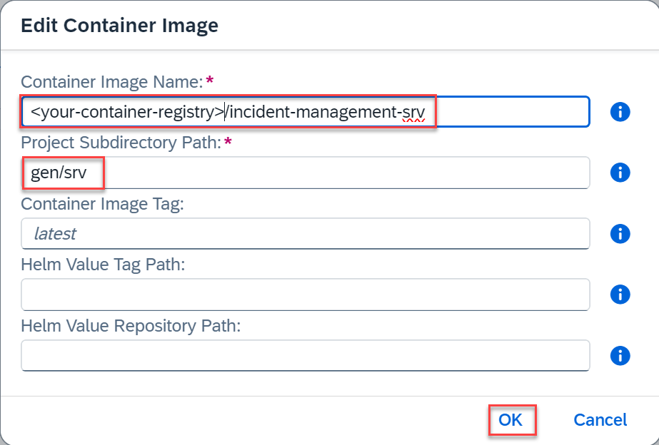

    - Choose **+**.
    - Enter **`<your-container-registry>/incident-management-hana-deployer`** in the **Container Image Name** field.
    - Enter **gen/db** in the **Project Subdirectory Path** field.
    - Choose **OK**.
    - Choose **+**.
    - Enter **`<your-container-registry>/incident-management-html5-deployer`** in the **Container Image Name** field.
    - Enter **app/incidents** in the **Project Subdirectory Path** field.
    - Choose **OK**.

    <!-- border; size:540px --> 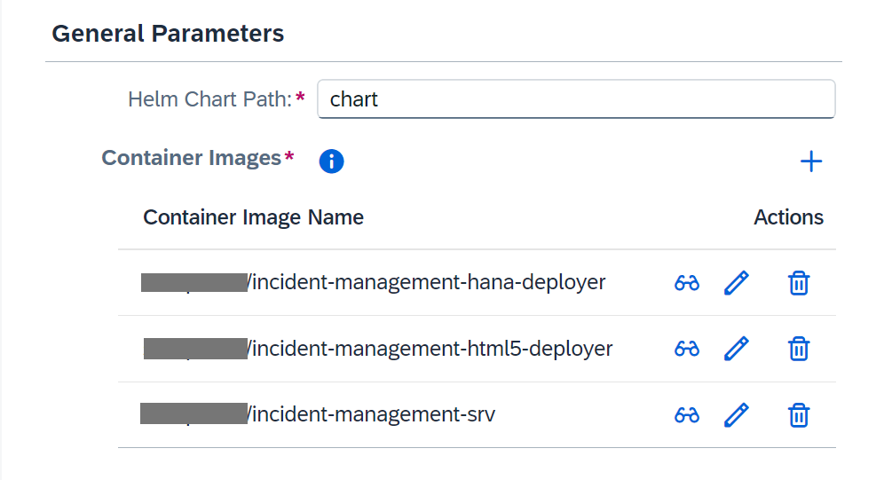


3. Select **npm** from the dropdown in the **Build Tool** field.

4. Select **Node 18** from the dropdown in the **Build Tool Version** field. 

5. Enter **cds-build** in the **Script** field.

6. In the **CNB Build** section, enter the URL of your container registry in the **Container Registry URL** field (for example, https://index.docker.io if you are using Docker Hub).

7. Open the value help for the **Container Registry Credential** field and choose **container-registry-credentials**.

8. Switch the **Helm Dependency Update** toggle **ON**.

    <!-- border; size:540px --> 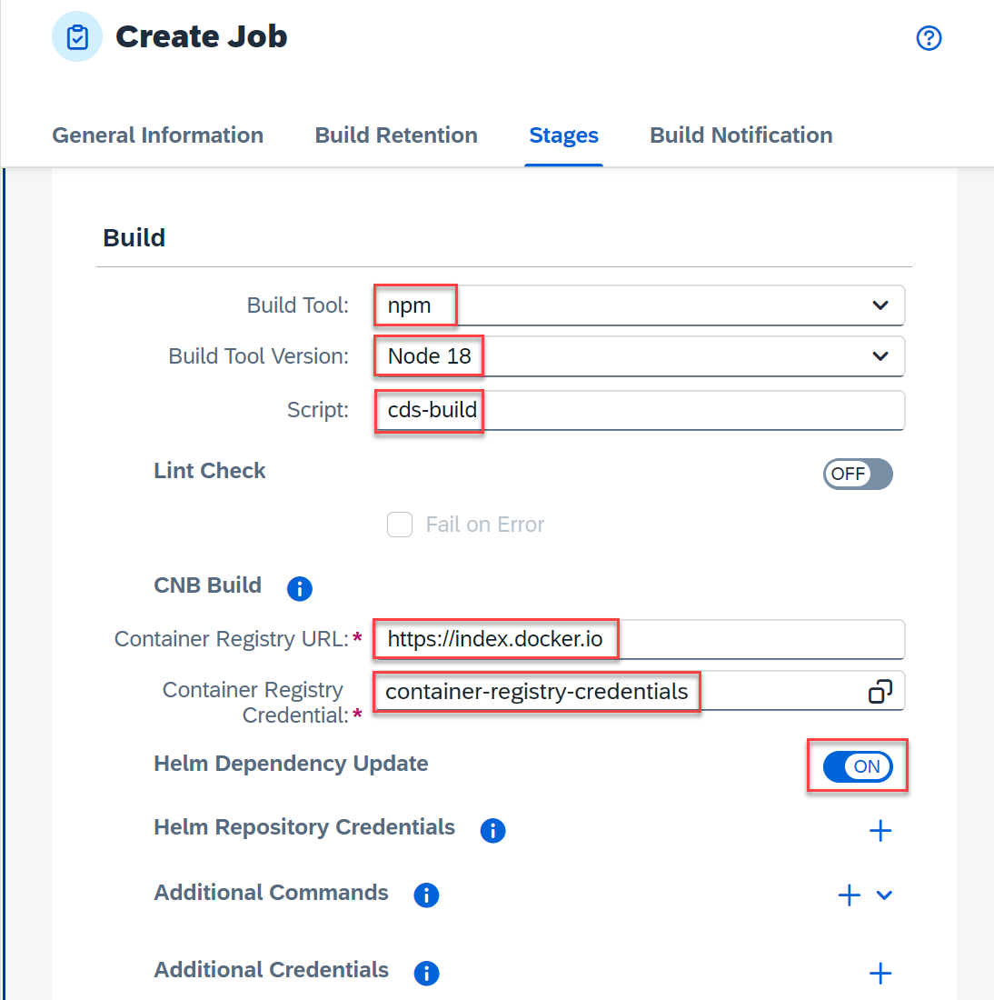

#### Add unit tests and configure release

1. In the **Additional Unit Tests** section, switch the toggle button to **ON**.  

2. Enter **test** in the **npm Script** field.

    <!-- border; size:540px --> 

3. Scroll down to the **Release** section and switch the **Release** toggle **ON**. 

4. Provide the required information under **Deploy to Kyma**:

    - Open the value help for the **Kubernetes Configuration Credential** field and choose **kube-config**.
    - Enter **incident-management-namespace** in the **Kubernetes Namespace** field.
    - Enter **incident-management** in the **Helm Release Name** field.
    - Choose **+** to add helm values.

    <!-- border; size:540px --> 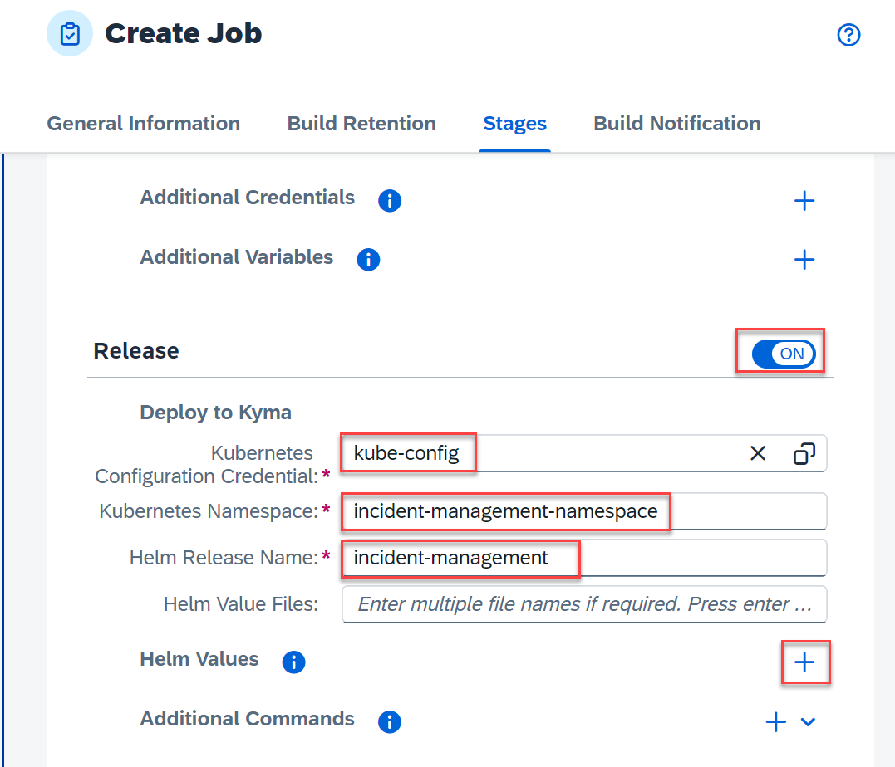

5. In the **Add Helm Values** dialog:
    - Enter **xsuaa.jsonParameters** in the **Helm Value Path** field.
    - Enter **xs-security.json** in the **Value** field.
    - Select **file** from the dropdown in the **Source** field.
    - Choose **OK**.

    <!-- border; size:540px --> 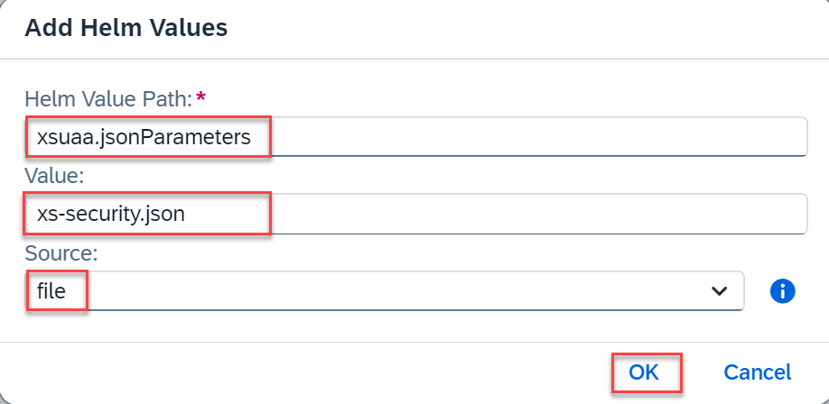

6. Choose **Create**.

### Test your job

1. You have to trigger your job manually the first time after creation. Go back to the **SAP Continuous Integration and Delivery** application and navigate to the **Jobs** tab.

2. Choose the **Incident-Management** job and choose **Run**.

    <!-- border; size:540px --> 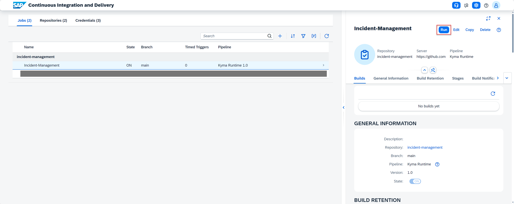

3. Verify that a new tile appears in the Builds view. This tile should be marked as running.

    <!-- border; size:540px --> 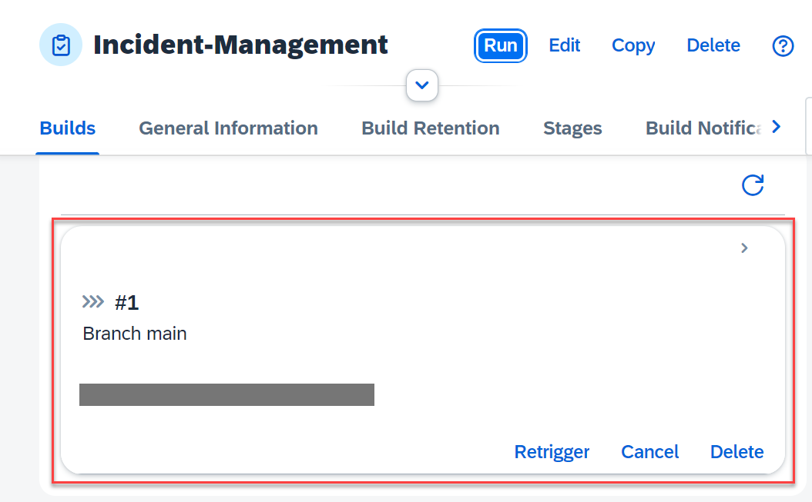

4. Wait until the job has finished and verify that the build tile is marked as successful.

    <!-- border; size:540px --> 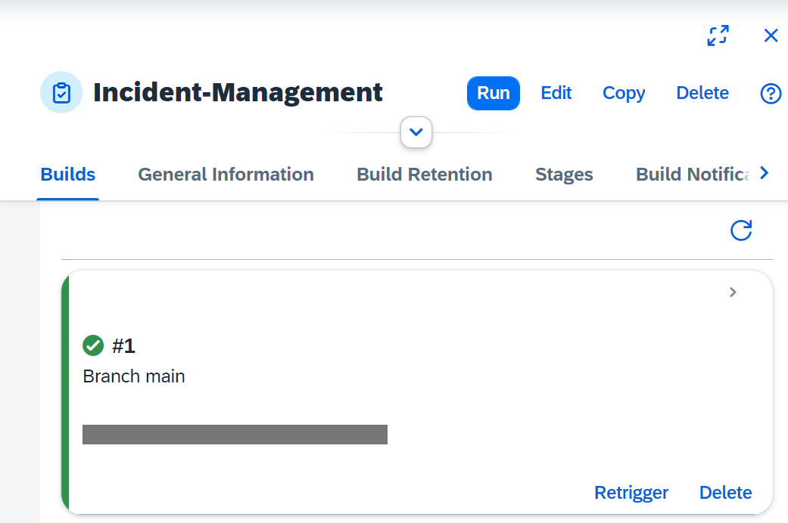
 
