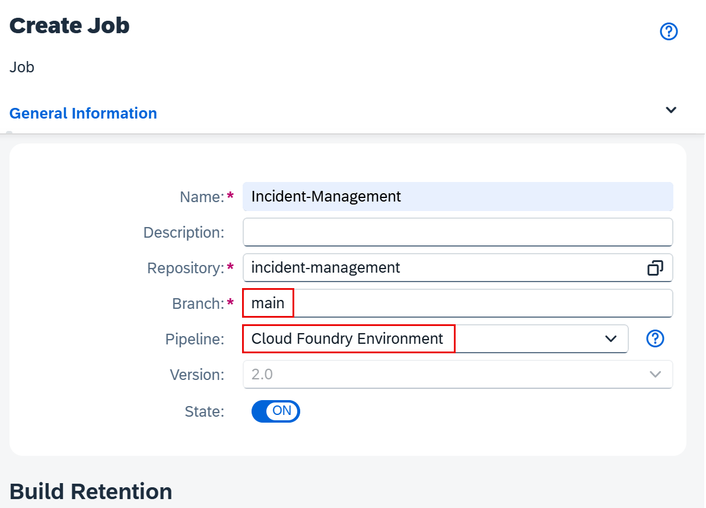

## You will learn

- How to initialize a repository in SAP Business Application Studio
- How to set up your CI/CD pipeline

## Prerequisites

- You have an [enterprise global account](https://help.sap.com/docs/btp/sap-business-technology-platform/getting-global-account#loiod61c2819034b48e68145c45c36acba6e) in SAP BTP. To use services for free, you can sign up for a CPEA (Cloud Platform Enterprise Agreement) or a Pay-As-You-Go for SAP BTP global account and make use of the free tier services only. See [Using Free Service Plans](https://help.sap.com/docs/btp/sap-business-technology-platform/using-free-service-plans?version=Cloud).
- You have an S-user or P-user. See [User and Member Management](https://help.sap.com/docs/btp/sap-business-technology-platform/user-and-member-management).
- You are an administrator of the global account in SAP BTP.
- You have a subaccount in SAP BTP to deploy the services and applications.
- You have one of the following browsers that are supported for working in SAP Business Application Studio:
    - Mozilla Firefox
    - Google Chrome
    - Microsoft Edge
- You have prepared your application for deployment in SAP Cloud Foundry runtime. See [Deploy in SAP BTP, Cloud Foundry Runtime](../../deploy-to-cf.html).

### Create a repository

To be able to perform the steps for setting up a CI/CD pipeline, you will need a public repository. Currently, SAP Continuous Integration and Delivery supports [GitHub](https://github.com/) and [Bitbucket](https://bitbucket.org/) repositories.

For real application development, you need to consider the right place for your repository, of course.

In this example, we'll be creating a repository on GitHub. You'll need a [GitHub](https://github.com/) account for this step. Go ahead and create one if you don't have it yet.

1. Create a new GitHub repository in your GitHub account.

1. Under **Repository name**, enter **incident-management**.

2. Choose **Create repository**.

    <!-- border; size:540px --> 

3. You'll be directed to the **Quick Setup** page of your new repository. Make sure to copy the URL of the repository as you'll need it in the next steps.

    <!-- border; size:540px --> 

### Initialize a repository in SAP Business Application Studio

1. In SAP Business Application Studio, navigate to **Source Control** and choose **Initialize Repository**.

    <!-- border; size:540px --> 

2. In the dropdown **Pick workspace folder to initialize git repo in**, choose the **incident-management** folder.

    <!-- border; size:540px --> 

3. Open the three dots menu next to **Source Control** and choose **Remote** &rarr; **Add Remote...**.

    <!-- border; size:540px --> 

4. Paste the URL of your repository in the **Provide repository URL** field and press <kbd>Enter<kbd>.

    <!-- border; size:540px --> 

5. Provide a remote name and press <kbd>Enter<kbd>.

    <!-- border; size:540px --> 

6. Stage your changes, add a commit message and choose **Publish Branch**.

    <!-- border; size:540px --> 

7. Provide your GitHub username and password when prompted. When the changes are pushed, you'll be able to see your project in your GitHub repository.

### Enable SAP Continuous Integration and Delivery Service

1. Navigate to your subaccount and choose **Services** &rarr; **Service Marketplace** on the left.

4. Type **Continuous Integration & Delivery** in the search box and choose **Create**.

    <!-- border; size:540px --> 

6. Choose **Create** in the **New Instance or Subscription** popup without changing any values.

    <!-- border; size:540px --> 

7. Choose **View Subscription** and wait until the status changes to **Subscribed**.

    <!-- border; size:540px --> 

    <!-- border; size:540px --> 

8. In your SAP BTP subaccount, choose **Security** &rarr; **Role Collections** in the left-hand pane.

9. Choose role collection **CICD Service Administrator**.

10. Choose **Edit**.

    <!-- border; size:540px --> 

11. In the **Users** section, enter your user and select the icon to add the user.

    <!-- border; size:540px --> 

    > Keep the setting `Default Identity Provider` unless you have a custom identity provider configured.

13. Choose **Save**.

    > See [Initial Setup](https://help.sap.com/docs/CONTINUOUS_DELIVERY/99c72101f7ee40d0b2deb4df72ba1ad3/719acaf61e4b4bf0a496483155c52570.html) for more details on how to enable the service.

### Access SAP Continuous Integration and Delivery Service

1. In your SAP BTP subaccount, navigate to **Services** &rarr; **Instances and Subscriptions** in the left-hand pane.

2. Choose **Continuous Integration & Delivery**.

    <!-- border; size:540px --> 

3. Use your SAP BTP global user name and global password to log in to the application.
 

### Add Credentials

1. Choose the **Credentials** tab and choose the icon to add a new credential.

    <!-- border; size:540px --> 

2. Under **Create Credentials** on the right:

    - Enter **github** in the **Credential Name** field.
    - Choose **Basic Authentication** from the dropdown in the **Type** field.
    - Enter your GitHub user name in the **Username** field.
    - Enter your GitHub password (or GitHub access token if you have created one) in the **Password** field.
    - Choose **Create**. 

    <!-- border; size:540px --> 

3. Choose the icon to add a new credential again and create a credential for Cloud Foundry.

    - Enter **cf** in the **Credential Name** field.
    - Choose **Basic Authentication** from the dropdown in the **Type** field.
    - Enter your SAP BTP global user name in the **Username** field.
    - Enter your SAP BTP global password in the **Password** field.
    - Choose **Create**.

    <!-- border; size:540px --> 

### Add a CI/CD job

1. Navigate to the **Jobs** tab and choose the icon to add a new job.

    <!-- border; size:540px --> 

2. Enter **Incident-Management** in the **Job Name** field.

#### Add repository 

3. Open the value help for the **Repository** field. 

    <!-- border; size:540px --> 

2. In the **Select Repository** popup, choose **Add Repository**. A popup opens.

    <!-- border; size:540px --> 

3. In the **Add Repository** popup, enter details for the repository you created in **Step 1: Create a repository**:

    - Enter **incident-management** in the **Name** field.
    - Enter your repository's URL in the **Clone URL** field.
    - Open the value help in the **Credentials** field and choose the credential **github** that you created in **Step 5: Add credentials**. 
    - Select **GitHub** from the dropdown in the **Type** field.

    <!-- border; size:540px --> 

#### Create credentials

1. Open the value help in the **Webhook Credential** field.

    <!-- border; size:540px --> 

2. In the **Select Credentials** popup, choose **Create Credentials**.

    <!-- border; size:540px --> 

3. In the **Create Credentials** popup:

    - Enter **webhook** in the **Credentials Name** field.
    - Click **Generate** next to the **Secret** field to create a secret.
    - Copy the generated secret from the **Secret** field and save it. You'll need it in **Step 7: Create a GitHub webhook**.
    - Choose **Create**. 

    <!-- border; size:540px --> 

4. Back in the **Add Repository** popup, choose **Add** to complete the addition of a repository.

    <!-- border; size:540px --> 

#### Configure pipeline and stages

1. Back in the **General Information** tab, enter **main** in the **Branch** field.

2. Select **SAP Cloud Application Programming Model** from the dropdown in the **Pipeline** field.

    <!-- border; size:540px --> 

3. In the **Stages** section, select **mta** from the dropdown in the **Build Tool** field.

4. Select the latest Java and Node version from the dropdown in the **Build Tool Version** field. 

    <!-- border; size:540px --> 

#### Add unit tests and configure release

1. In the **Additional Unit Tests** section, switch the toggle button to **ON**.  

2. Enter **test** in the **npm Script** field.

    <!-- border; size:540px --> 

3. In the **Release** section, switch the toggle **Deploy to Cloud Foundry Space** to **ON**. 

4. Provide the required information for your account and complete the job creation:

    - Enter the URL of your API endpoint in the **API Endpoint** field.
    - Enter the name of your Cloud Foundry organisation in the **Org Name** field.
    - Enter the name of your development space in the **Space** field.

        > You can get the values from your subaccount's **Overview** page in the SAP BTP cockpit.

    - Select **standard** from the dropdown in the **Deploy Type** field.
    - Open the value help in the **Credentials** field and choose the credential **cf** that you created in **Step 5: Add credentials**.
    - Choose **Create**.

    <!-- border; size:540px --> 

### Create a GitHub webhook

1. Navigate to the **Repositories** tab and choose the **incident-management** repository that you created. Under the **Webhook Event Receiver** tab, choose **Webhook Data**.

    <!-- border; size:540px --> 

2. In the **Webhook Creation** popup, find the **Payload URL** field and copy its value.

    <!-- border; size:540px --> 

3. Go to your repository on GitHub and open the **Settings** tab.

4. From the navigation pane on the left, choose **Webhooks** &rarr; **Add webhook**.

    <!-- border; size:540px --> 

5. Insert the data for your webhook:

    - Paste the **incident-management** repository's payload URL that you copied from the **Webhook Creation** popup in the **Payload URL** field.
    - Select **application/json** from the dropdown in the **Content type** field. 
    - Paste the secret you created in **Step 6: Add a CI/CD job** in the **Secret** field.
    - Under **Which events would you like to trigger this webhook**, select **Just the push event**. 
    - Choose **Add webhook**.

    <!-- border; size:540px --> 

### Test your job

1. You have to trigger your job manually the first time after creation. Go back to the **SAP Continuous Integration and Delivery** application and navigate to the **Jobs** tab.

2. Choose the **Incident-Management** job and choose **Run**.

    <!-- border; size:540px --> 

3. Verify that a new tile appears in the Builds view. This tile should be marked as running.

    <!-- border; size:540px --> 

4. Wait until the job has finished and verify that the build tile is marked as successful.

    <!-- border; size:540px --> 
 
