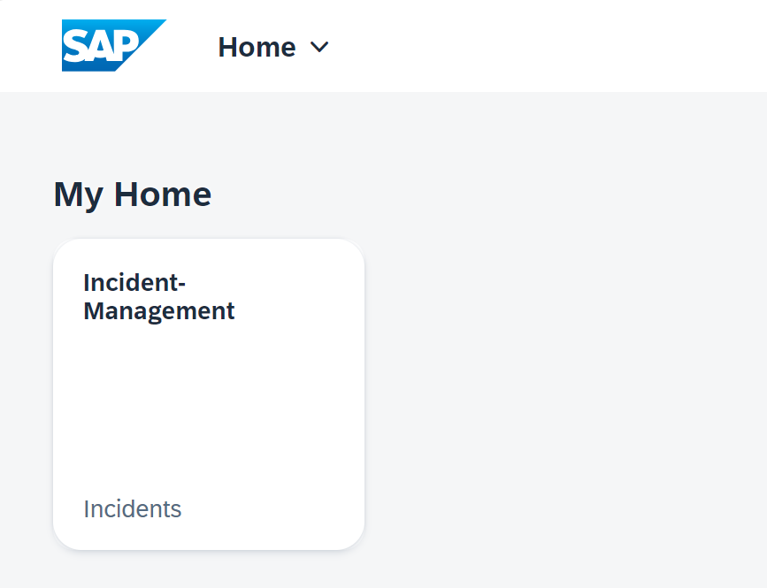

## You will learn

- How to add a launch page for local testing


## Prerequisites

You have added business logic to your application. Follow the steps in the [Add Custom Logic](add-custom-logic) tutorial that is part of the [Develop a Full-Stack CAP Application Following SAP BTP Developer’s Guide](https://developers.sap.com/group.cap-application-full-stack.html) tutorial group.

> This tutorial follows the guidance provided in the [SAP BTP Developer's Guide](https://help.sap.com/docs/btp/btp-developers-guide/what-is-btp-developers-guide).

### Overview

You have already generated the **Incident Management** application and can start it in the browser from SAP Business Application Studio. However, you can also add a launch page for local testing. This page looks like a real site, but is just a local copy of the otherwise centrally managed SAP Build Work Zone, standard edition site and comes with a limited version of its functionality. There's no option to add or remove applications via configuration, user roles aren't taken into account, and end-user personalization is also not included. If you want these and other SAP Build Work Zone, standard edition functionalities included, you have to set them up for your project. Find out how to do this in [Integrate Your Application with SAP Build Work Zone, Standard Edition](integrate-with-work-zone). You stick to the launch page for this tutorial though.

In the current implementation, you can open the **Incident Management** application via the `app/incidents/webapp/index.html` file and there is no launch page. If you now create a second application using the SAP Fiori application generator within your project, it will be generated in the same way, again with its own `index.html` file. Instead, you can use a launch page for all the applications. You can add a launch page by creating an HTML file that uses the built-in SAPUI5 shell in the **app** folder. 

### Implement a local launch page

1. In SAP Business Application Studio, go to your **IncidentManagement** dev space.

    > Make sure the **IncidentManagement** dev space is in status **RUNNING**.

2. Create a new **launchpage.html** file in the **app** folder of the **INCIDENT-MANAGEMENT** application.

3. Copy the following content to the **launchpage.html** file:

    ```html
    <!DOCTYPE html>
    <html>
        <head>
            <meta http-equiv="X-UA-Compatible" content="IE=edge" />
            <meta charset="UTF-8" />
            <meta name="viewport" content="width=device-width, initial-scale=1.0" />

            <script>
                window['sap-ushell-config'] = {
                    defaultRenderer: 'fiori2',
                    services: {
                        NavTargetResolution: {
                            config: {
                                allowTestUrlComponentConfig: true,
                                enableClientSideTargetResolution: true
                            }
                        }           
                    },
                    applications: {
                        "incidents-app": {
                            title: 'Incident-Management',
                            description: 'Incidents',
                            additionalInformation: 'SAPUI5.Component=ns.incidents',
                            applicationType: 'URL',
                            url: "./incidents/webapp",
                            navigationMode: 'embedded'
                        }
                }
            }
            </script>
            <script src="https://ui5.sap.com/test-resources/sap/ushell/bootstrap/sandbox.js"></script>
            <script
                src="https://ui5.sap.com/resources/sap-ui-core.js"
                data-sap-ui-libs="sap.m, sap.ushell, sap.fe.templates"
                data-sap-ui-compatVersion="edge"
                data-sap-ui-theme="sap_horizon"
                data-sap-ui-frameOptions="allow"
                data-sap-ui-bindingSyntax="complex"
            ></script>
            <script>
                sap.ui.getCore().attachInit(function() {
                    sap.ushell.Container.createRenderer().placeAt('content');
                });
            </script>
        </head>
        <body class="sapUiBody" id="content"></body>
    </html>
    ```

3. Make sure the SAP Fiori application is running.

3. Go to the tab of the opened SAP Fiori application in your browser and replace **/incidents/webapp/index.html?sap-ui-xx-viewCache=false** with **/launchpage.html#Shell-home** in the URL.

    > You now see a tile of the **Incident Management** application on the launch page.

	<!-- border; size:540px --> 

### Check the launchpage.html file

Let's have a look at the **launchpage.html** file and the configuration inside. In the first script you will see:

```html
	<script>
		window["sap-ushell-config"] = {
			defaultRenderer: "fiori2",
			services: {
                NavTargetResolution: {
                    config: {
                        allowTestUrlComponentConfig: true,
                        enableClientSideTargetResolution: true
                    }
                }    
            },
            applications: {
				"incidents-app": {
					title: "Incidents",
					description: "Incidents",
					additionalInformation: "SAPUI5.Component=ns.incidents",
					applicationType: "URL",
					url: "./incidents/webapp",
					navigationMode: "embedded"
				}
			}
		};
	</script>
```

There is a single application in the launch page with URL that points to it. There are other properties configured here like the title and description. Similarly, another application can be added to the launch page by adding an entry in this file.

> Why is the file named **launchpage.html** instead of **index.html**? 
    You are using the name **launchpage.html** because the CAP server by default looks for an **index.html** file in the **app** folder. If the CAP server finds such a file, it replaces the default page that also contains the links to the services with the **index.html** in the folder. While this makes sense in many cases, for development purposes we'd recommend keeping the default page generated by CDS and using a different name for the index file of the launch page.
