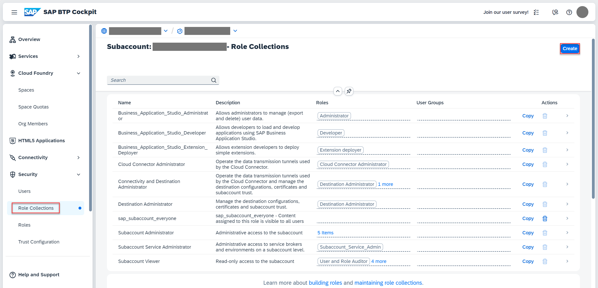
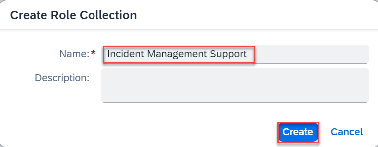
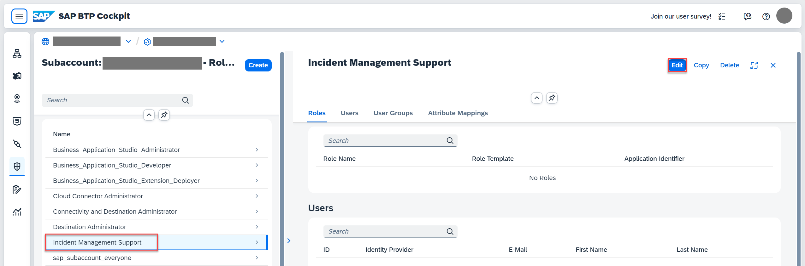
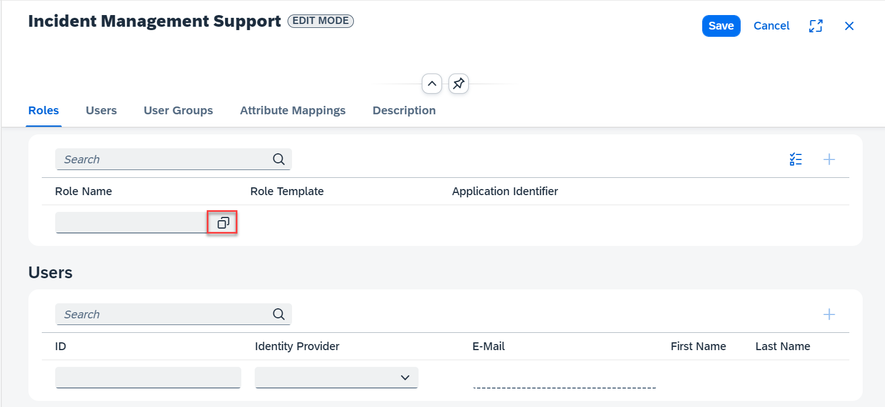
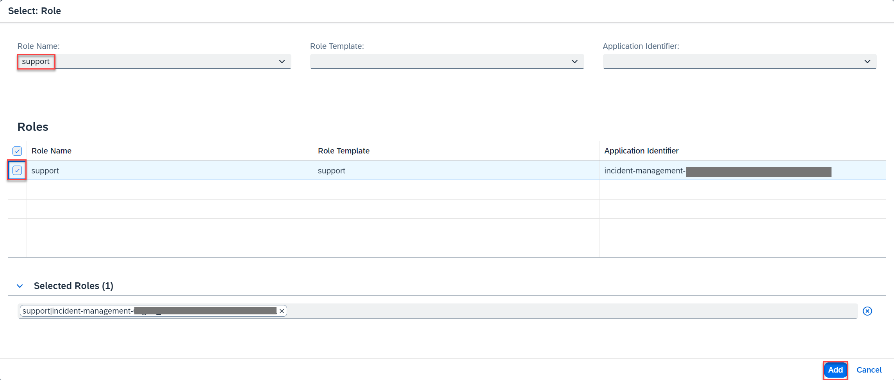
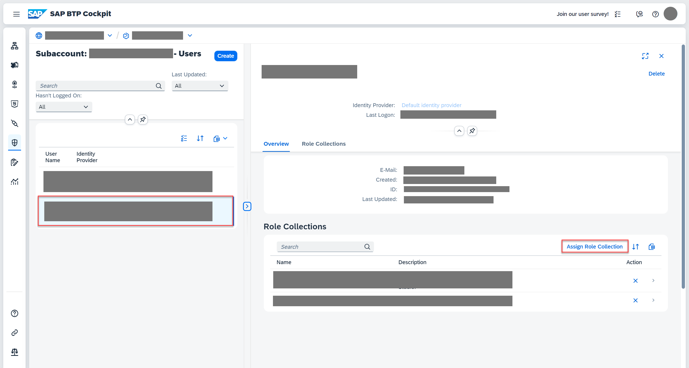
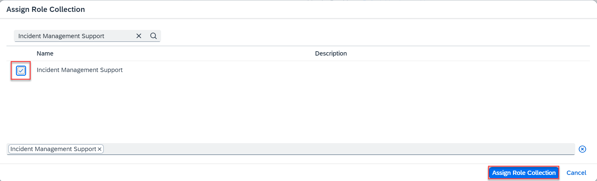

## You will learn

- How to create and assign a role collection in the SAP BTP subaccount.

## Prerequisites

You have deployed your application in SAP BTP, Cloud Foundry runtime. See [Deploy in SAP BTP, Cloud Foundry Runtime](../../deploy-to-cf.html)

### Create a role collection and add role

1. Open the SAP BTP cockpit and navigate to your subaccount.

1. Choose **Security** &rarr; **Role Collections**, and then choose **Create**.

      <!-- border; size:540px --> 

2. In the **Create Role Collection** popup, enter **Incident Management Support** in the **Name** field and choose **Create**.

      <!-- border; size:540px --> 

3. Choose the role collection **Incident Management Support** from the list of role collections and choose **Edit** on the right.

      <!-- border; size:540px --> 

4. Open the value help in the **Role Name** field.

      <!-- border; size:540px --> 

5. Search for the role **support**, select it, and choose **Add**.

      <!-- border; size:540px --> 

6. Choose **Save**.

### Assign a role collection to a user

1. Choose **Security** &rarr; **Users**, and then choose a user from the list.

2. Under **Role Collections** on the right, choose **Assign Role Collection**.

      <!-- border; size:540px --> 

2. In the **Assign Role Collection** dialog, select the **Incident Management Support** role collection and choose **Assign Role Collection**.

      <!-- border; size:540px --> 

